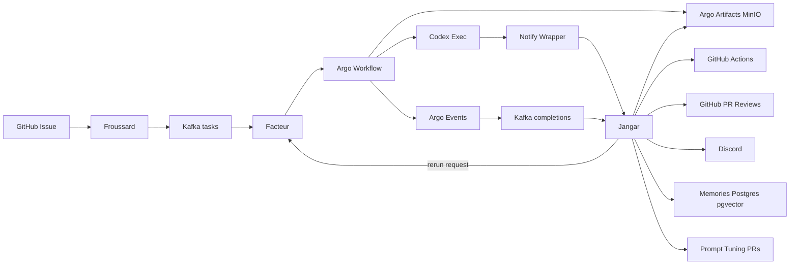
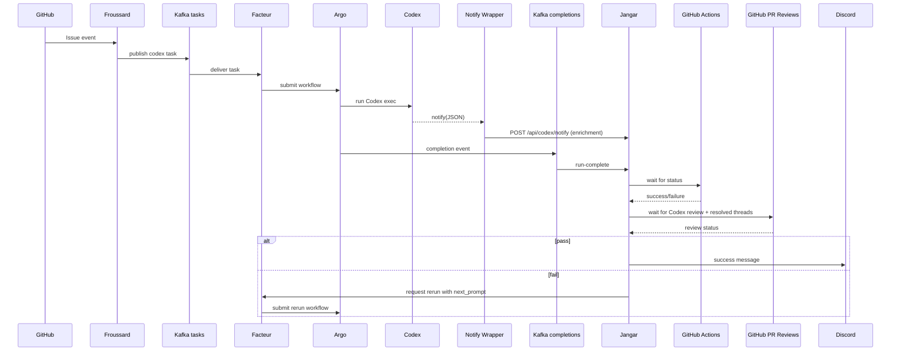
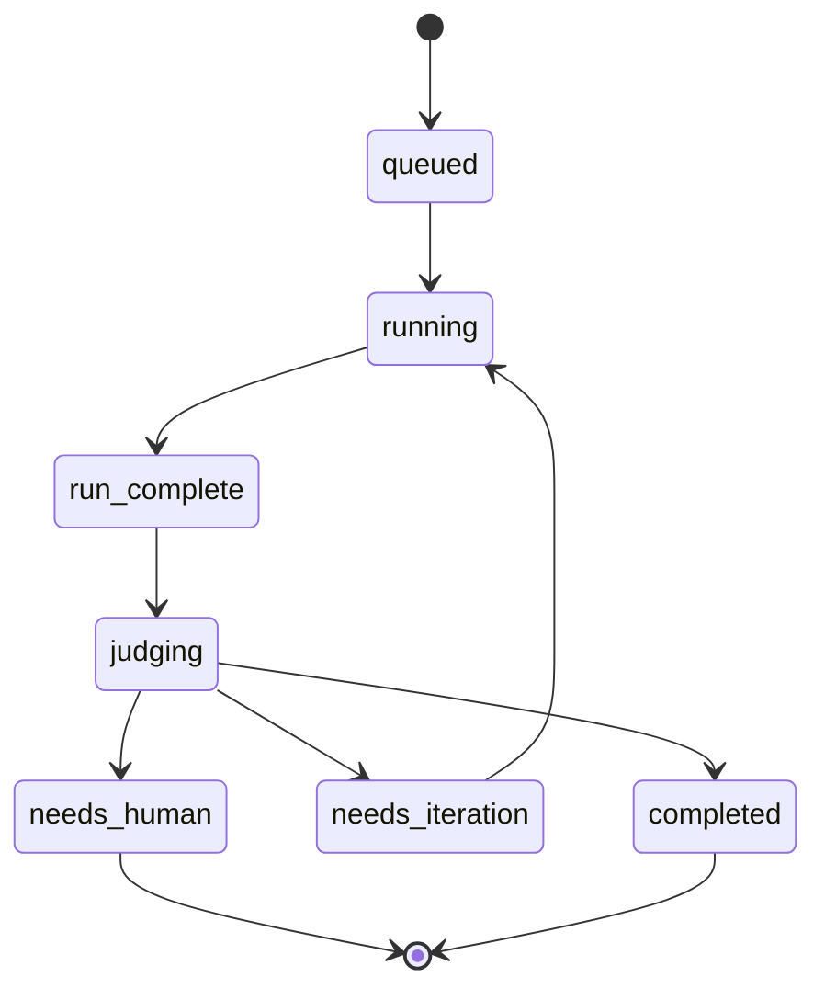

# Codex Exec Notifications -> Jangar Judge -> Resumable Argo Iteration

Status: Complete (ready for implementation)
Owner: Jangar + Froussard + Facteur
Scope: Codex exec runs in Argo, judge consumes completion notifications, decides pass/fail, triggers reruns, and posts success to Discord.

## Summary
Codex runs inside Argo workflows triggered by Facteur from GitHub issue events. Argo Events publishes workflow completions to Kafka (success or failure), and Codex may emit a notify event on successful turn completion. Jangar ingests run-complete events from the Kafka completions topic as the source of truth, uses notify as enrichment, waits for GitHub Actions CI results and Codex PR review completion, evaluates whether work is complete, and either:
- marks success and posts to Discord, or
- generates a follow-up prompt and triggers a new Argo run that resumes work from the last commit.

All runs are resumable via a per-issue branch. Artifacts are stored in MinIO. Prompt auto-tuning is automated by generating PRs to update the initial prompt template.

## Goals
- Automated completion decisions with minimal human escalation.
- Resumable iterations without losing work.
- Deterministic gating plus LLM-based requirement evaluation.
- Automated prompt improvements as PRs for human review.

## Non-goals
- Replacing GitHub Actions CI.
- Manual (human) review flows beyond automated Codex review gating.
- Deep security/auth design (assume existing trusted service-to-service network).

## Definitions
- Turn completion: Codex emits notify only after a successful turn with no follow-up needed.
- Completion: CI green for the attempt commit SHA + Codex review completed + all Codex PR review threads resolved + judge pass.
- Run: One Argo workflow attempt for a given issue.
- Attempt: A numbered iteration of a run (1..N) on the same branch.

## Architecture

Components:
- Froussard: receives GitHub webhooks, publishes Codex tasks to Kafka, and owns the workflow template manifests.
- Facteur: consumes Codex tasks and submits Argo workflows.
- Argo Workflows: executes Codex in exec mode.
- Codex exec: runs agent; emits notify on completion (optional enrichment).
- Notify wrapper: enriches notify payload and POSTs to Jangar.
- Jangar: persists run state, waits for CI, judges completion, and orchestrates reruns (triggered by run-complete).
- Jangar Memories: stores semantic memories (pgvector) for judge snapshots.
- MinIO: stores artifacts for each run.
- Argo Events: publishes workflow completion events to Kafka.
- Kafka: carries `github.issues.codex.tasks` and `argo.workflows.completions`.
- GitHub Actions: CI signal for the attempt commit SHA.
- Discord: success notification to general channel; escalation only on hard failure.

System overview:

## Data Flow
1) GitHub issue -> Froussard -> Kafka (`github.issues.codex.tasks`) -> Facteur -> Argo workflow
2) Argo runs Codex exec (`github-codex-implementation`).
3) Argo Events emits workflow completion -> Kafka (`argo.workflows.completions`).
4) Jangar ingests run-complete from Kafka (primary attempt record).
5) Codex notify fires on successful turn completion (optional enrichment).
6) Notify wrapper enriches payload and POSTs to Jangar.
7) Jangar waits for GitHub Actions CI result for the attempt commit SHA.
8) Jangar waits for Codex PR review completion and resolved review threads.
9) If Codex review has unresolved threads or requested changes, Jangar generates a next prompt that
   addresses every comment and triggers a rerun on the same branch.
10) Jangar gates + LLM judge (triggered by run-complete).
11) If pass: create/update PR, mark complete, Discord success.
12) If fail: generate next prompt, request Facteur to trigger new Argo run on same branch.
13) Jangar writes 10 memory snapshots from logs/output into the memories store.

## Current Production Wiring (Argo CD Sources of Truth)
- Workflow template: `argocd/applications/froussard/github-codex-implementation-workflow-template.yaml`
- Argo artifact repository: `argocd/applications/argo-workflows/kustomization.yaml`
  (bucket `argo-workflows` on `observability-minio.minio.svc.cluster.local:9000`)
- Workflow completions -> Kafka: `argocd/applications/froussard/workflow-completions-eventsource.yaml`
  and `argocd/applications/froussard/workflow-completions-sensor.yaml`
- Kafka topic: `argo.workflows.completions` (`argocd/applications/froussard/argo-workflows-completions-topic.yaml`)
- Facteur KafkaSource: `argocd/applications/facteur/overlays/cluster/facteur-codex-kafkasource.yaml`
- Facteur internal service: `argocd/applications/facteur/overlays/cluster/facteur-internal-service.yaml`
- Jangar service/deployment/DB/Redis: `argocd/applications/jangar/service.yaml`,
  `argocd/applications/jangar/deployment.yaml`

Sequence (happy path + rerun):

## Resumable Workflow (Branch-Commit)
- Use the existing head branch from the Codex task payload (today typically `codex/issue-<issue_id>-<suffix>`).
- Each attempt commits all changes and pushes to remote (handled by the implementation runner).
- Next run reuses the same head branch to continue from the last commit.

Notes:
- If branch does not exist, create it from default branch.
- Ensure all changes are committed even on failure (WIP commit allowed).
- Merge conflicts on resume trigger human escalation.

## Resume State (Codex Implementation)
The implementation runner (`apps/froussard/src/codex/cli/codex-implement.ts`) persists resume
metadata at `.codex/implementation-resume.json` and bundles changed files in
`.codex-implementation-changes.tar.gz`. On the next run, Codex attempts to restore those changes
before resuming the session (or falls back to a fresh session). Jangar should treat the presence
of resume metadata as a signal to continue the same attempt lineage.

## Artifact Capture (Argo Artifact Repository on MinIO)
Argo Workflows already ships artifacts to the cluster-wide artifact repository configured in
`argocd/applications/argo-workflows/kustomization.yaml` (bucket `argo-workflows` on
`observability-minio.minio.svc.cluster.local:9000`). The `github-codex-implementation` template
currently uploads:
- `.codex-implementation-changes.tar.gz` (implementation-changes)
- `.codex-implementation.patch` (implementation-patch)
- `.codex-implementation-status.txt` (implementation-status)

Add the following artifacts to support judging and resumability:
- `.codex-implementation.log`
- `.codex-implementation-events.jsonl`
- `.codex-implementation-agent.log`
- `.codex-implementation-runtime.log`
- `.codex/implementation-resume.json` (resume metadata)

Artifact access:
- The workflow completion payload includes artifact name/key metadata when available.
- Prefer querying the Argo Workflow API for `status.outputs.artifacts` to retrieve keys and S3 metadata.
- Fall back to direct S3 access in MinIO using the artifact keys.
 - The changes archive contains `metadata/manifest.json` with repo/issue/prompt/session metadata
   and the list of changed files.

## Failed-Run Ingestion (No Notify)
- Codex notify only fires on successful turn completion.
- Argo Events publishes workflow completions to Kafka (`argo.workflows.completions`) for both success
  and failure, so Jangar can track failed attempts even when notify never fires.
- Deliver completions to Jangar via a Knative KafkaSource in the `jangar` namespace
  targeting `/api/codex/run-complete`.
- Jangar must treat run-complete as the source of truth for attempt existence and judge triggering.
- Notify (if present) is enrichment only (assistant message + input context).

## Jangar Responsibilities
- Ingest run-complete events from Kafka (`argo.workflows.completions`) as the primary record.
- Ingest notify events as enrichment only.
- Correlate runs by issue_id, workflow_name, workflow_uid, turn_id, attempt.
- Decode workflow arguments (base64 `eventBody`) to recover repository/issue metadata.
- Query Argo Workflow API for outputs/artifact keys when needed.
- Use notify log excerpts (output/agent/runtime/events/status) for judge context and memory snapshots; fall back to artifacts when notify is missing.
- Wait for GitHub Actions CI status for the attempt commit SHA.
- Wait for Codex PR review completion and ensure all Codex review threads are resolved.
- Parse Codex review comments and embed them into `next_prompt` when reruns are required.
- Run deterministic gates:
  - CI must be green.
  - Codex review must be completed and resolved.
  - No merge conflicts on resume.
  - Non-empty change set (unless explicitly expected).
- Codex review must be complete with no unresolved Codex review threads or open “changes requested”.
- Run LLM judge for requirement coverage and quality.
- Decide pass/fail and trigger next actions.
- Create 10 memory snapshots per run (logs + outputs), stored via Jangar memories.
- Submit reruns through Facteur (`/codex/tasks`) with updated prompt + attempt metadata.

## CI Signal
- CI is sourced from GitHub Actions status for the commit SHA produced by the current attempt.
- Jangar must gate on the exact commit SHA (not branch-level status) to avoid stale green checks from prior attempts.
- Jangar does not rely on Argo-local tests for completion.
 - Commit SHA source order: PR head SHA (preferred) -> head branch SHA -> fallback to status artifact/manifest.

## PR Review Gate (Codex Review)
- Jangar must wait for the Codex review to complete on the PR (review by `codex`/`codex[bot]` or the configured reviewer identity).
- All Codex review threads must be resolved before marking completion.
- If Codex review requests changes or has unresolved threads, treat as `needs_iteration` and generate a new prompt that
  enumerates each comment and the required fix. Threads must be resolved before success.
- If Codex only posts PR issue comments (no formal review objects), treat the latest Codex comment as review completion
  and proceed once comment content is captured.

## Decision Logic
Pass:
- Update run + issue state: completed.
- Create PR if needed (or update existing).
- Post Discord success in general channel.

Fail:
- Generate next_prompt with specific fixes.
- Request Facteur to trigger new Argo run (same branch).
- If Codex review requested changes, include a checklist of Codex comments to address in the rerun prompt.
- Escalate to human only on hard failure:
  - merge conflicts
  - repeated infra failure
  - repeated identical failure beyond threshold
- For needs_iteration and needs_human, the judge must emit system-level improvement suggestions
  (system prompt tuning and broader system changes) and open a PR with those recommendations.
- Review-driven iterations must include Codex comment summaries in `next_prompt`.
- If the workflow failed before producing artifacts or a commit SHA, classify as infra failure and
  rerun automatically until the infra-failure threshold is exceeded.

## Prompt Auto-tuning
- Aggregate failure reasons across runs.
- Generate prompt improvements automatically.
- Create PRs to update prompt templates.
- Human reviews/merges PRs.
- For needs_iteration and needs_human outcomes, always produce a PR with system prompt and
  system improvement suggestions.
- Use the repository PR template for auto-tuning PRs.

## State Machine
issue status: queued -> running -> run_complete -> judging -> completed | needs_iteration | needs_human

Constraints:
- Only one active run per issue.
- Max attempts with backoff; escalate after threshold.

State diagram:

## Observability
- Metrics: completion rate, avg attempts, failure reasons, CI duration, judge confidence.
- Run history per issue with artifact links.
- Memory snapshots per run (10 entries) for retrieval and prompt tuning.

## Memories + Embeddings
- Jangar persists 10 memory snapshots per run and generates embeddings on write.
- Embedding configuration is driven by `OPENAI_API_BASE_URL`, `OPENAI_API_KEY`,
  `OPENAI_EMBEDDING_MODEL`, and `OPENAI_EMBEDDING_DIMENSION` (defaults managed by Jangar).

## Risks and Mitigations
- Notify only on success: rely on onExit artifacts and Argo completion events.
- CI lag: delay judge until CI completes; store pending state.
- Prompt regressions: PR review required for prompt changes.
- Stale CI status on shared branch: gate on commit SHA produced by the current attempt.

## Default Policy Decisions
- Prompt template location: `apps/froussard/src/codex.ts` (`buildImplementationPrompt`).
- Max attempts: 3 (configurable); backoff: exponential (5m, 15m, 45m) with max cap 60m.
- CI integration: polling GitHub checks/check-runs by commit SHA (webhook optional).
