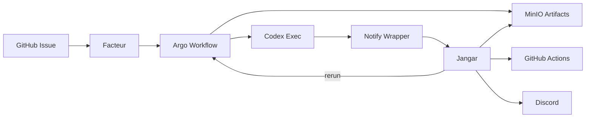
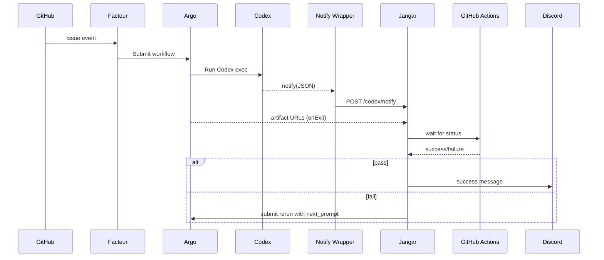
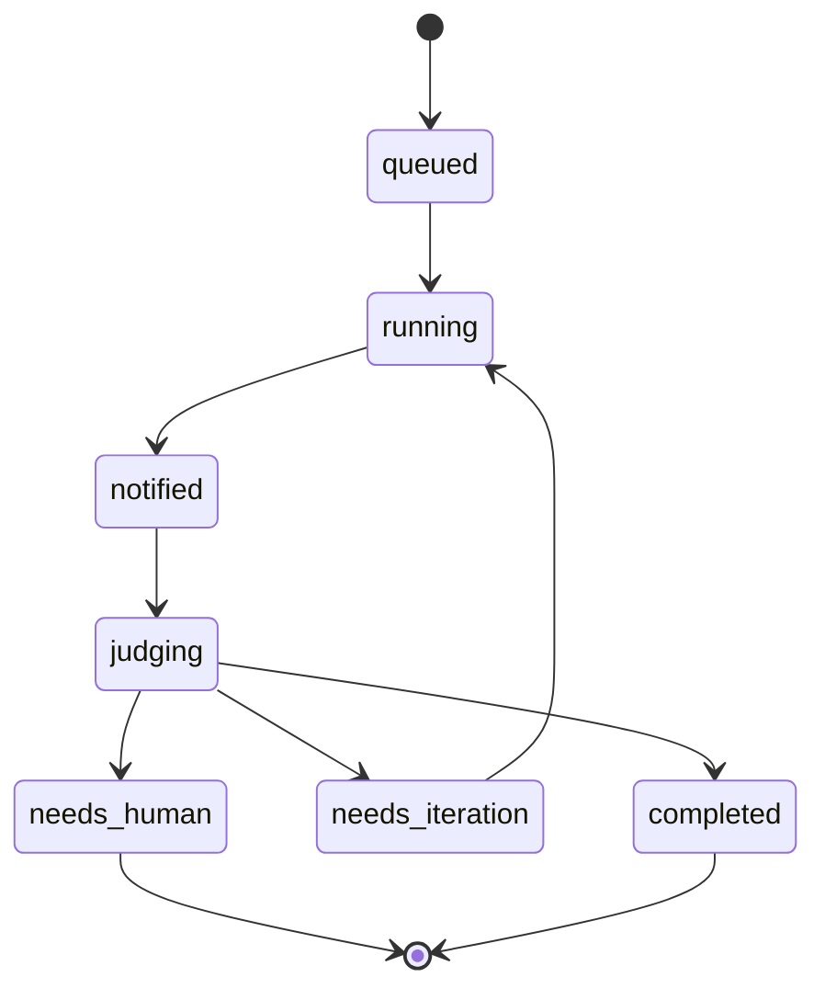

# Codex Exec Notifications -> Jangar Judge -> Resumable Argo Iteration

Status: Draft
Owner: Jangar + Froussard + Facteur
Scope: Codex exec runs in Argo, judge consumes completion notifications, decides pass/fail, triggers reruns, and posts success to Discord.

## Summary
Codex runs inside Argo workflows triggered by Facteur from GitHub issue events. Codex emits a notification on turn completion. Jangar ingests the notification, waits for GitHub Actions CI results, evaluates whether work is complete, and either:
- marks success and posts to Discord, or
- generates a follow-up prompt and triggers a new Argo run that resumes work from the last commit.

All runs are resumable via a per-issue branch. Artifacts are stored in MinIO. Prompt auto-tuning is automated by generating PRs to update the initial prompt template.

## Goals
- Automated completion decisions with minimal human escalation.
- Resumable iterations without losing work.
- Deterministic gating plus LLM-based requirement evaluation.
- Automated prompt improvements as PRs for human review.

## Non-goals
- Replacing GitHub Actions CI.
- Manual review flows.
- Deep security/auth design (assume existing trusted service-to-service network).

## Definitions
- Turn completion: Codex emits notify only after a successful turn with no follow-up needed.
- Run: One Argo workflow attempt for a given issue.
- Attempt: A numbered iteration of a run (1..N) on the same branch.

## Architecture

Components:
- Facteur: receives GitHub issue events; submits Argo workflows.
- Froussard: stores Argo workflow YAML; executes Codex in exec mode.
- Codex exec: runs agent; emits notify on completion.
- Notify wrapper: enriches notify payload and POSTs to Jangar.
- Jangar: persists run state, waits for CI, judges completion, and orchestrates reruns.
- MinIO: stores artifacts for each run.
- GitHub Actions: CI signal for the branch.
- Discord: success notification to general channel; escalation only on hard failure.

System overview:

## Data Flow
1) GitHub issue -> Facteur -> Argo workflow
2) Argo runs Codex exec
3) Codex notify fires on successful turn completion
4) Notify wrapper enriches payload and POSTs to Jangar
5) Jangar waits for GitHub Actions CI result
6) Jangar gates + LLM judge
7) If pass: create/update PR, mark complete, Discord success
8) If fail: generate next prompt, trigger new Argo run on same branch

Sequence (happy path + rerun):

## Resumable Workflow (Branch-Commit)
- Branch name: codex/issue-<issue_id>
- Each attempt commits all changes and pushes to remote.
- Next run checks out this branch and continues from last commit.

Notes:
- If branch does not exist, create it from default branch.
- Ensure all changes are committed even on failure (WIP commit allowed).
- Merge conflicts on resume trigger human escalation.

## Artifact Capture (MinIO)
All runs capture artifacts in an onExit/finally step (regardless of Codex success). 

Required artifacts:
- patch.diff
- git_status.txt
- git_diff_stat.txt
- commit_sha.txt
- codex.log
- build.log (if applicable)
- lint.log (if applicable)
- test.log (if applicable)
- runtime_meta.json (versions, env, workflow metadata)
- notify_payload.json (raw notify input)

MinIO path convention:
- codex-artifacts/<issue_id>/<workflow_id>/<attempt>/

## Jangar Responsibilities
- Ingest notifications and store runs + artifacts.
- Correlate runs by issue_id, workflow_id, turn_id, attempt.
- Wait for GitHub Actions CI status for the branch.
- Run deterministic gates:
  - CI must be green.
  - No merge conflicts on resume.
  - Non-empty change set (unless explicitly expected).
- Run LLM judge for requirement coverage and quality.
- Decide pass/fail and trigger next actions.

## CI Signal
- CI is sourced from GitHub Actions status for the branch or PR.
- Jangar does not rely on Argo-local tests for completion.

## Decision Logic
Pass:
- Update run + issue state: completed.
- Create PR if needed (or update existing).
- Post Discord success in general channel.

Fail:
- Generate next_prompt with specific fixes.
- Trigger new Argo run (same branch).
- Escalate to human only on hard failure:
  - merge conflicts
  - repeated infra failure
  - repeated identical failure beyond threshold

## Prompt Auto-tuning
- Aggregate failure reasons across runs.
- Generate prompt improvements automatically.
- Create PRs to update prompt templates.
- Human reviews/merges PRs.

## State Machine
issue status: queued -> running -> notified -> judging -> completed | needs_iteration | needs_human

Constraints:
- Only one active run per issue.
- Max attempts with backoff; escalate after threshold.

State diagram:

## Observability
- Metrics: completion rate, avg attempts, failure reasons, CI duration, judge confidence.
- Run history per issue with artifact links.

## Risks and Mitigations
- Notify only on success: rely on onExit artifacts and Argo completion events.
- CI lag: delay judge until CI completes; store pending state.
- Prompt regressions: PR review required for prompt changes.

## Open Questions
- Where prompt templates live in repo and how they are versioned.
- Max attempts threshold and backoff policy.
- GitHub Actions integration method (webhook vs polling).
