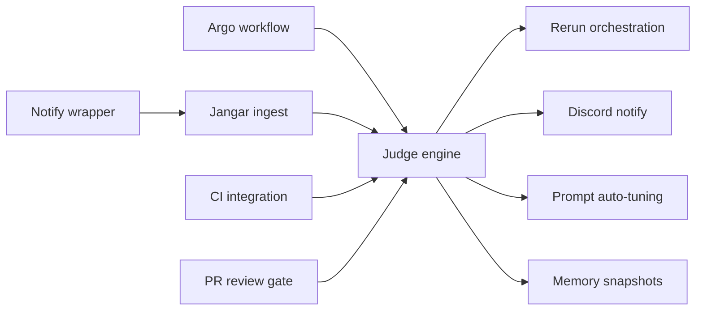

# Implementation Details: Codex Judge + Resumable Argo

This document splits the work into parallel tracks and provides concrete interfaces, schemas, and workflow steps.
The judge pipeline is triggered by the Argo run-complete event (success or failure); notify is enrichment only.

## Project Progress Inventory (as of 2025-12-29)

This section cross-references the design/implementation plan against current code and open GitHub items in this repo.

| Area / Workstream | Design/Doc Ref | Code Status | Evidence (paths) | Open Issues | Open PRs | Notes / Gaps |
| --- | --- | --- | --- | --- | --- | --- |
| A) Argo workflow artifacts | `docs/jangar/codex-judge-argo-implementation.md` | Done | `argocd/applications/froussard/github-codex-implementation-workflow-template.yaml` | - | - | Matches required artifact outputs; aligns with tracking doc “completed.” |
| B) Notify wrapper | `docs/jangar/codex-judge-argo-implementation.md` | Done | `apps/froussard/src/codex/cli/codex-implement.ts` | - | - | Emits `.codex-implementation-notify.json` and POSTs `/api/codex/notify`. |
| C) Run-complete ingest + persistence | `docs/jangar/codex-judge-argo-design.md` | Partial | `services/jangar/src/server/codex-judge.ts`, `services/jangar/src/server/codex-judge-store.ts`, `services/jangar/src/routes/api/codex/run-complete.tsx` | #2175 | - | Drops run-complete events missing repo/issue/head; can lose failed runs. |
| D) Artifact retrieval + fallback | `docs/jangar/codex-judge-argo-design.md` | Partial | `services/jangar/src/server/codex-judge.ts`, `services/jangar/src/server/argo-client.ts` | - | - | Fallback uses `.tgz` suffix and requires `artifact.url`; MinIO bucket/key paths will not work when URL is missing. |
| E) CI gating by commit SHA | `docs/jangar/codex-judge-argo-design.md` | Partial | `services/jangar/src/server/codex-judge.ts`, `services/jangar/src/server/github-client.ts` | - | - | Falls back to branch head when commit SHA missing; can accept stale CI. |
| F) PR review gate (Codex) | `docs/jangar/codex-judge-argo-implementation.md` | Partial | `services/jangar/src/server/github-client.ts`, `services/jangar/src/server/codex-judge.ts` | - | - | Review bypass mode can skip required gate; review parsing still sensitive to GraphQL thread details. |
| G) Judge engine (gates + LLM) | `docs/jangar/codex-judge-argo-design.md` | Done | `services/jangar/src/server/codex-judge.ts`, `services/jangar/src/server/codex-judge-gates.ts` | - | - | Deterministic gates + LLM judge + retries implemented. |
| H) Rerun orchestration | `docs/jangar/codex-judge-argo-design.md` | Done | `services/jangar/src/server/codex-judge.ts`, `services/jangar/src/server/migrations/20251229_codex_rerun_submissions.ts` | - | - | Submits to Facteur with backoff + dedupe. |
| I) Discord notifications | `docs/jangar/codex-judge-argo-design.md` | Done | `services/jangar/src/server/codex-judge.ts` | - | - | Success + escalation flows implemented. |
| J) Prompt auto-tuning PRs | `docs/jangar/codex-judge-argo-design.md` | Done | `services/jangar/src/server/codex-judge.ts` | - | - | Threshold + cooldown implemented; uses PR template if present. |
| K) Memory snapshots (10/run) | `docs/jangar/codex-judge-argo-design.md` | Done | `services/jangar/src/server/codex-judge.ts` | - | - | Writes 10 snapshots per run into memories store. |
| L) Run history API + UI | `docs/jangar/codex-judge-argo-design.md` | Partial (API only) | `services/jangar/src/routes/api/codex/runs.tsx` | #2151 | - | API exists; UI route/components missing. |
| M) Agent comms ingestion + SSE | `docs/nats-argo-agent-communications.md` | Implemented in code | `services/jangar/src/routes/api/agents/events.ts` | #2187 | - | SSE endpoint exists; remaining deployment/ops tracked in issue. |
| N) Observability / pipeline ops | `docs/nats-argo-agent-communications.md` | Not in code | - | #2191, #2173, #2174 | - | No code found for these observability tasks yet. |
| O) Argo events filter validation | `docs/jangar/codex-judge-argo-design.md` | Not in code | - | #2175 | - | Impacts reliability of run-complete ingestion. |
| P) Other open PRs (unrelated to judge) | - | In progress | - | #2198 | #2203, #2221 | PR #2203 likely addresses #2198 (Oxlint). #2221 unrelated. |

Untracked gaps to consider creating issues for:
- Artifact fallback: support bucket/key download when `artifact.url` is absent and fix `.tgz` suffix assumptions.
- CI gate: avoid branch-head fallback when commit SHA is missing; treat as infra failure or retry.
- Review gate: align review bypass with design requirements (strict by default).

Current production context (see `docs/codex-workflow.md`):
- Workflow template: `argocd/applications/froussard/github-codex-implementation-workflow-template.yaml`
- Workflow outputs: `.codex-implementation-changes.tar.gz`, `.codex-implementation.patch`, `.codex-implementation-status.txt`
- Argo Events -> Kafka completions: `argocd/applications/froussard/workflow-completions-*.yaml`
- Kafka topics: `github.issues.codex.tasks`, `argo.workflows.completions`

## Workstreams (Parallel)

A) Argo workflow updates (Froussard)
B) Notify wrapper
C) Jangar ingestion + persistence
D) GitHub Actions status integration
E) PR review gate (Codex review)
F) Judge engine (gates + LLM)
G) Orchestration (rerun trigger)
H) Discord notifications
I) Prompt auto-tuning PRs
J) Memory snapshots (10 per run)

Blocking chain:
- A, B, C, D, E can start immediately.
- F depends on C, D, E.
- G and H depend on F.
- I depends on F.
- J depends on F.

Dependency graph:

## A) Argo Workflow Updates (Froussard)

### Required inputs (already in the template)
- `eventBody` (base64 JSON), `rawEvent`, `head`, `base`

### What already exists
- Workflow `github-codex-implementation` runs `codex-implement.ts` and uploads three artifacts:
  `.codex-implementation-changes.tar.gz`, `.codex-implementation.patch`, `.codex-implementation-status.txt`.

### Additions needed
- Extend workflow outputs to include:
  - `.codex-implementation.log`
  - `.codex-implementation-events.jsonl`
  - `.codex-implementation-agent.log`
  - `.codex-implementation-runtime.log`
  - `.codex/implementation-resume.json`
- Add labels/annotations on the workflow for repo/issue/head/base to ease correlation
  (these can be derived from `eventBody` during submission).
- Ensure Argo artifact repository is used consistently (already configured in
  `argocd/applications/argo-workflows/kustomization.yaml`).

### Deliverables
- Updated workflow template artifact outputs.
- Optional: workflow labels/annotations for repo/issue/head/base.

### Detailed tasks
- Update `argocd/applications/froussard/github-codex-implementation-workflow-template.yaml`
  `outputs.artifacts` to include new log/resume files.
- Verify `codex-implement.ts` writes the log paths used by the workflow outputs.
- Validate Argo artifact repository is reachable in the workflow namespace.

### Acceptance criteria
- New artifacts appear in MinIO for each run.
- Jangar can fetch outputs via the Argo Workflow API.

## B) Notify Wrapper

### Purpose
Codex notify only provides minimal payload. In the current implementation, Codex runs via
`CodexRunner` inside `codex-implement.ts`, so notify must be invoked from the runner (or derived
from JSON event logs) rather than relying on CLI config alone.

### Inputs
- Raw notify JSON from Codex (if emitted), or parsed summary from `.codex-implementation-events.jsonl`
- Workflow metadata from the event payload (repo, issue, head/base, workflow name)

### Output
- POST /api/codex/notify to Jangar

### Retry
- Simple retry with backoff for transient errors (5xx, network).

### Deliverables
- Wrapper script or tiny service binary.
- Unit tests for payload enrichment.
- Config docs for Codex exec container.

### Detailed tasks
- Add a post-run hook in `codex-implement.ts` that emits a notify payload derived from
  `runCodexSession` results and/or the JSON event log.
- Merge workflow metadata (repo/issue/head/base/workflow name).
- Capture log excerpts (output/agent/runtime/events/status) and include them in the notify payload.
- POST to Jangar with timeout + retry.
- Log failures to stderr for Argo log capture.
- Persist notify payload to a local file so it can be uploaded as an Argo artifact.

### Acceptance criteria
- Jangar receives an enrichment payload even when CLI notify is unavailable.
- Notify emission does not block workflow completion.

## C) Jangar Ingestion + Persistence

### Endpoints
- POST /api/codex/notify
- POST /api/codex/run-complete (CloudEvent from KafkaSource)

Run-complete is the primary trigger for judging; notify only enriches the run context.

### notify payload (draft)
{
  "type": "agent-turn-complete",
  "repository": "org/repo",
  "issue_number": "123",
  "base_branch": "main",
  "head_branch": "codex/issue-123",
  "workflow_name": "github-codex-implementation-abc123",
  "workflow_namespace": "argo-workflows",
  "session_id": "session-123",
  "prompt": "...",
  "input_messages": ["..."],
  "last_assistant_message": "...",
  "log_excerpt": {
    "output": "...",
    "events": "...",
    "agent": "...",
    "runtime": "...",
    "status": "..."
  },
  "output_paths": {
    "output": "/workspace/lab/.codex-implementation.log",
    "events": "/workspace/lab/.codex-implementation-events.jsonl",
    "agent": "/workspace/lab/.codex-implementation-agent.log",
    "runtime": "/workspace/lab/.codex-implementation-runtime.log",
    "status": "/workspace/lab/.codex-implementation-status.txt",
    "patch": "/workspace/lab/.codex-implementation.patch",
    "changes": "/workspace/lab/.codex-implementation-changes.tar.gz",
    "notify": "/workspace/lab/.codex-implementation-notify.json"
  },
  "issued_at": "2025-12-28T00:00:00Z"
}

### run-complete payload (draft, from `argo.workflows.completions` sensor)
{
  "metadata": {
    "name": "github-codex-implementation-abc123",
    "namespace": "argo-workflows",
    "uid": "...",
    "labels": { "codex.stage": "implementation" },
    "annotations": {}
  },
  "status": {
    "phase": "Succeeded" | "Failed" | "Error",
    "startedAt": "...",
    "finishedAt": "..."
  },
  "arguments": {
    "parameters": [
      { "name": "eventBody", "value": "<base64 JSON>" },
      { "name": "rawEvent", "value": "<base64 JSON>" },
      { "name": "head", "value": "codex/issue-123" },
      { "name": "base", "value": "main" }
    ]
  },
  "artifacts": [
    { "name": "implementation-log", "key": "...", "bucket": "argo-workflows" }
  ],
  "stage": "implementation"
}

Note: KafkaSource delivers the payload as a CloudEvent. Jangar should read the JSON body
from the CloudEvent `data` field (or directly if the source is configured to pass raw data).

### Storage
Tables (or collections):
- runs(id, issue_id, workflow_id, attempt, branch, status, turn_id, thread_id, timestamps)
- artifacts(run_id, type, url, sha256)
- judge_evaluations(run_id, decision, confidence, reasons, missing_items, next_prompt)
- prompt_tuning(id, source_run_id, diff, pr_url, status)

Use the existing Postgres wiring in `services/jangar/src/server/db.ts` (jangar-db).

### Idempotency
- Unique key: workflow name + workflow uid (from run-complete); attach notify by workflow name.

### Deliverables
- Ingestion endpoint with validation.
- DB migrations for new tables.
- Run state machine implementation.
- Knative KafkaSource to deliver `argo.workflows.completions` to Jangar
  (new manifest under `argocd/applications/jangar`).

### Detailed tasks
- Validate payload schema and reject malformed input.
- Upsert run record; store artifacts metadata.
- Create run record on run-complete even if notify never arrived.
- If notify arrives first, attach it to the existing run once run-complete arrives.
- Create state transitions: run_complete -> waiting_for_ci -> judging.
- Persist raw notify payload for audit.
- Expose internal API for judge pipeline to fetch run context.
- Decode `eventBody` from workflow arguments to recover repo/issue/head/base.
- Query Argo Workflow API for artifact outputs (or extend the sensor payload).
 - Unpack `implementation-changes` archive and read `metadata/manifest.json` for prompt/session details.
- Add `services/jangar/src/routes/api/codex/run-complete.ts` and
  `services/jangar/src/routes/api/codex/notify.ts` (TanStack router).
- Configure KafkaSource sink to `jangar` service with `uri: /api/codex/run-complete`.

### Acceptance criteria
- Duplicate notifications do not create duplicate runs.
- Artifacts and run metadata are queryable by issue_id.
- Failed runs without notify are still recorded and retried.
- Judge starts only after run-complete exists (notify does not trigger judging).

## D) GitHub Actions Status Integration

### Goal
Provide CI status for the attempt commit SHA (prefer PR head SHA).

### Options
- Webhook receiver in Jangar, or
- Polling GitHub API for workflow runs by commit SHA.

### Expected fields
- ci_status: pending | success | failure
- ci_url
- conclusion_time
- commit_sha (must match attempt commit_sha)

### Commit-scoped gating
- Use the attempt commit SHA (from artifacts) as the key for CI checks.
- Do not use branch-level status, because shared resumable branches can show stale green checks.

### Implementation notes
- Jangar already has `GITHUB_TOKEN` in `argocd/applications/jangar/deployment.yaml`; use it to
  query check-runs or workflow runs by commit SHA.
- Prefer PR head SHA (from GitHub API) over branch head to avoid stale results.

### Deliverables
- CI status updater (webhook or polling).
- Mapping of CI status to run records.

### Detailed tasks
- Decide integration mode (webhook preferred if available).
- Implement GitHub API client with rate limiting.
- Map commit SHA -> workflow run -> conclusion.
- Store CI status in run record; trigger judge once final.

### Acceptance criteria
- Judge runs only after CI conclusion is success or failure.
- CI URLs are stored and surfaced in Discord messages.

## E) PR Review Gate (Codex Review)

### Goal
Ensure the Codex review is complete and all Codex review threads are resolved before completion.

### Signals
- PR reviews by configured reviewers (`codex`, `codex[bot]`, or configured list)
- Review thread resolution status (no unresolved threads authored by Codex)

### Implementation notes
- Use GitHub GraphQL to fetch PR review threads (include comment body/path/line) and reviews.
- Gate on:
  - Latest Codex review state is `APPROVED` or `COMMENTED` with all threads resolved.
  - No open review threads authored by Codex.
- If Codex review requested changes or has unresolved threads, treat as `needs_iteration` and build
  `next_prompt` that enumerates each review comment with the required fix.
- If no formal Codex reviews exist but Codex posted PR issue comments, treat the latest Codex comment
  as a `commented` review state and continue.

### Deliverables
- PR review poller keyed by PR number + commit SHA.
- Configuration for Codex reviewer identities.

### Detailed tasks
- Add config `JANGAR_CODEX_REVIEWERS` (comma-separated GitHub logins).
- Query PR metadata + reviews + review threads (including comment bodies).
- Map review threads to unresolved items; store in run record.
- Build a `next_prompt` that lists each unresolved comment (path/line/body) when reruns are required.
- Block judge completion until resolved; if unresolved after timeout, classify as needs_iteration.

### Acceptance criteria
- Jangar does not mark success until Codex review is complete and threads are resolved.
- Codex review comments are surfaced in the failure reasons and next_prompt.
- Review-comment iterations always include a prompt section enumerating the Codex review comments.

## F) Judge Engine

### Deterministic gates
- ci_status must be success for the attempt commit_sha
- Codex PR review completed and all Codex review threads resolved
- merge conflict detection: check if patch apply failed or conflict markers present
- diff non-empty (unless task allows no-op)

### LLM judge input
- Issue title/body
- diff
- codex summary (last-assistant-message)
- artifacts and logs

### LLM judge output (JSON)
{
  "decision": "pass" | "fail",
  "confidence": 0-1,
  "requirements_coverage": ["..."],
  "missing_items": ["..."],
  "suggested_fixes": ["..."],
  "next_prompt": "...",
  "prompt_tuning_suggestions": ["..."],
  "system_improvement_suggestions": ["..."]
}

### Memory snapshot output (post-judge)
- Create 10 memory records per run using Jangar memories storage.
- Each snapshot should include:
  - summary: 1-2 sentence distilled insight
  - content: longer detail from logs/artifacts (e.g., failures, fixes, tests)
  - tags: issue, repo, workflow, attempt, status, stage
  - metadata: commit SHA, CI url, workflow name, timestamps

### Deliverables
- Gate evaluator with deterministic checks.
- LLM judge with JSON schema validation.
- Stored evaluation record with reasons and fixes.

### Detailed tasks
- Implement CI gate (block until success, fail on failure).
- Implement PR review gate integration (block until Codex review resolved).
- Merge conflict detection using diff/markers.
- Define rubric prompt template and schema.
- Validate LLM output and handle retries on invalid JSON.
- Generate next_prompt for reruns when failing.
 - If `needs_iteration` or `needs_human`, include system prompt improvements + system-level suggestions in the output.

### Acceptance criteria
- Deterministic gates block incomplete work before LLM.
- LLM output is always valid JSON or retried.
- Decision is persisted and correlated to run.

## G) Orchestration (Rerun Trigger)

### Behavior
- If decision == fail: trigger new Argo run
- Use same branch codex/issue-<id>
- Provide next_prompt
- Increment attempt

### Implementation
- Jangar calls Facteur `/codex/tasks` to submit the Argo workflow rerun
- Include run metadata + prompt in submission

### Deliverables
- Rerun submission logic with idempotency.
- Attempt counter stored per issue.

### Detailed tasks
- Construct a `CodexTask` protobuf payload with the same repo/issue/head/base and updated prompt.
- Use schema from `proto/proompteng/froussard/v1/codex_task.proto`.
- Use `delivery_id` derived from issue + attempt for idempotency.
- POST to `facteur-internal` (`argocd/applications/facteur/overlays/cluster/facteur-internal-service.yaml`)
  with `Content-Type: application/x-protobuf`.
- Implement Facteur API client and retries.
- Prevent duplicate reruns (idempotency key).
- Record link between run and rerun parent.

### Acceptance criteria
- Rerun starts with correct branch and prompt via Facteur.
- Attempts are monotonic and capped by policy.

## H) Discord Notifications

### Success only (general channel)
- Include issue link, PR link, CI link, summary, artifacts

### Escalation (rare)
- Only on hard failures (conflicts, repeated infra failure, repeated same failure)

### Deliverables
- Discord webhook integration.
- Standard message template.

### Detailed tasks
- Compose message with links + short summary.
- Only send on success, unless escalation conditions met.
- Rate limit and error handling.
- Configure `DISCORD_SUCCESS_CHANNEL_ID` secret in the `jangar` namespace for the general channel.

### Acceptance criteria
- Success notifications appear in general channel with correct links.
- Escalations are rare and only for defined hard failures.

## I) Prompt Auto-tuning PRs

### Pipeline
- Aggregate repeated failure reasons
- Modify prompt template
- Create PR with summary and run references
- Track PR status in Jangar
 - For needs_iteration and needs_human outcomes, always create a PR with system prompt and
   system-level improvement suggestions (not just prompt text edits).

### Deliverables
- Prompt tuning job producing PRs.
- Prompt version metadata stored in Jangar.

### Detailed tasks
- Prompt template location: `apps/froussard/src/codex.ts` (`buildImplementationPrompt`).
- Define edit strategy that keeps scope minimal and preserves existing constraints.
- Generate patch from tuning suggestions.
- Create PR branch and open PR automatically using the repo PR template.
- Track PR status and link to runs that caused change.
 - Include system-level improvement suggestions in the PR description or companion doc.

### Acceptance criteria
- PR created with minimal diff and clear rationale.
- Prompt version updated only via PR merge.

## J) Memory Snapshots (10 per run)

### Purpose
Persist structured learning from each run so future prompts and judge decisions can use semantic recall.

### Implementation
- Use Jangar memories endpoint (`POST /api/memories`) or direct store.
- Namespace: `codex:<repo>:<issue_number>` (or equivalent).
- Create exactly 10 entries per run; fill missing slots with generalized observations
  (e.g., environment, CI status, run timing).

### Embeddings
- Jangar creates embeddings internally on persist (see `services/jangar/src/server/memories-store.ts`).
- Embedding provider is controlled by:
  - `OPENAI_API_BASE_URL` / `OPENAI_API_KEY`
  - `OPENAI_EMBEDDING_MODEL` / `OPENAI_EMBEDDING_DIMENSION`
  - Self-hosted defaults: `qwen3-embedding:0.6b`, dimension `1024`
  - OpenAI defaults: `text-embedding-3-small`, dimension `1536`

### Acceptance criteria
- 10 memories written for each run (success or failure).
- Entries are retrievable by namespace and query.

## Parallel Execution Plan (Agent Split)

Agent 1: Argo workflow updates (Workstream A)
Agent 2: Notify wrapper (Workstream B)
Agent 3: Jangar ingestion + persistence (Workstream C)
Agent 4: GitHub Actions integration (Workstream D)
Agent 5: PR review gate (Workstream E)
Agent 6: Judge engine (Workstream F)
Agent 7: Orchestration (Workstream G)
Agent 8: Discord integration (Workstream H)
Agent 9: Prompt auto-tuning PRs (Workstream I)
Agent 10: Memory snapshots (Workstream J)

## Minimal Blocking Sequence
1) Complete A, B, C, D, E in parallel.
2) Once C + D + E complete, implement F.
3) G + H depend on F.
4) I depends on F (optional if prompt tuning is deferred).
5) J depends on F.

## Validation Checklist
- Argo runs produce artifacts even on failure.
- Notify wrapper posts to Jangar with expected schema.
- Jangar waits for CI and stores judge output.
- Jangar waits for Codex review completion and resolved threads.
- Rerun triggers resume from branch.
- Discord notifications only on success unless hard failure escalation.
