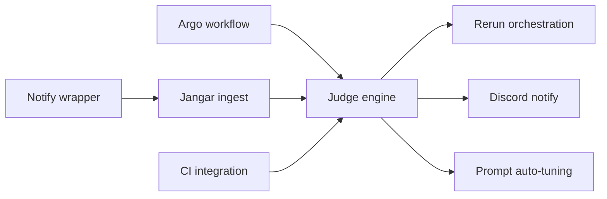

# Implementation Details: Codex Judge + Resumable Argo

This document splits the work into parallel tracks and provides concrete interfaces, schemas, and workflow steps.

## Workstreams (Parallel)

A) Argo workflow updates (Froussard)
B) Notify wrapper
C) Jangar ingestion + persistence
D) GitHub Actions status integration
E) Judge engine (gates + LLM)
F) Orchestration (rerun trigger)
G) Discord notifications
H) Prompt auto-tuning PRs

Blocking chain:
- A, B, C, D can start immediately.
- E depends on C and D.
- F and G depend on E.
- H depends on E.

Dependency graph:

## A) Argo Workflow Updates (Froussard)

### Required env inputs
- ISSUE_ID
- REPO_URL
- DEFAULT_BRANCH
- WORKFLOW_ID (Argo metadata)
- ATTEMPT (start at 1)
- PROMPT (current prompt text)

### Steps (high level)
1) checkout
   - clone repo
   - create or checkout branch codex/issue-<ISSUE_ID>
2) run codex exec
   - configure ~/.codex/config.toml to use notify wrapper
   - run Codex exec with PROMPT
   - capture codex log
3) commit+push
   - git add -A
   - if changes, git commit -m "codex: issue <id> attempt <n>"
   - git push
4) onExit: capture artifacts
   - git status --porcelain
   - git diff (patch)
   - git diff --stat
   - git rev-parse HEAD
   - package logs
   - upload to MinIO

### Deliverables
- Updated Argo workflow YAML with resumable branch-commit behavior.
- onExit artifact capture + MinIO upload step.
- Codex exec step configured with notify wrapper.

### Detailed tasks
- Define branch naming rule and implement create/checkout logic.
- Ensure Codex exec step writes logs to known paths.
- Add commit step that runs even on failure.
- Add onExit step to collect artifacts and upload to MinIO.
- Export artifact URLs as env for notify wrapper.
- Record runtime_meta.json (versions, env, workflow metadata, attempt).

### Acceptance criteria
- Run resumes from branch codex/issue-<ISSUE_ID> across attempts.
- Artifacts exist in MinIO for both success and failure.
- Codex notify payload includes artifact URLs and workflow metadata.

### Notes
- Always run onExit, even if Codex fails.
- If no changes, still record artifacts and mark empty diff.

## B) Notify Wrapper

### Purpose
Codex notify only provides minimal payload. Wrapper enriches with workflow metadata + artifact URLs and posts to Jangar.

### Inputs
- Raw notify JSON from Codex (last CLI arg)
- Env: ISSUE_ID, WORKFLOW_ID, ATTEMPT, BRANCH, ARTIFACT_BASE_URL, REPO, PR_ID (optional)

### Output
- POST /codex/notify to Jangar

### Retry
- Simple retry with backoff for transient errors (5xx, network).

### Deliverables
- Wrapper script or tiny service binary.
- Unit tests for payload enrichment.
- Config docs for Codex exec container.

### Detailed tasks
- Parse JSON from last CLI arg.
- Merge workflow metadata and artifact URLs.
- POST to Jangar with timeout + retry.
- Log failures to stderr for Argo log capture.
- Optionally persist notify payload to local file (for onExit artifact).

### Acceptance criteria
- Jangar receives enriched payload with artifacts.
- Wrapper does not block Codex exec completion.

## C) Jangar Ingestion + Persistence

### Endpoint
POST /codex/notify

### Payload schema (draft)
{
  "type": "agent-turn-complete",
  "thread-id": "...",
  "turn-id": "...",
  "cwd": "...",
  "input-messages": ["..."],
  "last-assistant-message": "...",
  "issue_id": "...",
  "workflow_id": "...",
  "attempt": 1,
  "branch": "codex/issue-123",
  "repo": "org/repo",
  "artifact_base_url": "s3://.../codex-artifacts/...",
  "artifacts": {
    "patch.diff": "...",
    "git_status.txt": "...",
    "git_diff_stat.txt": "...",
    "commit_sha.txt": "...",
    "codex.log": "...",
    "runtime_meta.json": "..."
  }
}

### Storage
Tables (or collections):
- runs(id, issue_id, workflow_id, attempt, branch, status, turn_id, thread_id, timestamps)
- artifacts(run_id, type, url, sha256)
- judge_evaluations(run_id, decision, confidence, reasons, missing_items, next_prompt)
- prompt_tuning(id, source_run_id, diff, pr_url, status)

### Idempotency
- Unique key: workflow_id + attempt + turn_id

### Deliverables
- Ingestion endpoint with validation.
- DB migrations for new tables.
- Run state machine implementation.

### Detailed tasks
- Validate payload schema and reject malformed input.
- Upsert run record; store artifacts metadata.
- Create state transitions: notified -> waiting_for_ci -> judging.
- Persist raw notify payload for audit.
- Expose internal API for judge pipeline to fetch run context.

### Acceptance criteria
- Duplicate notifications do not create duplicate runs.
- Artifacts and run metadata are queryable by issue_id.

## D) GitHub Actions Status Integration

### Goal
Provide CI status for a branch or PR.

### Options
- Webhook receiver in Jangar, or
- Polling GitHub API for workflow runs by branch.

### Expected fields
- ci_status: pending | success | failure
- ci_url
- conclusion_time
- commit_sha (must match attempt commit_sha)

### Commit-scoped gating
- Use the attempt commit SHA (from artifacts) as the key for CI checks.
- Do not use branch-level status, because shared resumable branches can show stale green checks.

### Deliverables
- CI status updater (webhook or polling).
- Mapping of CI status to run records.

### Detailed tasks
- Decide integration mode (webhook preferred if available).
- Implement GitHub API client with rate limiting.
- Map branch -> workflow run -> conclusion.
- Store CI status in run record; trigger judge once final.

### Acceptance criteria
- Judge runs only after CI conclusion is success or failure.
- CI URLs are stored and surfaced in Discord messages.

## E) Judge Engine

### Deterministic gates
- ci_status must be success for the attempt commit_sha
- merge conflict detection: check if patch apply failed or conflict markers present
- diff non-empty (unless task allows no-op)

### LLM judge input
- Issue title/body
- diff
- codex summary (last-assistant-message)
- artifacts and logs

### LLM judge output (JSON)
{
  "decision": "pass" | "fail",
  "confidence": 0-1,
  "requirements_coverage": ["..."],
  "missing_items": ["..."],
  "suggested_fixes": ["..."],
  "next_prompt": "...",
  "prompt_tuning_suggestions": ["..."],
  "system_improvement_suggestions": ["..."]
}

### Deliverables
- Gate evaluator with deterministic checks.
- LLM judge with JSON schema validation.
- Stored evaluation record with reasons and fixes.

### Detailed tasks
- Implement CI gate (block until success, fail on failure).
- Merge conflict detection using diff/markers.
- Define rubric prompt template and schema.
- Validate LLM output and handle retries on invalid JSON.
- Generate next_prompt for reruns when failing.

### Acceptance criteria
- Deterministic gates block incomplete work before LLM.
- LLM output is always valid JSON or retried.
- Decision is persisted and correlated to run.

## F) Orchestration (Rerun Trigger)

### Behavior
- If decision == fail: trigger new Argo run
- Use same branch codex/issue-<id>
- Provide next_prompt
- Increment attempt

### Implementation
- Jangar calls Facteur to submit the Argo workflow rerun
- Include run metadata + prompt in submission

### Deliverables
- Rerun submission logic with idempotency.
- Attempt counter stored per issue.

### Detailed tasks
- Construct rerun payload with branch, prompt, attempt+1.
- Implement Facteur API client and retries.
- Prevent duplicate reruns (idempotency key).
- Record link between run and rerun parent.

### Acceptance criteria
- Rerun starts with correct branch and prompt via Facteur.
- Attempts are monotonic and capped by policy.

## G) Discord Notifications

### Success only (general channel)
- Include issue link, PR link, CI link, summary, artifacts

### Escalation (rare)
- Only on hard failures (conflicts, repeated infra failure, repeated same failure)

### Deliverables
- Discord webhook integration.
- Standard message template.

### Detailed tasks
- Compose message with links + short summary.
- Only send on success, unless escalation conditions met.
- Rate limit and error handling.

### Acceptance criteria
- Success notifications appear in general channel with correct links.
- Escalations are rare and only for defined hard failures.

## H) Prompt Auto-tuning PRs

### Pipeline
- Aggregate repeated failure reasons
- Modify prompt template
- Create PR with summary and run references
- Track PR status in Jangar
 - For needs_iteration and needs_human outcomes, always create a PR with system prompt and
   system-level improvement suggestions (not just prompt text edits).

### Deliverables
- Prompt tuning job producing PRs.
- Prompt version metadata stored in Jangar.

### Detailed tasks
- Define prompt template location and edit strategy.
- Generate patch from tuning suggestions.
- Create PR branch and open PR automatically.
- Track PR status and link to runs that caused change.
 - Include system-level improvement suggestions in the PR description or companion doc.

### Acceptance criteria
- PR created with minimal diff and clear rationale.
- Prompt version updated only via PR merge.

## Parallel Execution Plan (Agent Split)

Agent 1: Argo workflow updates (Workstream A)
Agent 2: Notify wrapper (Workstream B)
Agent 3: Jangar ingestion + persistence (Workstream C)
Agent 4: GitHub Actions integration (Workstream D)
Agent 5: Judge engine (Workstream E)
Agent 6: Orchestration (Workstream F)
Agent 7: Discord integration (Workstream G)
Agent 8: Prompt auto-tuning PRs (Workstream H)

## Minimal Blocking Sequence
1) Complete A, B, C, D in parallel.
2) Once C + D complete, implement E.
3) F + G depend on E.
4) H depends on E (optional if prompt tuning is deferred).

## Validation Checklist
- Argo runs produce artifacts even on failure.
- Notify wrapper posts to Jangar with expected schema.
- Jangar waits for CI and stores judge output.
- Rerun triggers resume from branch.
- Discord notifications only on success unless hard failure escalation.
