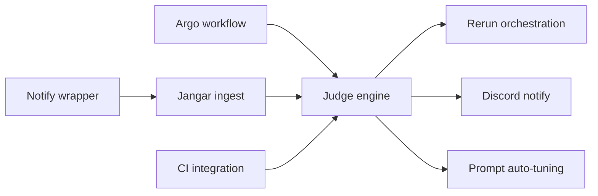

# Implementation Details: Codex Judge + Resumable Argo

This document splits the work into parallel tracks and provides concrete interfaces, schemas, and workflow steps.
The judge pipeline is triggered by the Argo run-complete event; notify is enrichment only.

Current production context (see `docs/codex-workflow.md`):
- Workflow template: `argocd/applications/froussard/github-codex-implementation-workflow-template.yaml`
- Workflow outputs: `.codex-implementation-changes.tar.gz`, `.codex-implementation.patch`, `.codex-implementation-status.txt`
- Argo Events -> Kafka completions: `argocd/applications/froussard/workflow-completions-*.yaml`
- Kafka topics: `github.issues.codex.tasks`, `argo.workflows.completions`

## Workstreams (Parallel)

A) Argo workflow updates (Froussard)
B) Notify wrapper
C) Jangar ingestion + persistence
D) GitHub Actions status integration
E) Judge engine (gates + LLM)
F) Orchestration (rerun trigger)
G) Discord notifications
H) Prompt auto-tuning PRs

Blocking chain:
- A, B, C, D can start immediately.
- E depends on C and D.
- F and G depend on E.
- H depends on E.

Dependency graph:

## A) Argo Workflow Updates (Froussard)

### Required inputs (already in the template)
- `eventBody` (base64 JSON), `rawEvent`, `head`, `base`

### What already exists
- Workflow `github-codex-implementation` runs `codex-implement.ts` and uploads three artifacts:
  `.codex-implementation-changes.tar.gz`, `.codex-implementation.patch`, `.codex-implementation-status.txt`.

### Additions needed
- Extend workflow outputs to include:
  - `.codex-implementation.log`
  - `.codex-implementation-events.jsonl`
  - `.codex-implementation-agent.log`
  - `.codex-implementation-runtime.log`
  - `.codex/implementation-resume.json`
- Add labels/annotations on the workflow for repo/issue/head/base to ease correlation
  (these can be derived from `eventBody` during submission).
- Ensure Argo artifact repository is used consistently (already configured in
  `argocd/applications/argo-workflows/kustomization.yaml`).

### Deliverables
- Updated workflow template artifact outputs.
- Optional: workflow labels/annotations for repo/issue/head/base.

### Detailed tasks
- Update `argocd/applications/froussard/github-codex-implementation-workflow-template.yaml`
  `outputs.artifacts` to include new log/resume files.
- Verify `codex-implement.ts` writes the log paths used by the workflow outputs.
- Validate Argo artifact repository is reachable in the workflow namespace.

### Acceptance criteria
- New artifacts appear in MinIO for each run.
- Jangar can fetch outputs via the Argo Workflow API.

## B) Notify Wrapper

### Purpose
Codex notify only provides minimal payload. In the current implementation, Codex runs via
`CodexRunner` inside `codex-implement.ts`, so notify must be invoked from the runner (or derived
from JSON event logs) rather than relying on CLI config alone.

### Inputs
- Raw notify JSON from Codex (if emitted), or parsed summary from `.codex-implementation-events.jsonl`
- Workflow metadata from the event payload (repo, issue, head/base, workflow name)

### Output
- POST /api/codex/notify to Jangar

### Retry
- Simple retry with backoff for transient errors (5xx, network).

### Deliverables
- Wrapper script or tiny service binary.
- Unit tests for payload enrichment.
- Config docs for Codex exec container.

### Detailed tasks
- Add a post-run hook in `codex-implement.ts` that emits a notify payload derived from
  `runCodexSession` results and/or the JSON event log.
- Merge workflow metadata (repo/issue/head/base/workflow name).
- POST to Jangar with timeout + retry.
- Log failures to stderr for Argo log capture.
- Persist notify payload to a local file so it can be uploaded as an Argo artifact.

### Acceptance criteria
- Jangar receives an enrichment payload even when CLI notify is unavailable.
- Notify emission does not block workflow completion.

## C) Jangar Ingestion + Persistence

### Endpoints
- POST /api/codex/notify
- POST /api/codex/run-complete (CloudEvent from KafkaSource)

Run-complete is the primary trigger for judging; notify only enriches the run context.

### notify payload (draft)
{
  "type": "agent-turn-complete",
  "thread-id": "...",
  "turn-id": "...",
  "cwd": "...",
  "input-messages": ["..."],
  "last-assistant-message": "...",
  "issue_id": "...",
  "workflow_id": "...",
  "attempt": 1,
  "branch": "codex/issue-123",
  "repo": "org/repo",
  "workflow_name": "github-codex-implementation-abc123",
  "workflow_namespace": "argo-workflows",
  "artifact_refs": ["implementation-changes", "implementation-patch", "implementation-status"]
}

### run-complete payload (draft, from `argo.workflows.completions` sensor)
{
  "metadata": {
    "name": "github-codex-implementation-abc123",
    "namespace": "argo-workflows",
    "uid": "...",
    "labels": { "codex.stage": "implementation" },
    "annotations": {}
  },
  "status": {
    "phase": "Succeeded" | "Failed" | "Error",
    "startedAt": "...",
    "finishedAt": "..."
  },
  "arguments": {
    "parameters": [
      { "name": "eventBody", "value": "<base64 JSON>" },
      { "name": "rawEvent", "value": "<base64 JSON>" },
      { "name": "head", "value": "codex/issue-123" },
      { "name": "base", "value": "main" }
    ]
  },
  "stage": "implementation"
}

Note: KafkaSource delivers the payload as a CloudEvent. Jangar should read the JSON body
from the CloudEvent `data` field (or directly if the source is configured to pass raw data).

### Storage
Tables (or collections):
- runs(id, issue_id, workflow_id, attempt, branch, status, turn_id, thread_id, timestamps)
- artifacts(run_id, type, url, sha256)
- judge_evaluations(run_id, decision, confidence, reasons, missing_items, next_prompt)
- prompt_tuning(id, source_run_id, diff, pr_url, status)

Use the existing Postgres wiring in `services/jangar/src/server/db.ts` (jangar-db).

### Idempotency
- Unique key: workflow name + workflow uid (from run-complete); attach notify by workflow name.

### Deliverables
- Ingestion endpoint with validation.
- DB migrations for new tables.
- Run state machine implementation.
- Knative KafkaSource to deliver `argo.workflows.completions` to Jangar
  (new manifest under `argocd/applications/jangar`).

### Detailed tasks
- Validate payload schema and reject malformed input.
- Upsert run record; store artifacts metadata.
- Create run record on run-complete even if notify never arrived.
- If notify arrives first, attach it to the existing run once run-complete arrives.
- Create state transitions: run_complete -> waiting_for_ci -> judging.
- Persist raw notify payload for audit.
- Expose internal API for judge pipeline to fetch run context.
- Decode `eventBody` from workflow arguments to recover repo/issue/head/base.
- Query Argo Workflow API for artifact outputs (or extend the sensor payload).
 - Unpack `implementation-changes` archive and read `metadata/manifest.json` for prompt/session details.
- Add `services/jangar/src/routes/api/codex/run-complete.ts` and
  `services/jangar/src/routes/api/codex/notify.ts` (TanStack router).
- Configure KafkaSource sink to `jangar` service with `uri: /api/codex/run-complete`.

### Acceptance criteria
- Duplicate notifications do not create duplicate runs.
- Artifacts and run metadata are queryable by issue_id.
- Failed runs without notify are still recorded and retried.
- Judge starts only after run-complete exists (notify does not trigger judging).

## D) GitHub Actions Status Integration

### Goal
Provide CI status for the attempt commit SHA (prefer PR head SHA).

### Options
- Webhook receiver in Jangar, or
- Polling GitHub API for workflow runs by commit SHA.

### Expected fields
- ci_status: pending | success | failure
- ci_url
- conclusion_time
- commit_sha (must match attempt commit_sha)

### Commit-scoped gating
- Use the attempt commit SHA (from artifacts) as the key for CI checks.
- Do not use branch-level status, because shared resumable branches can show stale green checks.

### Implementation notes
- Jangar already has `GITHUB_TOKEN` in `argocd/applications/jangar/deployment.yaml`; use it to
  query check-runs or workflow runs by commit SHA.
- Prefer PR head SHA (from GitHub API) over branch head to avoid stale results.

### Deliverables
- CI status updater (webhook or polling).
- Mapping of CI status to run records.

### Detailed tasks
- Decide integration mode (webhook preferred if available).
- Implement GitHub API client with rate limiting.
- Map commit SHA -> workflow run -> conclusion.
- Store CI status in run record; trigger judge once final.

### Acceptance criteria
- Judge runs only after CI conclusion is success or failure.
- CI URLs are stored and surfaced in Discord messages.

## E) Judge Engine

### Deterministic gates
- ci_status must be success for the attempt commit_sha
- merge conflict detection: check if patch apply failed or conflict markers present
- diff non-empty (unless task allows no-op)

### LLM judge input
- Issue title/body
- diff
- codex summary (last-assistant-message)
- artifacts and logs

### LLM judge output (JSON)
{
  "decision": "pass" | "fail",
  "confidence": 0-1,
  "requirements_coverage": ["..."],
  "missing_items": ["..."],
  "suggested_fixes": ["..."],
  "next_prompt": "...",
  "prompt_tuning_suggestions": ["..."],
  "system_improvement_suggestions": ["..."]
}

### Deliverables
- Gate evaluator with deterministic checks.
- LLM judge with JSON schema validation.
- Stored evaluation record with reasons and fixes.

### Detailed tasks
- Implement CI gate (block until success, fail on failure).
- Merge conflict detection using diff/markers.
- Define rubric prompt template and schema.
- Validate LLM output and handle retries on invalid JSON.
- Generate next_prompt for reruns when failing.

### Acceptance criteria
- Deterministic gates block incomplete work before LLM.
- LLM output is always valid JSON or retried.
- Decision is persisted and correlated to run.

## F) Orchestration (Rerun Trigger)

### Behavior
- If decision == fail: trigger new Argo run
- Use same branch codex/issue-<id>
- Provide next_prompt
- Increment attempt

### Implementation
- Jangar calls Facteur `/codex/tasks` to submit the Argo workflow rerun
- Include run metadata + prompt in submission

### Deliverables
- Rerun submission logic with idempotency.
- Attempt counter stored per issue.

### Detailed tasks
- Construct a `CodexTask` protobuf payload with the same repo/issue/head/base and updated prompt.
- Use schema from `proto/proompteng/froussard/v1/codex_task.proto`.
- Use `delivery_id` derived from issue + attempt for idempotency.
- POST to `facteur-internal` (`argocd/applications/facteur/overlays/cluster/facteur-internal-service.yaml`)
  with `Content-Type: application/x-protobuf`.
- Implement Facteur API client and retries.
- Prevent duplicate reruns (idempotency key).
- Record link between run and rerun parent.

### Acceptance criteria
- Rerun starts with correct branch and prompt via Facteur.
- Attempts are monotonic and capped by policy.

## G) Discord Notifications

### Success only (general channel)
- Include issue link, PR link, CI link, summary, artifacts

### Escalation (rare)
- Only on hard failures (conflicts, repeated infra failure, repeated same failure)

### Deliverables
- Discord webhook integration.
- Standard message template.

### Detailed tasks
- Compose message with links + short summary.
- Only send on success, unless escalation conditions met.
- Rate limit and error handling.

### Acceptance criteria
- Success notifications appear in general channel with correct links.
- Escalations are rare and only for defined hard failures.

## H) Prompt Auto-tuning PRs

### Pipeline
- Aggregate repeated failure reasons
- Modify prompt template
- Create PR with summary and run references
- Track PR status in Jangar
 - For needs_iteration and needs_human outcomes, always create a PR with system prompt and
   system-level improvement suggestions (not just prompt text edits).

### Deliverables
- Prompt tuning job producing PRs.
- Prompt version metadata stored in Jangar.

### Detailed tasks
- Define prompt template location and edit strategy.
- Generate patch from tuning suggestions.
- Create PR branch and open PR automatically.
- Track PR status and link to runs that caused change.
 - Include system-level improvement suggestions in the PR description or companion doc.

### Acceptance criteria
- PR created with minimal diff and clear rationale.
- Prompt version updated only via PR merge.

## Parallel Execution Plan (Agent Split)

Agent 1: Argo workflow updates (Workstream A)
Agent 2: Notify wrapper (Workstream B)
Agent 3: Jangar ingestion + persistence (Workstream C)
Agent 4: GitHub Actions integration (Workstream D)
Agent 5: Judge engine (Workstream E)
Agent 6: Orchestration (Workstream F)
Agent 7: Discord integration (Workstream G)
Agent 8: Prompt auto-tuning PRs (Workstream H)

## Minimal Blocking Sequence
1) Complete A, B, C, D in parallel.
2) Once C + D complete, implement E.
3) F + G depend on E.
4) H depends on E (optional if prompt tuning is deferred).

## Validation Checklist
- Argo runs produce artifacts even on failure.
- Notify wrapper posts to Jangar with expected schema.
- Jangar waits for CI and stores judge output.
- Rerun triggers resume from branch.
- Discord notifications only on success unless hard failure escalation.
