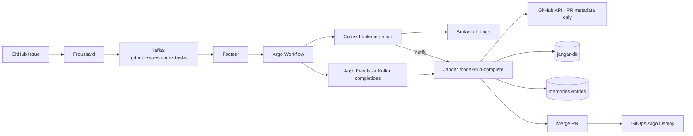
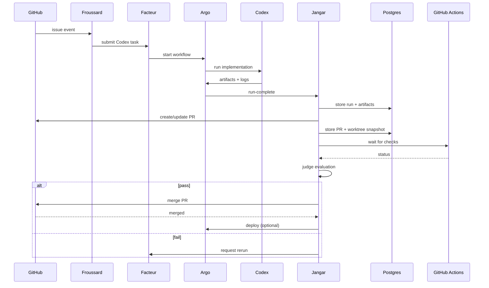
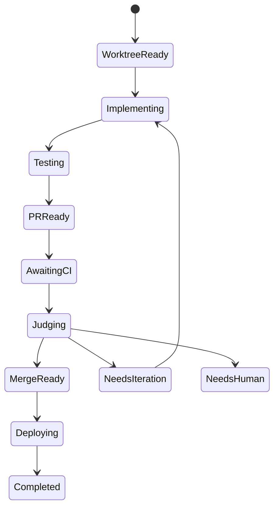

# One-Shot Autonomous Codex Run (Argo -> Jangar -> GitHub -> Deploy)

Date: 2026-01-04
Status: Design draft for immediate implementation
Owner: Jangar
Scope: Single autonomous Argo workflow run that completes implementation, tests, PR, judging, merge, and deploy.

## 1) Snapshot: Ground Truth (Cluster + DB)

This design is grounded in the current live cluster and the `jangar` database.

### 1.1 Kubernetes
- Namespace: `jangar`
  - Pods: `jangar` (2 containers), `bumba` (2 pods), `jangar-db-1`, `jangar-openwebui-redis-0`, `open-webui-0`
  - Services: `jangar`, `jangar-db-rw/ro/r`, `jangar-openwebui-redis`, `open-webui`, `jangar-tailscale`
- Namespace: `argo-workflows`
  - Completed `github-codex-implementation-*` workflows exist (e.g., `github-codex-implementation-20260103-*`).
- Namespace: `nats` exists (NATS cluster running).
- Namespace: `facteur` exists with `facteur-internal` service.

### 1.2 CNPG (Postgres)
- CNPG cluster: `jangar-db` in namespace `jangar`, Postgres 17.0, backup to `s3://argo-workflows/cnpg/jangar`.
- Database: `jangar` with schemas: `codex_judge`, `jangar_github`, `workflow_comms`, `terminals`, `memories`, `atlas`, `public`.

### 1.3 Current DB Counts (2026-01-04)
```
 codex_judge.runs              88
 codex_judge.evaluations       60
 codex_judge.artifacts         120
 codex_judge.prompt_tuning     9
 codex_judge.rerun_submissions 13

 jangar_github.events          513
 jangar_github.pr_state        2
 jangar_github.review_state    1
 jangar_github.check_state     15
 jangar_github.pr_files        2
 jangar_github.review_threads  2
 jangar_github.comments        3
 jangar_github.write_actions   0

 workflow_comms.agent_messages 326
 terminals.sessions            23
 memories.entries              918
```

### 1.4 Observed Gaps
- `jangar_github.pr_files` only has 2 rows (PR #2304). This confirms file snapshots are incomplete and **must be sourced from the local worktree only**.
- `jangar_github.check_state` stores 15 distinct commit SHAs across 2 PRs, so UI must group checks by commit.
- `jangar_github.write_actions` is empty, so no automated merges have occurred yet.

## 2) Goal

A **single autonomous Argo workflow** must fully execute:
1) worktree provisioning
2) implementation
3) tests
4) PR creation/update
5) authoritative file snapshot
6) CI + review gating
7) judge evaluation
8) merge
9) deploy
10) persistence of evidence + audit logs

No separate phases. One run must complete everything or halt on `needs_human`.

## 3) Existing Implementation Baseline (Code)

### Codex Judge
- `services/jangar/src/server/codex-judge.ts`
- `services/jangar/src/server/codex-judge-store.ts`
- `services/jangar/src/server/codex-judge-gates.ts`
- Artifacts via `services/jangar/src/server/argo-client.ts` and MinIO

### GitHub Review
- `services/jangar/src/server/github-review-ingest.ts`
- `services/jangar/src/server/github-review-store.ts`
- `services/jangar/src/server/github-review-actions.ts`

### Worktrees
- `services/jangar/src/server/bumba.ts`
- `services/jangar/src/server/terminals.ts`
- `services/jangar/src/server/chat.ts`

### Agent Comms
- `services/jangar/src/server/agent-comms-subscriber.ts`
- `services/jangar/src/routes/api/agents/events.ts`

## 4) One-Shot Architecture



## 5) One-Shot Workflow (Detailed)

### 5.1 Inputs
- `repository` (e.g., `proompteng/lab`)
- `issueNumber`
- `base` (e.g., `main`)
- `head` (e.g., `codex/issue-<n>`)
- `prompt`

### 5.2 Step 1: Worktree Provisioning (Authoritative File Source)
- Use worktree root `${CODEX_CWD}/.worktrees`.
- Worktree name: `pr-${owner}-${repo}-${issueNumber}`.
- If exists: `git fetch --all` then `git reset --hard <head>`.
- If not: `git worktree add --detach <path> <head>`.
- Store in DB (`jangar_github.pr_worktrees`).

### 5.3 Step 2: Implementation
- Run Codex agent in worktree.
- Generate patch artifacts and logs.
- Produce `.codex-implementation-changes.tar.gz` with `metadata/manifest.json`.

### 5.4 Step 3: Tests
- Run repo-appropriate tests.
- Append results to `implementation-log` artifact.
- If tests fail, mark `ci_status=failure` but continue to PR for full visibility.

### 5.5 Step 4: PR Creation / Update
- Use `github.createPullRequest`.
- If PR exists for branch, update description.
- Call `codex_judge.updateRunPrInfo` to persist PR number, URL, and head SHA.

### 5.6 Step 5: Authoritative File Snapshot
- Generate diff: `git diff --name-status <base>..<head>`.
- Optional patch: `git diff -U3 <base>..<head>`.
- Store results in `jangar_github.pr_files` with `source='worktree'`.
- **No GitHub API usage is permitted for file lists or patches.** The local worktree is the single source of truth.

### 5.7 Step 6: CI + Review Gate
- CI status: `jangar_github.check_state` grouped by commit SHA.
- Review status: `jangar_github.review_state` (decision + unresolved thread count).
- Mergeability: GitHub API `mergeable_state`.

### 5.8 Step 7: Codex Judge
- Evaluate via `services/jangar/src/server/codex-judge.ts`.
- Requirements:
  - CI green
  - Review clear
  - Mergeable state clean/ok
  - Judge decision = pass

### 5.9 Step 8: Merge PR
- Use `mergePullRequest` in `github-review-actions.ts`.
- Record in `jangar_github.write_actions`.

### 5.10 Step 9: Deploy
- GitOps preferred: merge triggers Argo CD sync.
- Optionally trigger Argo deploy workflow via `argo-client.ts`.

### 5.11 Step 10: Post-Deploy Verification (Required)
After the deployment is reported ready, the system must **automatically run end-to-end and integration tests**.
- Run service-level integration suites (API + workflow hooks).
- Run UI E2E suites (Playwright) covering the PR review surface and judge linkage.
- Failures must gate completion and trigger either rollback or `needs_iteration`.
  - Record failures in artifacts and `codex_judge.evaluations` with a clear reason.

### 5.12 Step 11: Persist Evidence
- Store artifacts in `codex_judge.artifacts`.
- Store evaluation in `codex_judge.evaluations`.
- Store memories in `memories.entries`.

## 6) Data Model Changes

### 6.1 `jangar_github.pr_files`
Add `source text not null default 'worktree'`.
- Only worktree snapshots are valid; no API backfill is allowed for PR files or patches.

### 6.2 `jangar_github.pr_worktrees` (new)
Tracks worktree allocations to make runs deterministic.

```
CREATE TABLE jangar_github.pr_worktrees (
  id uuid PRIMARY KEY DEFAULT gen_random_uuid(),
  repository text NOT NULL,
  pr_number integer NOT NULL,
  worktree_name text NOT NULL,
  worktree_path text NOT NULL,
  base_sha text,
  head_sha text,
  last_refreshed_at timestamptz NOT NULL,
  UNIQUE (repository, pr_number)
);
```

## 7) API Changes

### 7.1 Judge Runs by PR
`GET /api/github/pulls/:owner/:repo/:number/judge-runs`
- Returns all `codex_judge.runs` for the PR.

### 7.2 Checks Grouped by Commit
`GET /api/github/pulls/:owner/:repo/:number/checks`
- Returns grouped check runs by `commit_sha`.

### 7.3 Worktree Snapshot Refresh
`POST /api/github/pulls/:owner/:repo/:number/refresh-files`
- Triggers worktree diff and updates `pr_files` with `source='worktree'`.

## 8) UI Requirements (PR Detail Page)
- Replace button group with tabs (Overview / Files / Conversation / Checks / Judge).
- Checks tab grouped by commit SHA.
- Files tab shows full file tree from worktree snapshot.
- Judge tab links to run history.

## 9) Mermaid Diagrams

### 9.1 Sequence: One-Shot Run


### 9.2 State: Run Lifecycle


## 10) Success Criteria
- Worktree snapshot exists for PR with `source='worktree'`.
- CI + review + mergeable = pass.
- Judge decision = pass.
- PR merged and deployment triggered.
- Post-deploy E2E + integration tests completed successfully.
- Artifacts and memories persisted.

## 11) Operational Notes
- Jangar already has env vars for GitHub, NATS, MinIO, Facteur, Argo.
- `jangar_github.pr_files` is currently incomplete; worktree is mandatory.
- `jangar_github.write_actions` currently empty; this run should populate it.
