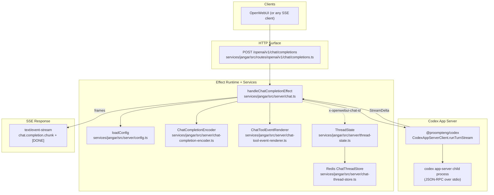

# Jangar service current state (2025-12-14)

This note describes the current Jangar OpenAI-compatible chat-completions proxy and its supporting services. Source of truth:

- `services/jangar/src/routes/openai/v1/chat/completions.ts`
- `services/jangar/src/server/chat.ts`
- `services/jangar/src/server/chat-completion-encoder.ts`
- `services/jangar/src/server/chat-tool-event-renderer.ts`
- `services/jangar/src/server/thread-state.ts`
- `services/jangar/src/server/chat-thread-store.ts`

## Architecture (components)



## Endpoint surface

- POST `/openai/v1/chat/completions` (streaming only).
- Handler chain:
  - Route wiring: `services/jangar/src/routes/openai/v1/chat/completions.ts`
  - Logic: `services/jangar/src/server/chat.ts` (`handleChatCompletionEffect` → `toSseResponse`)
- Request schema highlights:
  - `messages`: non-empty array of `{ role, content, name? }`
  - `stream` must be `true` (otherwise an SSE error payload + `[DONE]`)
  - optional `model`
  - optional `stream_options`:
    - `include_usage: boolean` (default `false`)
    - `include_plan: boolean` (default `true`; set `false` to suppress plan todos)

## Prompt building

- Prompt sent to Codex is built by joining messages as `"role: content"` lines.
- For OpenAI-style `content` part arrays, text parts are concatenated and non-text parts are summarized (e.g. `[image_url] <url>`).

## Codex integration

- Stream is driven by `client.runTurnStream(prompt, { model, cwd })`.
- `cwd` defaults to the repo root; override with `CODEX_CWD` (production default `/workspace/lab`).
- Turn interruption:
  - On client abort the handler emits an SSE error chunk (`request_cancelled`) and interrupts the active Codex turn (or marks a pending interrupt until ids arrive).

## OpenWebUI thread continuity (optional)

If a request includes `x-openwebui-chat-id`, Jangar persists thread state to keep OpenWebUI chats “continuous” across requests:

- The handler reads/writes thread state via the Effect service `ThreadState`.
- `ThreadState` lazily initializes a Redis-backed `ChatThreadStore` (only when needed).
- Required config for this feature:
  - `JANGAR_REDIS_URL`
  - optional `JANGAR_CHAT_KEY_PREFIX` (defaults to `openwebui:chat`)
- Behavior:
  - Stores the latest `threadId` for the chat id.
  - Stores a monotonically increasing `turnNumber`.
  - If Codex returns “conversation not found” for a stored thread id, Jangar clears the mapping and retries once with a new thread.

## SSE response shape

- Headers: `content-type: text/event-stream`, `cache-control: no-cache`, `connection: keep-alive`, `x-accel-buffering: no`.
- Heartbeat: `: keepalive` every 5s (disabled in tests); no initial `retry:` hint.
- Stream termination: ends with `data: [DONE]`.

## Streamed content model

All output is emitted as OpenAI-style `chat.completion.chunk` frames so OpenWebUI can render it.

- **Assistant text**: `choices[0].delta.content` chunks (role attached only on the first emitted chunk).
- **Reasoning**: emitted as `reasoning_content` (asterisks of length ≥4 are broken onto newlines to avoid accidental fences; flushed immediately to avoid long silent periods).
- **Plan updates**: `delta.type === 'plan'` is rendered into assistant content as markdown todos:
  - completed: `- [x] ...`
  - pending: `- [ ] ...`
  - in progress: `- [ ] ... (in progress)`
- **Tool events** (from `delta.type === 'tool'`, rendered into human-friendly markdown):
  - `command`: opens a fenced block; emits truncated output/detail (max 5 lines). If the upstream only provides aggregated output on completion, that aggregated output is rendered.
  - `file`: skips `started`; renders each change as a fenced block with `<path>\n<diff...>` truncated to 5 lines; dedupes identical summaries.
  - `webSearch`: emits the query in backticks (no fencing).
- **Usage**:
  - When `stream_options.include_usage=true`, usage is normalized to OpenAI fields and emitted once near the end (even if an upstream error occurred).
- **Errors**: upstream errors are forwarded as `{ error: { message, type, code? } }` and the stream continues listening for trailing usage updates.

## Notable behaviors / gaps

- Tool calls are rendered as text/fences, not OpenAI `tool_calls` objects; this is intentional to avoid OpenWebUI attempting tool re-execution.
- Response caching is disabled via `no-cache` but not `no-store`; intermediaries could still buffer.
- Heartbeat interval is 5s and there is no initial `retry:` directive; some proxies can still time out idle connections.

## Smoke test

From `services/jangar`:

```bash
bun run dev
curl -N -X POST http://localhost:3000/openai/v1/chat/completions \
  -H 'content-type: application/json' \
  -d '{"model":"gpt-5.3-codex","messages":[{"role":"user","content":"hi"}],"stream":true}'
```
