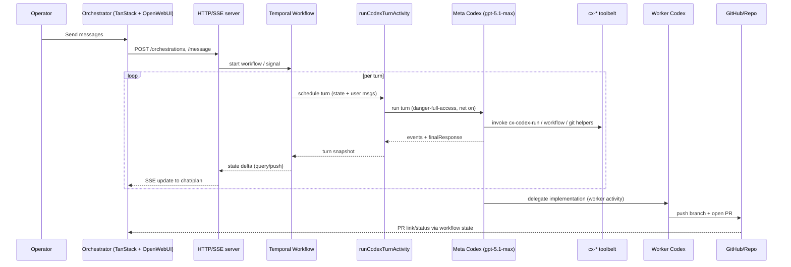
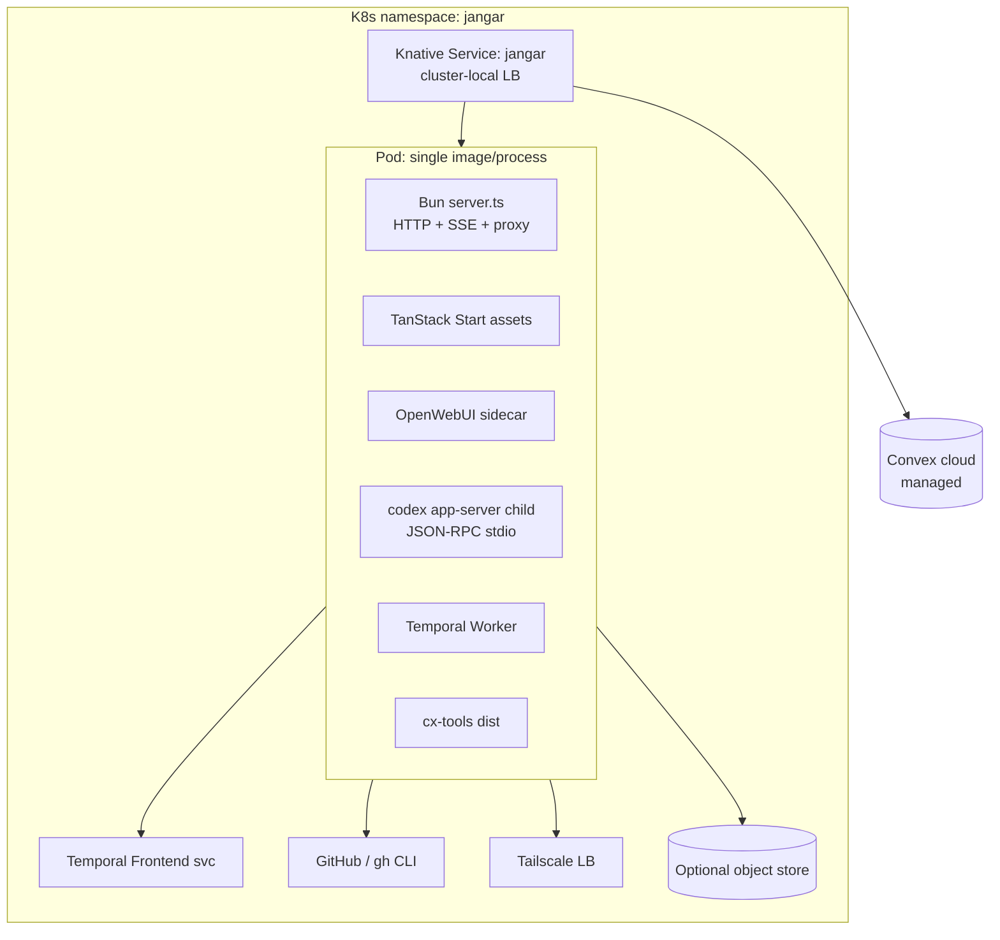

# Jangar Full-Stack Orchestrator — Design

## Overview

Jangar will become a single Bun-based service that provides:

- A Temporal workflow that runs **one Codex turn per Activity** (auditable, retryable, visible in history).
- A meta Codex (model `gpt-5.1-codex-max`, `danger-full-access`, network on, approval `never`) that plans and delegates work to worker Codex runs capable of repo changes and PR creation.
- HTTP + SSE APIs and a TanStack Start UI served from the same process for operators to chat and watch execution.
- Persistence in Convex (chat_sessions, chat_messages, work_orders per `docs/jangar/persistence.md`) for chat history, workflow/PR linkage, and recency sorting; optional object storage for raw logs.

## Goals

- Per-turn durability: every Codex turn is a Temporal Activity with stored snapshot.
- Full-stack in `services/jangar`: Temporal worker, HTTP/SSE API, UI assets.
- Repo automation: worker Codex runs can clone repos, apply changes, run tests/linters, and open PRs.
- Minimal token overhead: no MCP; use small Bun CLIs for side effects.

## Non-Goals (v1)

- Multi-repo coordination in one workflow.
- Rich RBAC; assume trusted operators.
- Long-term log archival (optional bucket, not mandatory).

- **Single entrypoint & image:** One Bun process (`services/jangar/src/server.ts`) in one container image. It starts HTTP/SSE APIs, serves TanStack Start UI, runs/owns a long-lived `codex app-server` child, and hosts the Temporal worker. OpenWebUI runs as a sidecar container (or bundled assets) pointed at the in-process OpenAI proxy.
- **Workflow:** `codexOrchestrationWorkflow` loops, invoking `runCodexTurnActivity` for each turn; delegates worker tasks via `runWorkerTaskActivity`; exposes signals/queries.
- **Activities:**
  - `runCodexTurnActivity`: run one Codex turn with configured sandbox/model/env; returns events + snapshot.
  - `runWorkerTaskActivity`: clone repo, execute worker Codex, run lint/tests, push branch, open PR.
  - Optional `publishEventActivity` to push deltas to SSE broker.
- **Toolbelt:** `packages/cx-tools` Bun CLIs (`cx-codex-run`, `cx-workflow-*`, optional `cx-log`) emitting single-line JSON; used by Codex shell calls instead of MCP.
- **Persistence:** Convex collections `chat_sessions`, `chat_messages`, and `work_orders` (see `docs/jangar/persistence.md`) to store conversations, message history, and workflow/PR linkage; optional bucket for raw event logs; OpenWebUI conversations map to `chat_sessions`, and `work_orders.workflowId` links to Temporal.
- **Orchestrator UI:** TanStack Start shell plus OpenWebUI front-end pointed at our OpenAI-compatible proxy; exposes a `meta-orchestrator` model that routes into the workflow.

## Diagrams

### Turn-by-turn flow



### Deployment view



## Infra Changes (Argo/CD)

- No in-cluster database. Persist state in Convex; provision a `production` deployment (cloud or self-hosted via ArgoCD `argocd/applications/convex`). Create a service user deploy key with write access.
- `argocd/applications/jangar/kservice.yaml` updates:
  - Env: `CONVEX_DEPLOYMENT` (e.g., `https://<deploy-id>.convex.cloud`), `CONVEX_DEPLOY_KEY` (Convex deploy key), `CODEX_API_KEY`, `GITHUB_TOKEN`; optional `CODEX_PATH`, `GH_HOST`, `GH_REPO`.
  - Keep Tailscale LB; containerPort 8080 serves HTTP/API/UI.
- OpenWebUI sidecar remains the same; now backed by Convex for conversation/orchestration persistence instead of Postgres.
- Optional: bucket creds (MinIO) for log archival; or small Redis for SSE fan-out (otherwise in-process emitter).

## Component Design (code paths)

1) **Codex wrapper env passthrough**
   - `packages/codex/src/options.ts`: add `env?: Record<string,string>` to `CodexOptions`.
   - `packages/codex/src/codex-exec.ts`: pass provided env to `spawn` (fallback `process.env`).
   - Re-export in `packages/codex/src/index.ts`.

2) **Toolbelt (no MCP)** — `packages/cx-tools`
   - CLIs: `cx-codex-run`, `cx-workflow-start`, `cx-workflow-signal`, `cx-workflow-query`, `cx-workflow-cancel`, optional `cx-log`.
   - Flags only; outputs single-line JSON.
   - Guard shell wrapper/allowlist for Codex-run commands.
   - Build to `packages/cx-tools/dist`; expose via package `bin`.

3) **Activities** — `services/jangar/src/activities`
   - `run-codex-turn.ts`: inputs `{threadId?, prompt, images?, depth, repoUrl?, workdir?, userMessages?, constraints?}`.
     - Prepare temp `CODEX_HOME`, temp workdir (clone if repoUrl).
     - Env: `CODEX_API_KEY`, optional `CODEX_PATH`, prepend toolbelt `bin`, set `CX_DEPTH`.
     - Run Codex turn with `model gpt-5.1-max`, `sandbox danger-full-access`, `networkAccessEnabled true`, `approvalPolicy never`.
     - Capture events; return snapshot `{threadId, finalResponse, items, usage, planSummary?, filesTouched?, commandsRun?}`.

- `run-worker-task.ts`: inputs `{repoUrl, task, depth, baseBranch?, tests?, lint?}`.
  - Clone shallow; branch `auto/<mission>-<id>`; run Codex worker (single or small loop), run lint/tests, push, open PR (`gh`/GitHub API); return `{prUrl, branch, commitSha, notes}`.
- Shared helpers in `services/jangar/src/lib/`: git ops, env builders, temp paths.

3.5) **Orchestrator (OpenWebUI front-end via app-server proxy)**

- Deploy OpenWebUI cluster-local; configure it to use Jangar’s OpenAI-compatible proxy with a single model `meta-orchestrator`.
    - Proxy handler in `services/jangar/src/server.ts` translates `/v1/chat/completions` into Codex app-server JSON-RPC calls (`thread/start`/`turn/start`) and streams deltas back in OpenAI format.
    - Default model served to OpenWebUI is now `gpt-5.1-codex-max`; requests for `meta-orchestrator` are mapped to this model to avoid Codex backend 400s.
    - Implementation notes:
  - Spawn long-lived `codex app-server` as a child process; perform `initialize` handshake once.
  - Map OpenWebUI conversation IDs to app-server thread IDs (persist in Convex).
  - Stream `item/agentMessage/delta` → OpenAI delta chunks; `turn/completed` → final chunk with `finish_reason` and `usage`.
  - Return `/v1/models` stub listing only `meta-orchestrator`.
  - Validate Bearer token against a shared secret; Codex auth remains local (CODEX session/API key).
  - App-server protocol is JSON-RPC 2.0 over stdio (line-delimited JSON); not HTTP. If HTTP is needed, the proxy provides it. Spec: <https://www.jsonrpc.org/specification>.
  - App-server honors per-turn `cwd`, `sandbox_policy`/`sandbox_mode`, `approvalPolicy`, and network toggles—so the proxy can let Codex scan/modify the repo by setting `cwd` to the repo root and `sandbox_mode` to `workspace-write` or `danger-full-access`.
    - Persist mapping `chat_id ↔ orchestration_id` in Convex so reloads stay consistent; replay history from Convex, not OpenWebUI’s local store.

4) **Workflow** — `services/jangar/src/workflows/index.ts`
   - `codexOrchestrationWorkflow` input `{topic, repoUrl, constraints?, depth=1, maxTurns=8}`.
   - State: `threadId`, `turns[]`, `workerPRs[]`, `status`, `lastUpdated`.
   - Loop: call `runCodexTurnActivity`; append snapshot; stop on “done” or maxTurns.
   - Delegate worker tasks via `runWorkerTaskActivity` when planner requests; feed results into next prompt.
   - Signals: `submitUserMessage`, `abort`. Queries: `getState`.

5) **Persistence layer** — Convex functions (see `docs/jangar/persistence.md`)
   - Collections: `chat_sessions` (chat metadata + recency), `chat_messages` (message history, tool metadata), `work_orders` (link to Temporal `workflowId`, GitHub issue/PR URLs, target repo/branch, status, requester).
   - Server functions to implement:
     - `chatSessions:create|get|list|updateLastMessage` (soft-delete aware)
     - `chatMessages:append|listBySession` (soft-delete aware)
     - `workOrders:create|updateStatus|updateResult|listBySession|get`
   - Indexing: chat_messages by `sessionId, createdAt`; work_orders by `sessionId, createdAt` and `status, updatedAt`.
   - Env: `CONVEX_URL`/`CONVEX_DEPLOYMENT`, `CONVEX_DEPLOY_KEY` (or admin key), optional `CONVEX_SELF_HOSTED_URL`/`CONVEX_SITE_ORIGIN` for self-hosted.
   - The Bun service calls Convex via the official JS client; Temporal activities write status/PR updates via these mutations; UI queries Convex for session lists/history.
   - Optional bucket writes remain for raw logs; Convex is the source of truth for chat + work-order state.

    ```mermaid
    flowchart LR
      UI["TanStack Start UI\n(services/jangar/src/ui)"] --> API["HTTP/SSE API\nservices/jangar/src/server.ts"]
      API --> CVX[(Convex mutations/queries)]
      API --> Temporal["Temporal Workflows\nservices/jangar/src/workflows"]
      Temporal --> Activities["Activities\nservices/jangar/src/activities"]
      Activities --> CVX
      Activities -->|optional| Bucket[(Object store)]
      API -. SSE .-> UI
    ```

6) **HTTP + SSE** — `services/jangar/src/server.ts`
 - `POST /chat-sessions` → create session in Convex (returns session id, default title).
  - `POST /chat-sessions/:id/messages` → append message; optional `workOrderId` when spawning work.
  - `POST /work-orders` → start workflow (Temporal) and persist `work_orders` record (`workflowId`, target repo/branch, status) linked to a chat session.
  - `POST /work-orders/:id/abort` → signal abort.
  - `GET /chat-sessions/:id` → Convex session + messages.
  - `GET /work-orders/:id/stream` → SSE of workflow/PR status deltas (Convex + Temporal query).
  - `/healthz` retained.

7) **UI (Orchestrator — TanStack Start + OpenWebUI)** — `services/jangar/src/ui/`
   - Routes: `/` (mission list), `/mission/$id` (chat, plan timeline, activity log, PR card).
   - TanStack Query for REST; SSE hook merges deltas.
   - OpenWebUI is iframe-embedded into the mission view and pointed at the local proxy; keep it cluster-local and hide nav to make the embed feel native. Built assets are still served by `server.ts`.

8) **Build & Deploy**
   - `packages/scripts/src/jangar/build-image.ts`: bundle `packages/cx-tools/dist`, `services/jangar/dist/ui`, run entry `bun run src/index.ts`.
   - Install Codex CLI inside the image (download official release or pre-bundled binary) so `codex app-server` and `codex exec` are available at runtime.
   - Deploy Convex functions first (`bunx convex deploy --yes` in `services/jangar`), then apply Kustomize for the service + OpenWebUI (cluster-local). Convex may be cloud or the existing self-hosted stack under `argocd/applications/convex`.

## Data & State

- Temporal history: authoritative per-turn events.
- Convex: durable chat sessions/messages plus work orders (workflow/PR linkage) for UI reloads and summaries.
- Optional bucket: raw event logs/streams (if enabled).

## Defaults & Guardrails

- Depth limit via `CX_DEPTH`; block if exceeded.
- Allowlisted commands only (`cx-*`, `git`, `gh`, minimal OS tools) when Codex shells.
- Activity timeout (e.g., 20 min); workflow `maxTurns` default 8.
- Sandbox `danger-full-access`; network on; approval `never` for meta; worker may reuse or downgrade per call.
- Model: `gpt-5.1-max` for meta; worker configurable.

## Testing Strategy

- Unit: toolbelt CLIs, env builder, git helper, Convex client layer.
- Integration: Temporal dev; run workflow end-to-end; verify each turn is an Activity and snapshots persist.
- E2E: sample public repo; worker opens PR; UI shows turn timeline.

## Open Questions

- Auth path for PRs (`gh` vs GitHub REST/app token); finalize env contract.
- Raw event log storage location (bucket vs none).
- Repo-specific lint/test commands—config-driven or prompt-driven?
- SSE fan-out scaling—stick to in-process emitter or add Redis.

## Implementation Order (recommended)

1) Codex env passthrough.
2) Toolbelt scaffold (`cx-codex-run`, `cx-workflow-start`).
3) `run-codex-turn` activity + helpers.
4) Workflow loop with signals/queries.
5) DB layer + migrations.
6) HTTP/SSE endpoints.
7) Worker task activity (clone/PR).
8) TanStack Start UI wiring.
9) Build/deploy updates; smoke tests.
