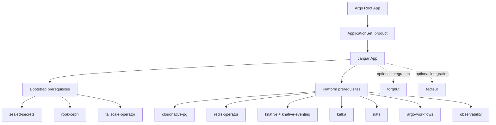

# Jangar application dependency tree

This document maps `argocd/applications/jangar` dependencies across Argo CD applications and runtime services.

## 1. Argo CD application dependency tree



## 2. Runtime dependency tree (inside `jangar` manifests)

```mermaid
graph TD
  JDEPLOY[Deployment: jangar] --> JDB[Secret: jangar-db-app]
  JDEPLOY --> JREDIS[Service: jangar-openwebui-redis]
  JDEPLOY --> NATSSEC[Secret: nats-jangar-credentials]
  JDEPLOY --> NATSSVC[nats.nats.svc.cluster.local:4222]
  JDEPLOY --> KAFKASEC[Secrets: kafka-codex-username / kafka-codex-credentials]
  JDEPLOY --> ARGOSVC[argo-workflows-server.argo-workflows.svc.cluster.local]
  JDEPLOY --> MINIOSEC[Secret: observability-minio-creds]
  JDEPLOY --> CHSEC[Secret: jangar-clickhouse-auth]
  JDEPLOY --> CHSVC[torghut-clickhouse.torghut.svc]
  JDEPLOY -. optional .-> TDB[Secret: torghut-db-app]
  JDEPLOY -. optional .-> FINT[facteur-internal.facteur.svc.cluster.local]

  OUI[OpenWebUI Helm release] --> JDB
  OUI --> JREDIS

  KSRC1[KafkaSource: jangar-codex-github-events] --> KAFKASVC[kafka-kafka-bootstrap.kafka:9092]
  KSRC1 --> KAFKASEC
  KSRC2[KafkaSource: jangar-codex-completions] --> KAFKASVC
  KSRC2 --> KAFKASEC
```



## 3. Hard vs optional dependencies

Hard dependencies:

1. `sealed-secrets` (for decrypting all SealedSecret resources).
1. `rook-ceph` (`rook-ceph-block` and `rook-cephfs` storage classes).
1. `cloudnative-pg` (CNPG `Cluster` + generated DB secrets).
1. `redis-operator` (for `Redis` custom resource).
1. `knative` + `knative-eventing` + `kafka` (for `KafkaSource` resources).
1. `nats` (NATS credentials + broker endpoint).
1. `argo-workflows` (run-complete and workflow API integration).
1. `observability` (MinIO creds/endpoint currently referenced by `jangar` and CNPG backup config).
1. `tailscale-operator` (for `LoadBalancer` services using `loadBalancerClass: tailscale`).

Optional or feature-gated integrations:

1. `torghut` (`torghut-db-app` is optional; clickhouse integration depends on `torghut-clickhouse` service/creds).
1. `facteur` (`facteur-internal` URL is configured; behavior depends on enabled feature paths).

## 4. Recommended enable order

1. `sealed-secrets`, `rook-ceph`, `tailscale-operator` (bootstrap layer).
1. `cloudnative-pg`, `redis-operator`, `knative`, `knative-eventing`, `kafka`, `nats`, `argo-workflows`, `observability` (platform layer).
1. `jangar` (product layer).
1. Optional product integrations: `torghut`, `facteur`.

## 5. Quick validation

```bash
kubectl get applications -n argocd | rg 'sealed-secrets|rook-ceph|tailscale|cloudnative-pg|redis-operator|knative|kafka|nats|argo-workflows|observability|jangar'
kubectl -n jangar get secret jangar-db-app github-token jangar-clickhouse-auth
kubectl -n jangar get kafkasources.sources.knative.dev
kubectl -n jangar get redis.redis.opstreelabs.in
kubectl -n jangar get cluster.postgresql.cnpg.io,scheduledbackup.postgresql.cnpg.io
```
