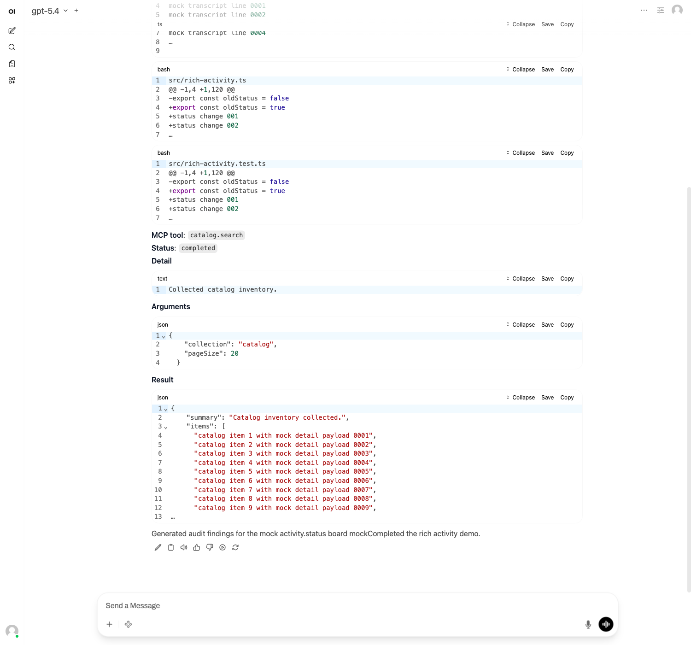
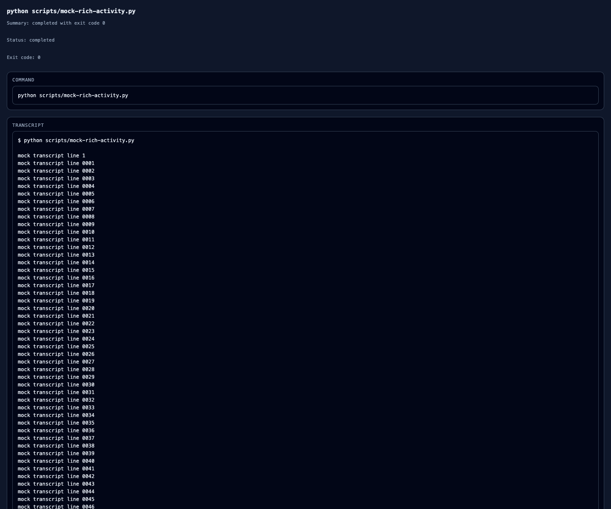

# OpenWebUI Rich Activity Implementation

This note documents the production no-fork rich activity path that Jangar now ships for OpenWebUI.

## Product contract

- OpenWebUI keeps consuming standard `delta.content` and `delta.reasoning_content`.
- Jangar never relies on OpenAI `tool_calls` for this UX.
- Full assistant prose stays inline in the retained transcript.
- Large activity payloads are summarized in-chat and can spill into signed detail pages.
- User-visible detail links are scoped to `chatClientKind === 'openwebui'`.

## Screenshots

Main OpenWebUI conversation rendering:

Signed detail page rendering:

## Runtime split

The implementation intentionally separates two concerns that used to be coupled:

- `detailLinks`: the production path that stages render blobs and appends signed markdown links directly into assistant text
- `jangarEvent`: an experimental transport that can still emit `delta.jangar_event` when `x-jangar-openwebui-render-mode: rich-ui-v1` is requested

The critical rule is that `jangarEvent` is optional. Production correctness for OpenWebUI must not depend on it.

## Main server flow

Relevant files:

- `services/jangar/src/server/chat.ts`
- `services/jangar/src/server/chat-completion-encoder.ts`
- `services/jangar/src/server/openwebui-render-store.ts`
- `services/jangar/src/server/openwebui-render-signing.ts`
- `services/jangar/src/routes/api/openwebui/rich-ui/render/$renderId.ts`

`chat.ts` treats `JANGAR_OPENWEBUI_RICH_RENDER_ENABLED` as the production gate for detail links. If the external base URL, signing secret, or render store is unavailable, the request falls back to text-only streaming instead of failing the turn.

The encoder is the stable product contract. It keeps assistant message text inline and applies preview budgets only to reasoning, plans, rate limits, tool payloads, usage, and errors. The current budgets are:

- `4 KiB` max inline preview per activity block
- `24 KiB` max total activity preview budget per assistant turn
- `8 KiB` max structured payload before forced spillover

Per activity type, the transcript renders a concise summary first and only adds a signed detail link when the payload exceeds those budgets or the experience is better with a dedicated page, such as command transcripts, diffs, large JSON results, and image previews.

## Staging and signing

Render blobs and signed links share the same 7-day lifetime. The route stays:

- `/api/openwebui/rich-ui/render/$renderId?e=...&sig=...`

The route validates:

- blob existence
- expiry seconds in the URL against the staged blob
- HMAC signature
- expiration time

The HTML renderer chooses a payload-specific template for:

- command transcripts
- unified diffs
- JSON inspector pages
- image previews
- generic text fallback

## Important bug fix

The production transcript detail-link state and the experimental `jangar_event` render-ref state now use separate staging slots inside the encoder.

That split fixes a real signature bug: large `mcp` and `dynamicTool` events could previously sign a render ref with one kind for the experimental event path and then overwrite the same logical blob as `json` for the transcript path, which caused the detail route to reject the link as invalid. The current implementation keeps those refs independent while still sharing the pending blob persistence queue.

## Mock Codex regression harness

The local OpenWebUI browser regression now defaults to a deterministic mock Codex app server flow instead of requiring a real local Codex process.

Relevant files:

- `services/jangar/src/server/mock-codex-client.ts`
- `services/jangar/src/server/codex-client.ts`
- `services/jangar/tests/openwebui-chat.e2e.ts`
- `services/jangar/scripts/openwebui-e2e.sh`

The mock stream covers these event types:

- `message`
- `reasoning`
- `plan`
- `rate_limits`
- `tool:command`
- `tool:file`
- `tool:mcp`
- `tool:dynamicTool`
- `tool:webSearch`
- `tool:imageGeneration`
- `usage`
- `error`

That allows the browser suite to verify the full no-fork OpenWebUI experience end to end, including:

- additive multi-turn chat continuity
- readable rich activity summaries in the stock OpenWebUI chat surface
- signed detail pages for transcripts, diffs, large JSON results, and image previews
- assistant error rendering

## Validation

The implementation is currently covered by:

- unit tests for the encoder and render store
- route tests for signed detail pages
- chat handler integration tests
- Playwright/OpenWebUI end-to-end coverage against the mock Codex path
