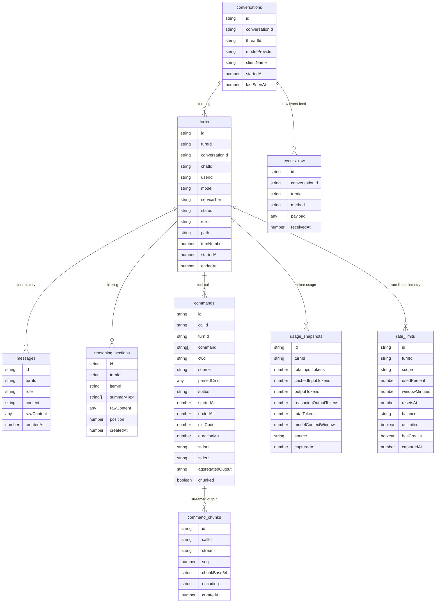

# Jangar persistence

## Environment

- `CONVEX_URL` / `CONVEX_DEPLOYMENT`
- `CONVEX_SELF_HOSTED_URL` / `CONVEX_SITE_ORIGIN`
- `CONVEX_DEPLOY_KEY` or `CONVEX_ADMIN_KEY` (Convex admin auth)
- Optional dev fallback: `VITE_CONVEX_URL`
- Local default: `http://127.0.0.1:3210`

## Data model (Convex)

### Column reference

**conversations**

| column | type | nullable | notes |
| --- | --- | --- | --- |
| id | string | no | PK |
| conversationId | string | no | external identifier from OpenWebUI/client |
| threadId | string | yes | Codex thread id (if returned) |
| modelProvider | string | yes | client-declared provider |
| clientName | string | yes | caller name (e.g., openwebui) |
| startedAt | number (ms) | no | first seen timestamp |
| lastSeenAt | number (ms) | no | last activity timestamp |

**turns**

| column | type | nullable | notes |
| --- | --- | --- | --- |
| id | string | no | PK |
| turnId | string | no | external turn id from Codex stream |
| conversationId | string | no | FK conversations.id |
| chatId | string | yes | OpenWebUI chat id |
| userId | string | yes | caller id (default `openwebui`) |
| model | string | yes | model used |
| serviceTier | string | yes | free/premium/etc. |
| status | string | no | running \| succeeded \| failed \| canceled |
| error | string | yes | error detail |
| path | string | yes | optional path context |
| turnNumber | number | yes | client-supplied sequence |
| startedAt | number (ms) | no | when turn began |
| endedAt | number (ms) | yes | when turn finished |

**messages**

| column | type | nullable | notes |
| --- | --- | --- | --- |
| id | string | no | PK |
| turnId | string | no | FK turns.id |
| role | string | no | user \| assistant \| system \| tool |
| content | string | no | rendered content (plain text) |
| rawContent | any | yes | original payload (for structured responses) |
| createdAt | number (ms) | no | timestamp |

**reasoning_sections**

| column | type | nullable | notes |
| --- | --- | --- | --- |
| turnId | string | no | FK turns.id |
| itemId | string | no | identifier for the reasoning section |
| summaryText | string[] | yes | compacted reasoning text |
| rawContent | any | yes | full reasoning payload |
| position | number | yes | ordering within the turn |
| createdAt | number (ms) | no | timestamp |

**commands**

| column | type | nullable | notes |
| --- | --- | --- | --- |
| callId | string | no | stable per tool call |
| turnId | string | no | FK turns.id |
| command | string[] | no | argv as captured |
| cwd | string | yes | working directory |
| source | string | yes | command \| file \| mcp \| search |
| parsedCmd | any | yes | structured metadata |
| status | string | yes | started \| running \| completed \| failed |
| startedAt | number (ms) | no | timestamp |
| endedAt | number (ms) | yes | timestamp |
| exitCode | number | yes | exit status |
| durationMs | number | yes | runtime |
| stdout | string | yes | final stdout (if non-chunked) |
| stderr | string | yes | final stderr (if non-chunked) |
| aggregatedOutput | string | yes | summarized output |
| chunked | boolean | no | true when paired with command_chunks |

**command_chunks**

| column | type | nullable | notes |
| --- | --- | --- | --- |
| callId | string | no | FK commands.callId |
| stream | string | no | stdout \| stderr |
| seq | number | no | monotonic per call |
| chunkBase64 | string | no | chunk data (base64) |
| encoding | string | yes | encoding hint |
| createdAt | number (ms) | no | timestamp |

**usage_snapshots**

| column | type | nullable | notes |
| --- | --- | --- | --- |
| turnId | string | no | FK turns.id |
| totalInputTokens | number | yes | prompt tokens |
| cachedInputTokens | number | yes | cache hits |
| outputTokens | number | yes | completion tokens |
| reasoningOutputTokens | number | yes | reasoning tokens |
| totalTokens | number | yes | total tokens |
| modelContextWindow | number | yes | context window used |
| source | string | yes | producer (e.g., codex stream) |
| capturedAt | number (ms) | no | timestamp |

**rate_limits**

| column | type | nullable | notes |
| --- | --- | --- | --- |
| turnId | string | no | FK turns.id |
| scope | string | no | primary \| secondary \| credits |
| usedPercent | number | yes | percentage used |
| windowMinutes | number | yes | rate limit window |
| resetsAt | number | yes | reset epoch ms |
| balance | string | yes | credit balance |
| unlimited | boolean | yes | unlimited flag |
| hasCredits | boolean | yes | credit availability |
| capturedAt | number (ms) | no | timestamp |

**events_raw**

| column | type | nullable | notes |
| --- | --- | --- | --- |
| conversationId | string | no | FK conversations.id |
| turnId | string | yes | FK turns.id |
| method | string | no | event kind (tool, usage, turn/error, etc.) |
| payload | any | no | raw event payload |
| receivedAt | number (ms) | no | timestamp |

## Functions to implement (Convex)

- `app:upsertConversation`
- `app:upsertTurn`
- `app:appendMessage`
- `app:appendReasoningSection`
- `app:upsertCommand`
- `app:appendCommandChunk`
- `app:appendUsageSnapshot`
- `app:appendRateLimit`
- `app:appendEvent`

Indexes

- conversations: by `conversationId`
- turns: by `conversationId`; by `chatId`; by `turnId`
- messages: by `turnId`; by `createdAt`
- reasoning_sections: by `turnId`
- commands: by `turnId`; by `callId`
- command_chunks: by `callId, seq`
- usage_snapshots: by `turnId, capturedAt`
- rate_limits: by `turnId, capturedAt`
- events_raw: by `conversationId, receivedAt`

Deployment

- `bun packages/scripts/src/jangar/deploy-service.ts` runs `convex deploy --yes` before Knative apply; ensure Convex envs/keys are set.
