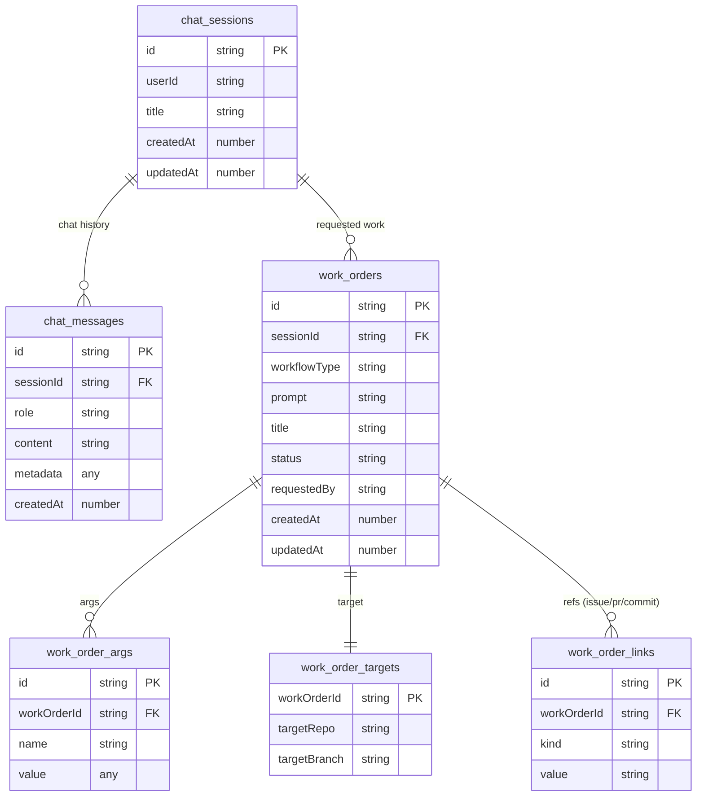

# Jangar persistence (chat + work orders, 5NF)

Jangar stores chat context and work orders that launch Temporal workflows. The work-order data is normalized so each fact lives in exactly one place and joins are lossless (5NF-oriented).

## Environment
- `CONVEX_URL` / `CONVEX_DEPLOYMENT`
- `CONVEX_SELF_HOSTED_URL` / `CONVEX_SITE_ORIGIN`
- `CONVEX_DEPLOY_KEY` or `CONVEX_ADMIN_KEY`
- Local default: `http://127.0.0.1:3210`

## Data model (Convex)

### Column reference

**chat_sessions**
| column | type | notes |
| --- | --- | --- |
| id | string | PK |
| userId | string | requester |
| title | string | display title |
| createdAt | number (ms) | timestamp |
| updatedAt | number (ms) | timestamp |

**chat_messages**
| column | type | notes |
| --- | --- | --- |
| id | string | PK |
| sessionId | string | FK chat_sessions.id |
| role | string | user \| assistant \| system |
| content | string | message text |
| metadata | any | tool calls, attachments, etc. |
| createdAt | number (ms) | timestamp |

**work_orders**
| column | type | notes |
| --- | --- | --- |
| id | string | PK |
| sessionId | string | FK chat_sessions.id |
| workflowType | string | Temporal workflow name |
| prompt | string | operator instruction |
| title | string | human label |
| status | string | draft \| submitted \| accepted \| running \| succeeded \| failed \| canceled |
| requestedBy | string | user id / subject |
| createdAt | number (ms) | timestamp |
| updatedAt | number (ms) | timestamp |

**work_order_args** (multi-valued workflow parameters)
| column | type | notes |
| --- | --- | --- |
| id | string | PK |
| workOrderId | string | FK work_orders.id |
| name | string | argument name |
| value | any | argument value |

**work_order_targets** (one-to-one)
| column | type | notes |
| --- | --- | --- |
| workOrderId | string | PK/FK work_orders.id |
| targetRepo | string | repo URL/path |
| targetBranch | string | branch name |

**work_order_links** (normalized references)
| column | type | notes |
| --- | --- | --- |
| id | string | PK |
| workOrderId | string | FK work_orders.id |
| kind | string | github_issue \| pr \| commit |
| value | string | URL or SHA |

## Functions to implement (Convex)
- `chatSessions:create`, `chatSessions:list`, `chatSessions:get`
- `chatMessages:append`, `chatMessages:listBySession`
- `workOrders:create`
- `workOrders:updateStatus`
- `workOrderArgs:upsert`
- `workOrderTargets:upsert`
- `workOrderLinks:add`
- `workOrders:listBySession`
- `workOrders:get`

Indexes
- chat_messages: by `sessionId, createdAt`
- work_orders: by `sessionId, createdAt`; by `status, updatedAt`
- work_order_args: by `workOrderId, name`
- work_order_links: by `workOrderId, kind`

Deployment
- `bun packages/scripts/src/jangar/deploy-service.ts` runs `convex deploy` before Knative apply; ensure Convex envs/keys are set.
