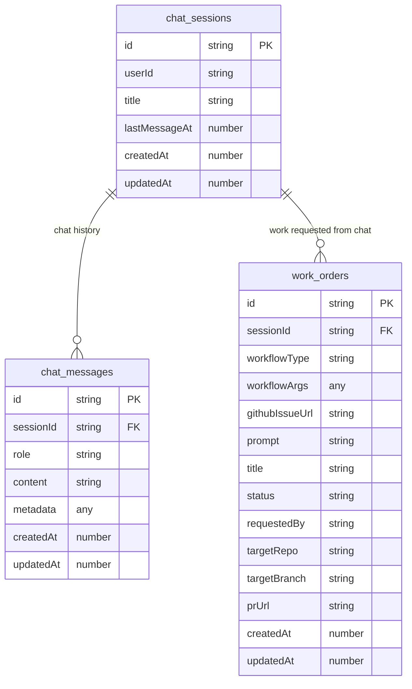

# Jangar persistence (chat + work orders, simple)

Jangar is the control plane UI for Codex background workers. It stores chat context (sessions + messages) and work orders that launch Temporal workflows—kept simple and denormalized enough to be practical.

## Environment
- `CONVEX_URL` / `CONVEX_DEPLOYMENT`
- `CONVEX_SELF_HOSTED_URL` / `CONVEX_SITE_ORIGIN`
- `CONVEX_DEPLOY_KEY` or `CONVEX_ADMIN_KEY`
- Local default: `http://127.0.0.1:3210`

## Data model (Convex)

### Column reference

**chat_sessions**
| column | type | notes |
| --- | --- | --- |
| id | string | PK |
| userId | string | requester |
| title | string | display title |
| lastMessageAt | number (ms) | for recency sorting |
| createdAt | number (ms) | timestamp |
| updatedAt | number (ms) | timestamp |

**chat_messages**
| column | type | notes |
| --- | --- | --- |
| id | string | PK |
| sessionId | string | FK chat_sessions.id |
| role | string | user \| assistant \| system |
| content | string | message text |
| metadata | any | tool calls, attachments, etc. |
| createdAt | number (ms) | timestamp |
| updatedAt | number (ms) | timestamp |

**work_orders**
| column | type | notes |
| --- | --- | --- |
| id | string | PK |
| sessionId | string | FK chat_sessions.id |
| workflowType | string | Temporal workflow name |
| workflowArgs | any | JSON args for workflow start |
| githubIssueUrl | string | optional source issue/PR |
| prompt | string | operator instruction |
| title | string | human label |
| status | string | draft \| submitted \| accepted \| running \| succeeded \| failed \| canceled |
| requestedBy | string | user id / subject |
| targetRepo | string | repo URL/path |
| targetBranch | string | branch to use/create |
| prUrl | string | resulting PR URL (if produced) |
| createdAt | number (ms) | timestamp |
| updatedAt | number (ms) | timestamp |

## Functions to implement (Convex)
- `chatSessions:create`, `chatSessions:list`, `chatSessions:get`, `chatSessions:updateLastMessage`
- `chatMessages:append`, `chatMessages:listBySession`
- `workOrders:create`
- `workOrders:updateStatus`
- `workOrders:updateResult` (prUrl)
- `workOrders:listBySession`
- `workOrders:get`

Indexes
- chat_messages: by `sessionId, createdAt`
-, work_orders: by `sessionId, createdAt`; by `status, updatedAt`

Deployment
- `bun packages/scripts/src/jangar/deploy-service.ts` runs `convex deploy` before Knative apply; ensure Convex envs/keys are set.
