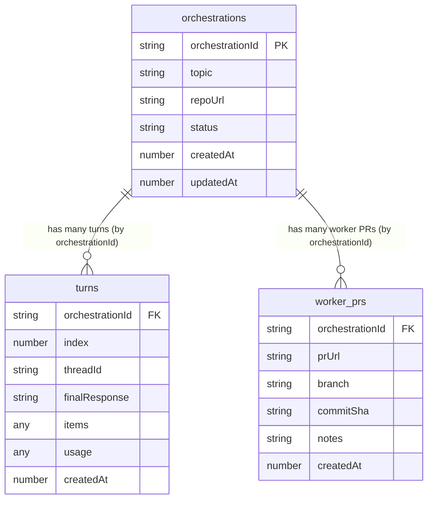

# Jangar persistence (Convex)

Jangar now persists orchestrations, turns, and worker PRs in Convex. The service writes state through Convex server functions and reads via queries; no database migrations or Drizzle remain.

## Environment
- `CONVEX_URL` or `CONVEX_DEPLOYMENT` (preferred): Convex deployment URL (production).
- `CONVEX_SELF_HOSTED_URL` or `CONVEX_SITE_ORIGIN` (fallback): self-hosted Convex endpoint (e.g., `https://convex.proompteng.ai/http`).
- `CONVEX_ADMIN_KEY` or `CONVEX_DEPLOY_KEY` (optional): admin/deploy key; if set, Jangar uses admin auth for server-to-server calls.
- Local default: if no env is set, Jangar points to `http://127.0.0.1:3210` (Convex dev).

## Local workflow
1. Install deps: `cd services/jangar && bun install`.
2. Start a Convex dev server in another shell: `cd services/jangar && bunx convex dev` (lists URL/token and stays running).
3. Run the worker or server as usual (`bun run src/worker.ts` or `bun run src/index.ts --dev`).

- ## Convex schema & functions
- Schema lives in `services/jangar/convex/schema.ts` with functions under `services/jangar/convex/`.
- Functions:
  - `orchestrations:upsert` — create/update orchestration state.
  - `orchestrations:appendTurn` — append or upsert a turn snapshot.
  - `orchestrations:recordWorkerPr` — store worker PR metadata.
  - `orchestrations:getState` — return the orchestration with turns and worker PRs.

### Data model (Convex)

## Deployment
- The Jangar deploy script (`bun packages/scripts/src/jangar/deploy-service.ts`) now runs `convex deploy` for `services/jangar/convex` before applying K8s manifests. It requires `CONVEX_DEPLOYMENT`/`CONVEX_SELF_HOSTED_URL` and `CONVEX_DEPLOY_KEY`/`CONVEX_ADMIN_KEY` in the environment.
- CI (`.github/workflows/jangar-ci.yml`) deploys Convex on pushes to `main` when Jangar files change.

No SQL migrations are shipped; state is fully managed by Convex.
