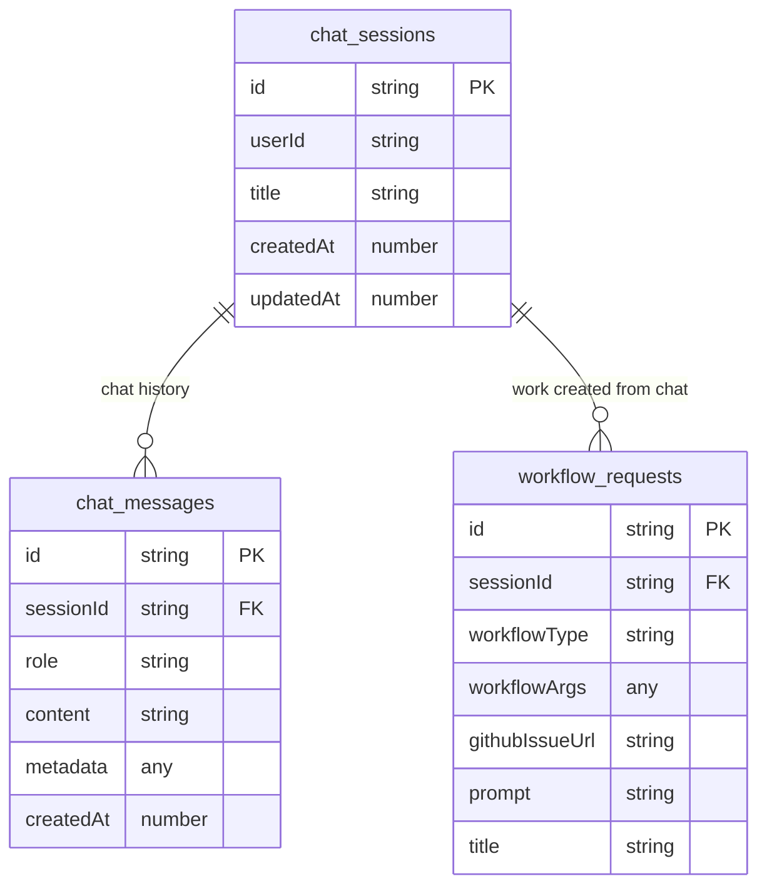

# Jangar persistence (Convex control plane)

Jangar is the control plane UI for Codex background workers. It tracks chat sessions, workflow requests, Temporal runs, step logs, and artifacts in Convex (no Postgres/Drizzle).

## Environment

- `CONVEX_URL` or `CONVEX_DEPLOYMENT`: Convex deployment URL for prod.
- `CONVEX_SELF_HOSTED_URL` / `CONVEX_SITE_ORIGIN`: self-hosted endpoint (e.g., `https://convex.proompteng.ai/http`).
- `CONVEX_DEPLOY_KEY` or `CONVEX_ADMIN_KEY`: required for deploys and server-to-server calls.
- Local default: `http://127.0.0.1:3210` when not set.

## Local workflow

1. `cd services/jangar && bun install`
2. In another shell: `bunx convex dev` (dev deployment + codegen/watch).
3. Run UI/worker: `bun run dev:all` (convex + UI + single worker).

## Convex schema & functions

- Schema: `services/jangar/convex/schema.ts`
- Functions (mutations/queries under `services/jangar/convex/`):
  - `sessions:create`, `sessions:list`, `sessions:getWithThreads`
  - `threads:append`
  - `workOrders:createFromMessage`, `workOrders:listBySession`
  - `runs:start`, `runs:updateStatus`, `runs:getDashboard`, `runs:getTimeline`
  - `steps:appendOrUpdate`
  - `artifacts:add`
  - `events:append`

### Data model (Convex)

### Tables (columns → data types)

**chat_sessions**
| column | type |
| --- | --- |
| id | string |
| userId | string |
| title | string |
| createdAt | number (ms) |
| updatedAt | number (ms) |

**chat_messages**
| column | type |
| --- | --- |
| id | string |
| sessionId | string (FK chat_sessions.id) |
| role | string (user | assistant | system) |
| content | string |
| metadata | any |
| createdAt | number (ms) |

**workflow_requests**
| column | type |
| --- | --- |
| id | string |
| sessionId | string (FK chat_sessions.id) |
| workflowType | string (Temporal workflow type) |
| workflowArgs | any (JSON-serializable args) |
| githubIssueUrl | string |
| prompt | string |
| title | string |

## Deployment

- `bun packages/scripts/src/jangar/deploy-service.ts` runs `convex deploy` before updating the Knative service.
- Ensure Convex env vars/keys are present in the deploy environment.
