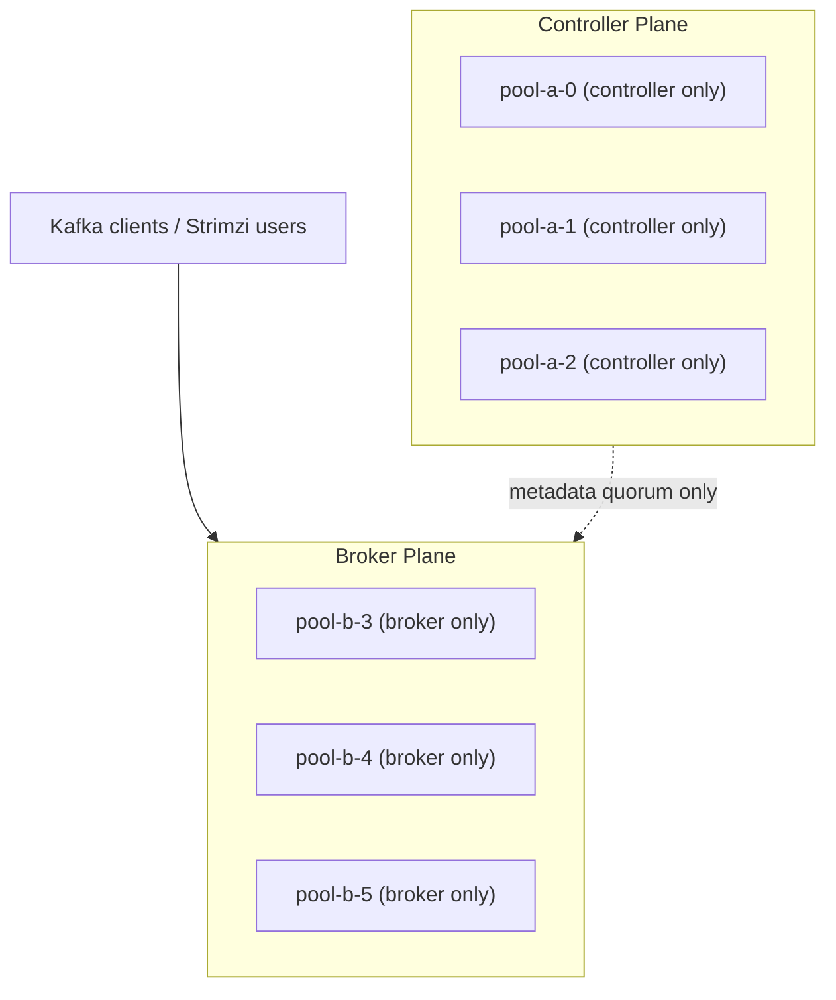

# Kafka KRaft Controller/Broker Separation Design

## Status

- Version: `v1`
- Last updated: **2026-03-11**
- Source of truth (GitOps): `argocd/applications/kafka/**`
- Current production baseline: Kafka `4.1.1`, Strimzi `0.50.0`

## Purpose

Define the production target architecture and rollout plan to finish separating KRaft controller and broker duties in the
shared Kafka cluster after the March 9, 2026 recovery incident and the March 11, 2026 broker-pool scale-out.

This document is the design and rollout reference for the remaining work after PR `#4307` introduced `KafkaNodePool/pool-b`.

## Executive Summary

The cluster no longer needs more controllers. It needs the existing three controllers to stop doing broker work.

The correct production end state is:

- `pool-a`: `3` controller-only nodes, preserving the existing controller quorum IDs `0,1,2`
- `pool-b`: `3` broker-only nodes, carrying all partition replicas on broker IDs `3,4,5`
- no broker partitions assigned to controller nodes
- no planned application downtime during migration

The safe path is phased:

1. Keep the existing `3`-controller quorum on `pool-a`
2. Add worker-node capacity and enforce broker placement
3. Reassign all partitions from brokers `0,1,2` to brokers `3,4,5`
4. Verify steady-state health and restart behavior
5. Remove the `broker` role from `pool-a`

## Background

On **2026-03-09**, Kafka degraded because KRaft controller work and broker log recovery were contending on the same
pods and Ceph-backed PVCs. The incident is documented in
[`incidents/2026-03-09-kafka-kraft-recovery-stall-and-strimzi-hardening.md`](incidents/2026-03-09-kafka-kraft-recovery-stall-and-strimzi-hardening.md).

On **2026-03-11**, the first durable topology step was completed by GitOps:

- `KafkaNodePool/pool-b` was added with `3` broker-only replicas
- Argo CD applied the change at commit `18d023d5f13b70382e35c890e1d4a0dacfa867db`
- new brokers `3,4,5` became `Ready`

That change reduced future migration risk, but it did **not** finish the topology split. `pool-a` still carries both
`controller` and `broker` roles, so the original controller quorum remains exposed to broker data placement and recovery
load.

## Current Verified State

As of **2026-03-11 UTC**, the live cluster is:

- Argo CD application `kafka`: `Synced`, `Healthy`
- `KafkaNodePool/pool-a`:
  - roles: `controller`, `broker`
  - replicas: `3`
  - node IDs: `0,1,2`
  - storage: `rook-ceph-block`, `30Gi`, `deleteClaim: false`
- `KafkaNodePool/pool-b`:
  - roles: `broker`
  - replicas: `3`
  - node IDs: `3,4,5`
  - storage: `rook-ceph-block`, `30Gi`, `deleteClaim: false`
- Kubernetes nodes:
  - only `3` nodes total exist in the cluster right now
  - two Kafka brokers are currently colocated on `talos-192-168-1-203`
- Kafka config baseline:
  - replication defaults `3`
  - `min.insync.replicas: 2`
  - no Cruise Control configured in the current `Kafka` CR

## Problem Statement

The current state is healthier than the incident state, but it is not yet production-correct for KRaft isolation.

Remaining issues:

1. Controller nodes still carry broker partitions.
2. Broker placement is not failure-domain clean because `6` Kafka pods are spread across only `3` Kubernetes nodes.
3. A future restart on `pool-a` can still combine controller-path work with broker recovery work.
4. There is no in-repo automated partition rebalance control plane yet.

## Constraints And Invariants

### KRaft and Strimzi constraints

- The production target is **3 controllers total**, not `6`.
- In this Strimzi generation, the controller quorum is effectively static for safe in-place operations.
- The existing controller quorum is already `pool-a` with node IDs `0,1,2`.
- The supported in-place path is:
  - keep `pool-a` as the controller quorum
  - add broker-only capacity
  - move partitions away
  - then remove the `broker` role from `pool-a`

### Availability constraints

- The migration must be executed without planned Kafka downtime.
- Short partition leadership moves are acceptable.
- Long periods of under-replicated partitions are not acceptable.
- `pool-a` must not lose the `broker` role until reassignment is complete and verified.

### Storage constraints

- This design keeps `rook-ceph-block` for the in-place split.
- Moving controllers to a different storage class is **not** part of this in-place design.
- If the cluster later requires controller storage migration to lower-latency local disks, that should be treated as a
  separate design or new-cluster migration.

## Non-goals

- Replacing Ceph-backed Kafka storage in this phase
- Rebuilding the Kafka cluster from scratch
- Introducing a second controller quorum
- Enabling every possible Strimzi feature in one rollout
- Changing topic schemas, application clients, or SASL user model

## Target Architecture



### Target operational properties

- Controllers keep only KRaft quorum and metadata responsibilities.
- Brokers handle topic data, log recovery, client traffic, and replica movement.
- Broker pods are spread one-per-node across dedicated worker capacity.
- Controller restarts do not trigger broker data replay on controller nodes.
- Broker restarts do not directly stall controller fsync work on the same pod.

## Architecture Decisions

### ADR-01: Keep the controller quorum at three nodes

- **Decision:** Keep exactly `3` controllers on `pool-a`.
- **Rationale:** `3` controllers is the normal HA baseline and avoids unnecessary quorum overhead.
- **Consequence:** The cluster tolerates one controller failure while keeping quorum.

### ADR-02: Finish the split by draining brokers, not by adding new controllers

- **Decision:** Move broker data off node IDs `0,1,2` and convert `pool-a` to controller-only.
- **Rationale:** This is the supported in-place topology transition for the current Strimzi setup.
- **Consequence:** All topic data ends up on broker IDs `3,4,5`.

### ADR-03: Add worker capacity before the heavy rebalance

- **Decision:** Add at least `3` Kubernetes worker nodes before large-scale partition reassignment.
- **Rationale:** The current cluster has only `3` nodes, so broker spread is not clean yet.
- **Consequence:** The rebalance should not be considered production-complete until broker placement is one-per-node.

### ADR-04: Use controlled manual partition reassignment for this migration

- **Decision:** Execute the one-time migration with Kafka partition reassignment tooling rather than adding Cruise
  Control mid-incident-follow-up.
- **Rationale:** Cruise Control is not currently deployed; introducing it would expand scope and blast radius.
- **Consequence:** The runbook must include explicit reassignment generation, throttling, verification, and rollback.

### ADR-05: Keep storage-class migration out of this phase

- **Decision:** Complete the role split first on the existing `rook-ceph-block` storage class.
- **Rationale:** Role separation is the immediate risk reducer and can be delivered with GitOps and no application
  downtime.
- **Consequence:** Storage latency remains a residual risk to monitor after the split.

## Required Follow-up Changes

### 1. Add worker-node capacity

Minimum requirement:

- add `3` worker nodes
- ensure broker pool pods can spread one-per-node

Recommended node policy:

- label worker nodes for Kafka broker placement, for example `workload.kafka/broker=true`
- optionally taint them if Kafka brokers should be isolated from general workloads
- keep controller pods on the existing controller quorum nodes unless a separate controller migration is designed later

Recommended GitOps placement policy for `pool-b`:

- use `KafkaNodePool.spec.template.pod.affinity.nodeAffinity` to require broker-labeled nodes
- use `KafkaNodePool.spec.template.pod.affinity.podAntiAffinity` to keep brokers apart
- use `KafkaNodePool.spec.template.pod.topologySpreadConstraints` to enforce one broker per node where possible

### 2. Add placement policy to the Kafka GitOps manifests

This design expects a follow-up PR that updates `pool-b` with:

- worker-node affinity
- anti-affinity against other Kafka brokers
- topology spread constraints by `kubernetes.io/hostname`

Optional follow-up:

- add corresponding node affinity for `pool-a` if controller placement must be explicitly pinned

### 3. Audit topic replication and capacity before reassignment

Before moving replicas:

- confirm no critical topics are still at replication factor `1`
- confirm internal topics remain at replication factor `3`
- confirm projected broker-disk usage fits on brokers `3,4,5`
- confirm the cluster has no sustained under-replicated partitions

Capacity gate:

- do not start the migration unless the target broker pool has enough free capacity to absorb all existing broker data
  from `pool-a` with headroom for normal growth and compaction

## Rollout Plan

### Phase 0: Completed baseline

Already done:

- `pool-b` created and reconciled
- brokers `3,4,5` registered and are `Ready`
- Argo app `kafka` is `Synced` and `Healthy`

### Phase 1: Prepare scheduling and capacity

1. Add `3` worker nodes.
2. Label the worker nodes for Kafka brokers.
3. Patch GitOps manifests so `pool-b` only schedules onto broker-labeled workers.
4. Let Strimzi roll `pool-b` onto the new workers.
5. Verify one broker per node and healthy PVC attachment.

Exit criteria:

- `pool-b-3`, `pool-b-4`, `pool-b-5` each run on a distinct worker node
- `pool-a` remains healthy
- Argo app `kafka` remains `Healthy`

### Phase 2: Inventory and generate reassignment plans

1. Collect current topic and partition assignments.
2. Build reassignment JSON that targets only brokers `3,4,5`.
3. Exclude no topics unless there is an explicit documented exception.
4. Split reassignment into batches if total movement volume is high.

Recommended batching order:

1. low-value and low-throughput topics
2. application topics
3. internal topics such as `__consumer_offsets` and `__transaction_state`

Rationale:

- prove mechanics first on the lowest-risk data
- keep rollback simpler early
- move critical internals only after the target brokers have shown stable behavior

### Phase 3: Execute reassignment with throttles

Recommended execution method:

- use Kafka admin tooling from a Strimzi Kafka container or another trusted admin pod
- execute reassignment with inter-broker and replication throttles
- verify completion after every batch before starting the next one

Representative workflow:

```sh
# 1. Export current assignments for the batch.
kafka-topics.sh --bootstrap-server kafka-kafka-bootstrap.kafka.svc:9092 --describe

# 2. Generate a reassignment targeting brokers 3,4,5.
kafka-reassign-partitions.sh \
  --bootstrap-server kafka-kafka-bootstrap.kafka.svc:9092 \
  --topics-to-move-json-file topics-batch.json \
  --broker-list 3,4,5 \
  --generate > reassignment-batch.out

# 3. Execute with throttle.
kafka-reassign-partitions.sh \
  --bootstrap-server kafka-kafka-bootstrap.kafka.svc:9092 \
  --reassignment-json-file reassignment-batch.json \
  --execute

# 4. Verify until complete.
kafka-reassign-partitions.sh \
  --bootstrap-server kafka-kafka-bootstrap.kafka.svc:9092 \
  --reassignment-json-file reassignment-batch.json \
  --verify
```

Operational guardrails:

- only one reassignment batch at a time
- do not start a new batch if under-replicated partitions are non-zero
- do not remove throttles or proceed during controller instability
- pause if broker disk, network, or Ceph latency spikes materially

### Phase 4: Validate broker drain completion

Before touching roles, prove that brokers `0,1,2` no longer host topic replicas.

Required validation:

- no topic partitions assigned to brokers `0,1,2`
- no leaders on brokers `0,1,2`
- no preferred leaders on brokers `0,1,2`
- all partitions on brokers `3,4,5` have healthy ISR

Acceptance gate:

- maintain clean steady state for at least one business day before role removal

### Phase 5: Convert `pool-a` to controller-only

Once broker drain is complete:

1. Update `KafkaNodePool/pool-a` roles from:
   - `controller`
   - `broker`
2. To:
   - `controller`
3. Merge the GitOps PR and let Argo reconcile.
4. Verify `pool-a` rolls cleanly as controller-only.

Post-change expected state:

- `pool-a`: controller-only
- `pool-b`: broker-only
- no partition data assigned to controller nodes

### Phase 6: Post-cut validation and recovery drill

Run production validation after the split:

1. rolling restart one broker in `pool-b`
2. rolling restart one controller in `pool-a`
3. confirm no application-visible outage
4. confirm Kafka users remain `Ready`
5. confirm broker recovery time is materially lower than the March 9 incident path

## Observability And Validation

### Control-plane health

Watch:

- Argo CD app health and sync
- `KafkaNodePool` status
- `StrimziPodSet` readiness
- broker/controller pod readiness
- controller logs for:
  - `writeNoOpRecord`
  - `processBrokerHeartbeat`
  - `Transitioning to Prospective`
  - `leader is (none)`

### Data-plane health

Watch:

- under-replicated partitions
- offline partitions
- ISR shrink/expand events
- client error rates
- produce and fetch latency
- Ceph PVC latency and broker disk usage

### Management-plane health

Watch:

- `KafkaUser` readiness
- Strimzi operator reconciliation errors
- any divergence between `Kafka` CR status and live `KafkaNodePool` / pod reality

Important note:

- during topology changes, `Kafka.status.kafkaNodePools` may lag. Treat `KafkaNodePool`, `StrimziPodSet`, and pod
  readiness as the more direct operational truth while reconciling.

## Rollback Plan

### If worker-node placement fails

- stop before reassignment
- keep current mixed-role state
- fix scheduling or node capacity first

### If reassignment causes instability

- stop after the current batch
- keep `pool-a` as broker+controller
- remove or lower throttles as appropriate
- reverse only the affected batch if necessary

### If controller-only conversion causes issues

- revert the GitOps change that removed the `broker` role from `pool-a`
- allow Strimzi to restore the previous mixed-role state
- do not prune the old PVCs because `deleteClaim: false` preserves rollback options

## Success Criteria

The migration is complete only when all of the following are true:

1. Argo app `kafka` is `Synced` and `Healthy`.
2. `pool-a` is controller-only.
3. `pool-b` is broker-only.
4. No partitions are assigned to broker IDs `0,1,2`.
5. All required topics remain available with healthy ISR.
6. `KafkaUser` resources stay `Ready`.
7. A rolling restart of one broker and one controller completes without incident.
8. Controller-path latency is materially lower than the March 9 incident profile.

## Residual Risks

- `rook-ceph-block` latency may still be a bottleneck even after role separation.
- A three-broker cluster still has limited data-plane fault tolerance compared with larger broker fleets.
- Manual reassignment is operationally safe but more operator-dependent than Cruise Control.
- If workers are not added, broker colocation continues to weaken fault isolation.

## Follow-up Work After This Design

### Near-term follow-ups

1. GitOps PR for broker-node affinity and topology spread rules
2. infrastructure change to add `3` worker nodes
3. runbook PR for the exact reassignment commands and throttle defaults used in production
4. GitOps PR to convert `pool-a` to controller-only after the drain is complete

### Optional longer-term follow-ups

1. evaluate Cruise Control for future broker balancing
2. evaluate moving broker storage to lower-latency media
3. evaluate a new-cluster migration if controller storage must move off Ceph

## References

- [docs/incidents/2026-03-09-kafka-kraft-recovery-stall-and-strimzi-hardening.md](incidents/2026-03-09-kafka-kraft-recovery-stall-and-strimzi-hardening.md)
- [argocd/applications/kafka/strimzi-kafka-cluster.yaml](../argocd/applications/kafka/strimzi-kafka-cluster.yaml)
