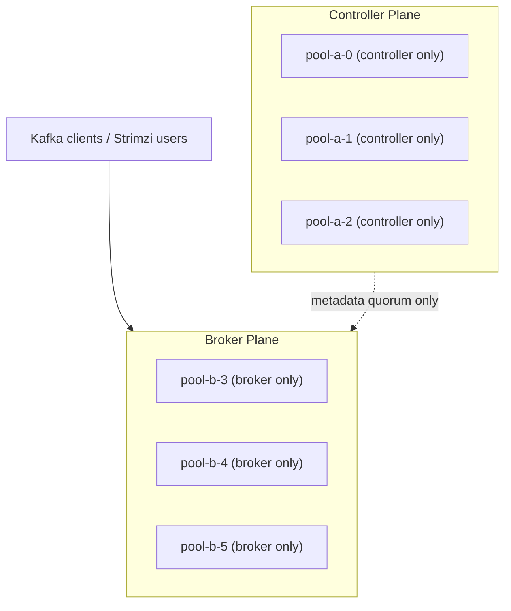

# Kafka KRaft Controller/Broker Separation Design

## Status

- Version: `v2`
- Last updated: **2026-03-11**
- Source of truth (GitOps): `argocd/applications/kafka/**`
- Current production baseline: Kafka `4.1.1`, Strimzi `0.50.0`

## Purpose

Define the production target architecture, the executed rollout, and the remaining physical-infrastructure follow-up for
separating KRaft controller and broker duties in the shared Kafka cluster after the March 9, 2026 recovery incident.

This document is the design and completion record for the in-place controller/broker split delivered across PRs `#4307`,
`#4330`, and `#4331`, plus the live operational cutover that converged the cluster afterward.

## Executive Summary

The cluster did not need more controllers. It needed the existing three controllers to stop doing broker work.

The production topology is now:

- `pool-a`: `3` controller-only nodes, preserving the existing controller quorum IDs `0,1,2`
- `pool-b`: `3` broker-only nodes, carrying all partition replicas on broker IDs `3,4,5`
- no broker partitions assigned to controller nodes
- no planned application downtime was required to complete the split

The durable GitOps changes are merged, the old broker IDs `0,1,2` have been unregistered, and the live cluster has
converged onto broker IDs `3,4,5`. The remaining work is outside the Kafka logical topology itself:

1. add more Kubernetes worker capacity for cleaner broker spread and stronger failure isolation
2. keep monitoring storage latency on the Ceph-backed broker pool
3. formalize the operational restart and recovery runbook for this new topology

## Background

On **2026-03-09**, Kafka degraded because KRaft controller work and broker log recovery were contending on the same
pods and Ceph-backed PVCs. The incident is documented in
[`incidents/2026-03-09-kafka-kraft-recovery-stall-and-strimzi-hardening.md`](incidents/2026-03-09-kafka-kraft-recovery-stall-and-strimzi-hardening.md).

On **2026-03-11**, the first durable topology step was completed by GitOps:

- `KafkaNodePool/pool-b` was added with `3` broker-only replicas
- Argo CD applied the change at commit `18d023d5f13b70382e35c890e1d4a0dacfa867db`
- new brokers `3,4,5` became `Ready`

On **2026-03-11**, the target topology was completed by GitOps in follow-up PRs:

- PR `#4330` added broker anti-affinity and topology spread protections to `pool-b`
- PR `#4331` removed the `broker` role from `pool-a`, making it controller-only in GitOps

After the GitOps merge, the live cluster still needed runtime convergence:

- brokers `4` and `5` remained fenced on the first incarnation after the role cutover
- old broker IDs `0,1,2` were still present until Strimzi finished unregistering them
- `KafkaUser` resources stayed stale `NotReady` until the entity operator was restarted

Those runtime issues were resolved during the live cutover by restarting the `pool-b` brokers so they came up cleanly
against the merged topology and then restarting the entity operator to clear stale admin-client bootstrap state.

## Current Verified State

As of **2026-03-12 UTC**, the live cluster is:

- Argo CD application `kafka`: `Synced`, `Healthy`
- `KafkaNodePool/pool-a`:
  - roles: `controller`
  - replicas: `3`
  - node IDs: `0,1,2`
  - storage: `rook-ceph-block`, `30Gi`, `deleteClaim: false`
- `KafkaNodePool/pool-b`:
  - roles: `broker`
  - replicas: `3`
  - node IDs: `3,4,5`
  - storage: `rook-ceph-block`, `30Gi`, `deleteClaim: false`
- Kubernetes nodes:
  - only `3` nodes total exist in the cluster right now
  - broker spread is still constrained by the small node count, so physical failure-domain isolation remains weaker
    than the logical Kafka topology
- Kafka config baseline:
  - replication defaults `3`
  - `min.insync.replicas: 2`
  - no Cruise Control configured in the current `Kafka` CR
- Operational verification:
  - `Kafka` CR condition: `Ready=True`
  - active broker registrations: only `3,4,5`
  - broker endpoint state: `3,4,5` all `unfenced`
  - under-replicated partitions: `0`
  - `KafkaUser` resources: all `Ready`

## Problem Statement

The Kafka topology split is complete and operationally healthy, but the broader platform is not yet at the ideal
production footprint.

Remaining issues:

1. Broker placement is not failure-domain clean because `6` Kafka pods are still spread across only `3` Kubernetes nodes.
2. Broker storage remains on `rook-ceph-block`, so Ceph latency is still a residual recovery and throughput risk.
3. There is no in-repo automated rebalance control plane such as Cruise Control.

## Constraints And Invariants

### KRaft and Strimzi constraints

- The production target is **3 controllers total**, not `6`.
- In this Strimzi generation, the controller quorum is effectively static for safe in-place operations.
- The existing controller quorum is already `pool-a` with node IDs `0,1,2`.
- The supported in-place path is:
  - keep `pool-a` as the controller quorum
  - add broker-only capacity
  - move partitions away
  - then remove the `broker` role from `pool-a`

### Availability constraints

- The migration must be executed without planned Kafka downtime.
- Short partition leadership moves are acceptable.
- Long periods of under-replicated partitions are not acceptable.
- `pool-a` must not lose the `broker` role until reassignment is complete and verified.

### Storage constraints

- This design keeps `rook-ceph-block` for the in-place split.
- Moving controllers to a different storage class is **not** part of this in-place design.
- If the cluster later requires controller storage migration to lower-latency local disks, that should be treated as a
  separate design or new-cluster migration.

## Non-goals

- Replacing Ceph-backed Kafka storage in this phase
- Rebuilding the Kafka cluster from scratch
- Introducing a second controller quorum
- Enabling every possible Strimzi feature in one rollout
- Changing topic schemas, application clients, or SASL user model

## Target Architecture

### Target operational properties

- Controllers keep only KRaft quorum and metadata responsibilities.
- Brokers handle topic data, log recovery, client traffic, and replica movement.
- Broker pods are spread one-per-node across dedicated worker capacity.
- Controller restarts do not trigger broker data replay on controller nodes.
- Broker restarts do not directly stall controller fsync work on the same pod.

## Architecture Decisions

### ADR-01: Keep the controller quorum at three nodes

- **Decision:** Keep exactly `3` controllers on `pool-a`.
- **Rationale:** `3` controllers is the normal HA baseline and avoids unnecessary quorum overhead.
- **Consequence:** The cluster tolerates one controller failure while keeping quorum.

### ADR-02: Finish the split by draining brokers, not by adding new controllers

- **Decision:** Move broker data off node IDs `0,1,2` and convert `pool-a` to controller-only.
- **Rationale:** This is the supported in-place topology transition for the current Strimzi setup.
- **Consequence:** All topic data ends up on broker IDs `3,4,5`.
- **Status:** Completed.

### ADR-03: Add worker capacity before the heavy rebalance

- **Decision:** Add at least `3` Kubernetes worker nodes before large-scale partition reassignment.
- **Rationale:** The current cluster has only `3` nodes, so broker spread is not clean yet.
- **Consequence:** The Kafka topology can still be correct, but the infrastructure is not yet at the desired
  production-quality failure-domain posture.
- **Status:** Still open.

### ADR-04: Use controlled manual partition reassignment for this migration

- **Decision:** Execute the one-time migration with Kafka partition reassignment tooling rather than adding Cruise
  Control mid-incident-follow-up.
- **Rationale:** Cruise Control is not currently deployed; introducing it would expand scope and blast radius.
- **Consequence:** The runbook must include explicit reassignment generation, throttling, verification, and rollback.

### ADR-05: Keep storage-class migration out of this phase

- **Decision:** Complete the role split first on the existing `rook-ceph-block` storage class.
- **Rationale:** Role separation is the immediate risk reducer and can be delivered with GitOps and no application
  downtime.
- **Consequence:** Storage latency remains a residual risk to monitor after the split.

## Executed Rollout

### Phase 0: Broker-only capacity added

- `pool-b` was created as a `3`-replica broker-only `KafkaNodePool`
- broker IDs `3,4,5` were introduced as the target data plane
- Argo reconciled the pool successfully

### Phase 1: Broker placement protections added in GitOps

- `pool-b` received anti-affinity and topology spread constraints
- this improved placement intent, although the cluster still lacks enough worker nodes for ideal spread

### Phase 2: Partition movement and broker drain completed

- topic replicas were moved onto brokers `3,4,5`
- by the time the controller-only cutover stabilized, there were no remaining partitions assigned to broker IDs `0,1,2`
- under-replicated partitions returned to `0`

### Phase 3: Controller-only conversion merged in GitOps

- `pool-a` roles were changed from `controller, broker` to `controller`
- the change merged via PR `#4331`
- this made the intended topology durable in GitOps

### Phase 4: Live runtime convergence completed

- broker-only pods `kafka-pool-b-3/4/5` were restarted so they came up cleanly against the merged topology
- Strimzi unregistered old broker IDs `0,1,2`
- the entity operator was restarted to clear stale `KafkaUser` admin-client bootstrap failures
- the cluster converged to a healthy steady state without planned application downtime

## Remaining Infrastructure Follow-up

### 1. Add worker-node capacity

Minimum requirement:

- add `3` worker nodes
- ensure the broker pool can spread one broker per worker node

Recommended node policy:

- label worker nodes for Kafka broker placement, for example `workload.kafka/broker=true`
- optionally taint them if Kafka brokers should be isolated from general workloads
- keep controller pods on the existing controller quorum nodes unless a separate controller migration is designed later

### 2. Tighten explicit placement policy once worker nodes exist

- require `pool-b` onto broker-labeled workers through node affinity
- keep anti-affinity and topology spread active
- optionally add explicit controller affinity for `pool-a` if the control-plane nodes must be pinned in GitOps

### 3. Add steady-state recovery and latency observability

- alert on under-replicated partitions, offline partitions, and broker fencing
- alert on controller event latency and KRaft heartbeat timeout churn
- keep `KafkaUser` readiness and entity-operator health on the shared-cluster operational dashboard

## Observability And Validation

### Control-plane health

Watch:

- Argo CD app health and sync
- `KafkaNodePool` status
- `StrimziPodSet` readiness
- broker/controller pod readiness
- controller logs for:
  - `writeNoOpRecord`
  - `processBrokerHeartbeat`
  - `Transitioning to Prospective`
  - `leader is (none)`

### Data-plane health

Watch:

- under-replicated partitions
- offline partitions
- ISR shrink/expand events
- client error rates
- produce and fetch latency
- Ceph PVC latency and broker disk usage

### Management-plane health

Watch:

- `KafkaUser` readiness
- Strimzi operator reconciliation errors
- any divergence between `Kafka` CR status and live `KafkaNodePool` / pod reality

Important note:

- during topology changes, `Kafka.status.kafkaNodePools` may lag. Treat `KafkaNodePool`, `StrimziPodSet`, and pod
  readiness as the more direct operational truth while reconciling.

## Rollback Plan

### If worker-node placement fails

- stop before reassignment
- keep current mixed-role state
- fix scheduling or node capacity first

### If reassignment causes instability

- stop after the current batch
- keep `pool-a` as broker+controller
- remove or lower throttles as appropriate
- reverse only the affected batch if necessary

### If controller-only conversion causes issues

- revert the GitOps change that removed the `broker` role from `pool-a`
- allow Strimzi to restore the previous mixed-role state
- do not prune the old PVCs because `deleteClaim: false` preserves rollback options

## Success Criteria

The topology program is considered complete for the Kafka layer when all of the following are true:

1. Argo app `kafka` is `Synced` and `Healthy`.
2. `pool-a` is controller-only.
3. `pool-b` is broker-only.
4. No partitions are assigned to broker IDs `0,1,2`.
5. All required topics remain available with healthy ISR.
6. `KafkaUser` resources stay `Ready`.
7. A rolling restart of one broker and one controller completes without incident.
8. Controller-path latency is materially lower than the March 9 incident profile.

Status at the time of this update:

- Criteria `1` through `6` are satisfied.
- Criteria `7` and `8` should remain part of operational follow-up and routine recovery drills.

## Residual Risks

- `rook-ceph-block` latency may still be a bottleneck even after role separation.
- A three-broker cluster still has limited data-plane fault tolerance compared with larger broker fleets.
- The completed one-time reassignment worked, but future balancing is still more operator-dependent than Cruise Control.
- Until more worker nodes exist, broker colocation continues to weaken fault isolation.

## Follow-up Work After This Design

### Near-term follow-ups

1. infrastructure change to add `3` worker nodes
2. GitOps PR to require `pool-b` onto broker-labeled workers once those nodes exist
3. runbook PR for broker/controller restart drills and Kafka recovery verification under the new topology
4. optional automation design for future partition balancing and capacity management

### Optional longer-term follow-ups

1. evaluate Cruise Control for future broker balancing
2. evaluate moving broker storage to lower-latency media
3. evaluate a new-cluster migration if controller storage must move off Ceph

## References

- [docs/incidents/2026-03-09-kafka-kraft-recovery-stall-and-strimzi-hardening.md](incidents/2026-03-09-kafka-kraft-recovery-stall-and-strimzi-hardening.md)
- [argocd/applications/kafka/strimzi-kafka-cluster.yaml](../argocd/applications/kafka/strimzi-kafka-cluster.yaml)
