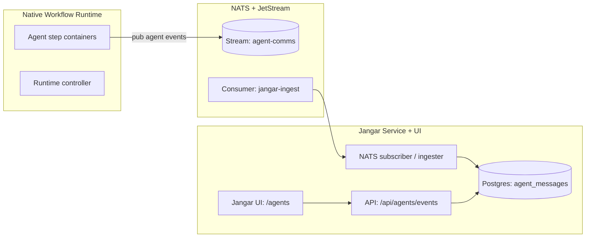

# NATS agent communications (native workflow runtime)

Owner: Platform + Jangar
Status: Draft

## Goals

- Use NATS JetStream as the **real-time bus** for workflow runtime “agent” messages.
- Persist messages so Jangar can **render full agent conversations** in the Jangar UI.
- Keep existing completion pipelines intact; NATS is for **agent comms**, not workflow completion.
- Provide a **global “general” channel** so all workflows/agents can coordinate across runs.

## Non-goals

- Replace Kafka for workflow completion topics.
- Implement external auth/TLS on day one (document a path, don’t block rollout).
- Expose NATS outside the cluster.

## Current stack context

- Native workflow runtime (default): Jangar controllers + runners in
  `services/jangar/src/server/agents-controller.ts` and
  `services/jangar/src/server/orchestration-controller.ts`.
- Jangar service + UI: `services/jangar` with Postgres (`jangar-db`) and Redis.
- OpenWebUI runs separately and proxies through Jangar’s OpenAI-compatible API.
- Codex runtimes already emit agent/event logs as artifacts (e.g. `.codex-implementation-agent.log`,
  `.codex-research-agent.log`, `.codex-implementation-events.jsonl`). Jangar already pulls these on run-complete
  (`services/jangar/src/server/codex-judge.ts`). NATS adds **real-time** delivery; artifacts remain the fallback/backfill.

## Architecture overview



## Message model

Every “agent communication” is a single NATS message that can be ordered and replayed.

### Required metadata (headers or JSON fields)

- `workflow_uid`: runtime workflow UID (maps to `codex_judge.runs.workflow_uid` when available)
- `workflow_name`: runtime workflow name
- `workflow_namespace`: runtime namespace (default `agents`)
- `run_id`: optional Jangar run id (maps to `codex_judge.runs.id` for Codex runs)
- `step_id`: runtime step id or pod name
- `agent_id`: stable agent identifier (e.g. `planner`, `executor`, `reviewer`)
- `role`: `system | user | assistant | tool`
- `kind`: `message | tool_call | tool_result | status | error`
- `timestamp`: RFC3339
- `channel`: optional; set to `general` for the shared cross-workflow chat
- `stage`: optional; can map to `codex_judge.runs.stage` when relevant
- `runtime`: optional runtime identifier (default `native`)

### Payload

- `content`: string (plain text or markdown)
- `tool`: optional tool metadata
- `attrs`: optional JSON map for structured data

### Example JSON

```json
{
  "workflow_uid": "4f5f...",
  "workflow_name": "codex-issue-2180",
  "workflow_namespace": "agents",
  "run_id": null,
  "step_id": "codex-agent-1",
  "agent_id": "executor",
  "role": "assistant",
  "kind": "message",
  "timestamp": "2025-12-29T01:22:10Z",
  "runtime": "native",
  "content": "Applied patch to charts/agents/values.yaml"
}
```

## Subject taxonomy

Use hierarchical subjects so Jangar can filter quickly.

```
workflow.<workflow_namespace>.<workflow_name>.<workflow_uid>.agent.<agent_id>.<kind>
```

### Global “general” channel

All workflows and agents also publish/subscribe to a shared channel:

```
workflow.general.<kind>
```

Set `channel: "general"` in the message body for easy filtering in Jangar.

Examples:

- `workflow.agents.codex-issue-2180.4f5f.agent.executor.message`
- `workflow.agents.codex-issue-2180.4f5f.agent.executor.tool_call`

### Why this shape

- Stable prefixes for JetStream stream matching (`workflow.>`)
- Easy to filter by run, agent, or kind without parsing JSON

## JetStream resources (NACK CRDs)

Create a dedicated stream for agent communications:

- Name: `agent-comms`
- Subjects: `workflow.>` (includes `workflow.general.*`)
- Retention: `limits`
- MaxAge: 7 days
- MaxBytes: 5–10Gi (tune)
- Replicas: 3
- Storage: `file`

Jangar uses a durable consumer:

- Name: `jangar-agent-comms`
- AckPolicy: `explicit`
- DeliverPolicy: `all`
- MaxAckPending: 20000

These CRDs should live under the GitOps bundle that owns the NATS and Jangar apps.

## Runtime publishing (native by default)

Runtime step containers publish events to NATS directly.

- Publish to run-specific subject **and** (if needed) the global general channel.

- `NATS_URL`: `nats://nats.nats.svc.cluster.local:4222`
- Optional: `NATS_SUBJECT_PREFIX` or computed subject per step

Example bash step:

```bash
nats pub "workflow.${WORKFLOW_NAMESPACE}.${WORKFLOW_NAME}.${WORKFLOW_UID}.agent.${AGENT_ID}.message" \
  --header "content-type: application/json" \
  "${PAYLOAD_JSON}"

# Global shared channel
nats pub "workflow.general.message" \
  --header "content-type: application/json" \
  "${PAYLOAD_JSON_GENERAL}"
```

Notes from current runtime templates:

- Codex runtimes already set `JANGAR_BASE_URL` and emit agent/event logs as artifacts.
- To publish in real time, either:
  1. Add a lightweight `nats` CLI to the runtime image, or
  2. Add a `natsio/nats-box` sidecar + helper script in a shared volume.

Either way, standardize subject + payload construction in a small wrapper (bash or node).

Recommended runtime env vars:

- `WORKFLOW_NAME`
- `WORKFLOW_UID`
- `WORKFLOW_NAMESPACE`
- `STEP_ID`
- `AGENT_ID`

## Jangar ingestion + UI

### Ingestion

- Add a NATS JetStream consumer in Jangar (`services/jangar/src/server/agent-comms/`).
- On message:
  - Validate schema.
  - Persist to Postgres table `agent_messages`.
  - Optionally store a short rolling window in Redis for quick UI streaming.

Implementation alignment with the current Jangar codebase:

- Follow the Effect service pattern (`services/jangar/src/server/effect-services.md`).
- Add `agent-comms-store.ts` using Kysely + `ensureMigrations` (pattern matches
  `codex-judge-store.ts`, `atlas-store.ts`, `memories-store.ts`).
- Add a migration file under `services/jangar/src/server/migrations/` (create schema
  `workflow_comms`) and register it in `services/jangar/src/server/kysely-migrations.ts`.
- Update `services/jangar/src/server/db.ts` to include the new table type.

Runtime placement:

- **Preferred:** a dedicated “jangar-agent-comms” worker Deployment (same image) that runs the subscriber
  continuously, decoupled from HTTP request lifecycles.
- **Alternative:** start the subscriber inside the Jangar server process via a module-level
  `ManagedRuntime`, ensuring only one consumer is created per process.
- **Current (Dec 30, 2025):** subscriber starts in-process via the Jangar SSR router bootstrap
  (`services/jangar/src/server/agent-comms-runtime.ts`). Set `JANGAR_AGENT_COMMS_SUBSCRIBER_DISABLED=true`
  when running a dedicated worker.

### Storage (Postgres)

Suggested table:

- `workflow_comms.agent_messages` (new schema to keep cross-workflow data separate from `codex_judge`):
  - `id` (uuid)
  - `workflow_uid`, `workflow_name`, `workflow_namespace`, `run_id`, `step_id`, `agent_id`
  - `role`, `kind`, `timestamp`
  - `content` (text), `attrs` (jsonb)
  - indexes on `(run_id, timestamp)`, `(workflow_uid, timestamp)`, `(agent_id)`, `(channel, timestamp)`

Retention policy:

- Keep 30–90 days in Postgres.
- JetStream holds 7 days for fast replay.

Backfill / reconciliation:

- On `run-complete`, Jangar already downloads agent/event artifacts (see
  `services/jangar/src/server/codex-judge.ts` with `implementation-agent-log` and
  `implementation-events`). Use these artifacts to backfill `workflow_comms.agent_messages`
  when NATS is unavailable or to seed historical runs.

## Optional adapters

### Argo Workflows adapter (optional)

Argo Workflows can publish the same schema if you still run Argo templates. If you adopt an
Argo adapter (optional integration):

- Map Argo fields to the runtime-agnostic metadata:
  - `workflow_uid`: `workflow.uid`
  - `workflow_name`: `metadata.name`
  - `workflow_namespace`: Argo namespace (often `argo-workflows`)
  - `step_id`: Argo node id or pod name
  - `runtime`: `argo`
- Use the default subject prefix `workflow.` whenever possible.
- If compatibility requires `argo.workflow.>`, configure the stream to include both prefixes and
  include `runtime: "argo"` in payloads.
