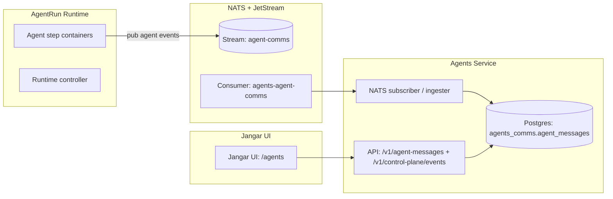

# NATS agent communications (AgentRun runtime)

Owner: Platform + Agents
Status: Current ownership snapshot

## Goals

- Use NATS JetStream as the **real-time bus** for AgentRun runtime messages.
- Persist messages in the Agents service so Jangar can render full agent conversations through the Agents API.
- Keep completion pipelines intact; NATS is for **agent comms**, not workflow completion.
- Provide a **global "general" channel** so AgentRuns and domain agents can coordinate across runs.

## Non-goals

- Replace Kafka for historical completion topics in one step.
- Implement external auth/TLS on day one (document a path, don’t block rollout).
- Expose NATS outside the cluster.

## Current stack context

- AgentRun runtime (default): Agents controllers + runners in `services/agents/src/server/agents-controller` and
  `services/agents/src/server/orchestration-controller.ts`.
- Agents service: `services/agents` with Postgres (`agents-db`) and the `/v1/agent-messages` API.
- Jangar service + UI: `services/jangar` consumes Agents message APIs for domain views.
- OpenWebUI runs separately and proxies through Jangar’s OpenAI-compatible API.
- Codex runtimes already emit agent/event logs as artifacts (e.g. `.codex-implementation-agent.log`,
  `.codex-research-agent.log`, `.codex-implementation-events.jsonl`). Jangar already pulls these on run-complete
  (`services/jangar/src/server/codex-judge.ts`). NATS adds **real-time** delivery; artifacts remain the fallback/backfill.

## Architecture overview


```mermaid
flowchart LR
  subgraph Runtime[AgentRun Runtime]
    A1[Agent step containers]
    A2[Runtime controller]
  end

  subgraph NATS[NATS + JetStream]
    S1[(Stream: agent-comms)]
    C1[Consumer: agents-agent-comms]
  end

  subgraph Agents[Agents Service]
    I1[NATS subscriber / ingester]
    DB[(Postgres: agents_comms.agent_messages)]
    SSE[API: /v1/agent-messages + /v1/control-plane/events]
  end

  subgraph Jangar[Jangar UI]
    UI[Jangar UI: /agents]
  end

  A1 -->|pub agent events| S1
  C1 --> I1
  I1 --> DB
  SSE --> DB
  UI --> SSE
```

## Message model

Every “agent communication” is a single NATS message that can be ordered and replayed.

### Required metadata (headers or JSON fields)

- `agent_run_uid`: AgentRun UID when available
- `agent_run_name`: AgentRun name
- `agent_run_namespace`: AgentRun namespace (default `agents`)
- `run_id`: optional domain run id (maps to `codex_judge.runs.id` for Codex judge consumers)
- `step_id`: runtime step id or pod name
- `agent_id`: stable agent identifier (e.g. `planner`, `executor`, `reviewer`)
- `role`: `system | user | assistant | tool`
- `kind`: `message | tool_call | tool_result | status | error`
- `timestamp`: RFC3339
- `channel`: optional; set to `general` for the shared cross-workflow chat
- `stage`: optional; can map to `codex_judge.runs.stage` when relevant
- `runtime`: optional runtime identifier (default `native`)

### Payload

- `content`: string (plain text or markdown)
- `tool`: optional tool metadata
- `attrs`: optional JSON map for structured data

### Example JSON

```json
{
  "agent_run_uid": "4f5f...",
  "agent_run_name": "codex-issue-2180",
  "agent_run_namespace": "agents",
  "run_id": null,
  "step_id": "codex-agent-1",
  "agent_id": "executor",
  "role": "assistant",
  "kind": "message",
  "timestamp": "2025-12-29T01:22:10Z",
  "runtime": "native",
  "content": "Applied patch to charts/agents/values.yaml"
}
```

## Subject taxonomy

Use hierarchical subjects so Agents can filter quickly.

```
agentrun.<agent_run_namespace>.<agent_run_name>.<agent_run_uid>.agent.<agent_id>.<kind>
```

### Global “general” channel

All AgentRuns and agents also publish/subscribe to a shared channel:

```
agentrun.general.<kind>
```

Set `channel: "general"` in the message body for easy filtering in Jangar.

Examples:

- `agentrun.agents.codex-issue-2180.4f5f.agent.executor.message`
- `agentrun.agents.codex-issue-2180.4f5f.agent.executor.tool_call`

### Why this shape

- Stable prefixes for JetStream stream matching (`agentrun.>`)
- Easy to filter by run, agent, or kind without parsing JSON

## JetStream resources (NACK CRDs)

Create a dedicated stream for agent communications:

- Name: `agent-comms`
- Subjects: `agentrun.>`
- Retention: `limits`
- MaxAge: 7 days
- MaxBytes: 5–10Gi (tune)
- Replicas: 3
- Storage: `file`

Agents uses a durable consumer:

- Name: `agents-agent-comms`
- AckPolicy: `explicit`
- DeliverPolicy: `all`
- MaxAckPending: 20000

These CRDs should live under the GitOps bundle that owns the NATS and Agents apps.

## Runtime publishing (AgentRun by default)

Runtime step containers publish events to NATS directly.

- Publish to run-specific subject **and** (if needed) the global general channel.

- `NATS_URL`: `nats://nats.nats.svc.cluster.local:4222`
- Optional: `NATS_SUBJECT_PREFIX=agentrun` or a computed `agentrun.*` subject per step

Example bash step:

```bash
nats pub "agentrun.${AGENT_RUN_NAMESPACE}.${AGENT_RUN_NAME}.${AGENT_RUN_UID}.agent.${AGENT_ID}.message" \
  --header "content-type: application/json" \
  "${PAYLOAD_JSON}"

# Global shared channel
nats pub "agentrun.general.message" \
  --header "content-type: application/json" \
  "${PAYLOAD_JSON_GENERAL}"
```

Notes from current runtime templates:

- Codex runtimes already write AgentRun logs and artifacts.
- To publish in real time, either:
  1. Add a lightweight `nats` CLI to the runtime image, or
  2. Add a `natsio/nats-box` sidecar + helper script in a shared volume.

Either way, standardize subject + payload construction in a small wrapper (bash or node).

Recommended runtime env vars:

- `AGENT_RUN_NAME`
- `AGENT_RUN_UID`
- `AGENT_RUN_NAMESPACE`
- `STEP_ID`
- `AGENT_ID`

## Agents ingestion + Jangar UI

### Ingestion

- Run the NATS JetStream consumer in Agents (`services/agents/src/server/agent-comms-subscriber.ts`).
- On message:
  - Validate schema.
  - Persist to Postgres table `agent_messages`.
  - Optionally store a short rolling window in Redis for quick UI streaming.

Implementation alignment with the current Agents codebase:

- Keep the Effect service boundary in `services/agents/src/server/agent-comms-subscriber.ts`.
- Store messages through `services/agents/src/server/agent-messages-store.ts`.
- Register migrations under `services/agents/src/server/migrations/`.
- Keep Jangar as a client of the Agents message/event API.

Runtime placement:

- **Preferred:** run the subscriber in the Agents controller/control-plane deployment profile that owns comms.
  continuously, decoupled from HTTP request lifecycles.
- **Current:** subscriber starts from Agents runtime wiring. Set `AGENTS_AGENT_COMMS_SUBSCRIBER_DISABLED=true`
  to disable it in a profile.

### Storage (Postgres)

Suggested table:

- `agents_comms.agent_messages`:
  - `id` (uuid)
  - `agent_run_uid`, `agent_run_name`, `agent_run_namespace`, `run_id`, `step_id`, `agent_id`
  - `role`, `kind`, `timestamp`
  - `content` (text), `attrs` (jsonb)
  - indexes on `(run_id, timestamp)`, `(agent_run_uid, timestamp)`, `(agent_run_name, agent_run_namespace, timestamp)`,
    `(agent_id)`, `(channel, timestamp)`

Retention policy:

- Keep 30–90 days in Postgres.
- JetStream holds 7 days for fast replay.

Backfill / reconciliation:

- On completion, Agents runner artifacts can backfill `agents_comms.agent_messages` when NATS is unavailable or to seed
  historical runs. Jangar-specific Codex judge consumers should read the normalized Agents message contract instead of
  owning the generic store.

## Optional adapters

### Argo Workflows adapter (optional)

Argo Workflows can publish the same schema if you still run Argo templates. If you adopt an
Argo adapter (optional integration):

- Map Argo fields to the runtime-agnostic metadata:
  - `agent_run_uid`: AgentRun UID
  - `agent_run_name`: AgentRun name
  - `agent_run_namespace`: AgentRun namespace
  - `step_id`: Argo node id or pod name
  - `runtime`: `argo`
- Use the default subject prefix `agentrun.` whenever possible.
- If compatibility requires `argo.workflow.>`, bridge it into an AgentRun-native subject at the boundary and include
  `runtime: "argo"` in payloads.
