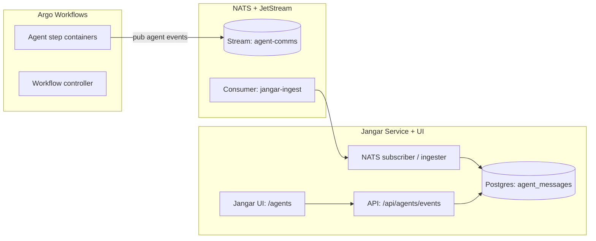

# NATS for Argo Workflow agent communications (Jangar UI)

Owner: Platform + Jangar
Status: Draft

## Goals

- Use NATS JetStream as the **real-time bus** for Argo workflow “agent” messages.
- Persist messages so Jangar can **render full agent conversations** in the Jangar UI.
- Keep existing Kafka-based Argo completion flow intact; NATS is for **agent comms**, not workflow completion.
- Provide a **global “general” channel** so all workflows/agents can coordinate across runs.

## Non-goals

- Replace Kafka for Argo Events workflow completion topics.
- Implement external auth/TLS on day one (document a path, don’t block rollout).
- Expose NATS outside the cluster.

## Current stack context

- NATS cluster: `argocd/applications/nats` (JetStream enabled, Longhorn PVCs).
- NACK controller: `argocd/applications/nack` (JetStream CRDs).
- Jangar service + UI: `services/jangar` with Postgres (`jangar-db`) and Redis.
- OpenWebUI runs separately and proxies through Jangar’s OpenAI-compatible API.
- Codex workflow templates already emit agent/event logs as artifacts (e.g. `.codex-implementation-agent.log`,
  `.codex-research-agent.log`, `.codex-implementation-events.jsonl`). Jangar already pulls these on run-complete
  (`services/jangar/src/server/codex-judge.ts`). NATS adds **real-time** delivery; artifacts remain the fallback/backfill.

## Architecture overview



## Message model

Every “agent communication” is a single NATS message that can be ordered and replayed.

### Required metadata (headers or JSON fields)

- `workflow_uid`: Argo `workflow.uid` (maps to `codex_judge.runs.workflow_uid`)
- `workflow_name`: Argo `metadata.name`
- `workflow_namespace`: Argo namespace (default `argo-workflows`)
- `run_id`: optional Jangar run id (maps to `codex_judge.runs.id` when available; omit for non-codex runs)
- `step_id`: Argo node id or pod name
- `agent_id`: stable agent identifier (e.g. `planner`, `executor`, `reviewer`)
- `role`: `system | user | assistant | tool`
- `kind`: `message | tool_call | tool_result | status | error`
- `timestamp`: RFC3339
- `channel`: optional; set to `general` for the shared cross-workflow chat
- `stage`: optional; can map to `codex_judge.runs.stage` when relevant

### Payload

- `content`: string (plain text or markdown)
- `tool`: optional tool metadata
- `attrs`: optional JSON map for structured data

### Example JSON

```json
{
  "workflow_uid": "4f5f...",
  "workflow_name": "codex-issue-2180",
  "workflow_namespace": "argo-workflows",
  "run_id": null,
  "step_id": "codex-agent-1",
  "agent_id": "executor",
  "role": "assistant",
  "kind": "message",
  "timestamp": "2025-12-29T01:22:10Z",
  "content": "Applied patch to argocd/applications/nats/values.yaml"
}
```

## Subject taxonomy

Use hierarchical subjects so Jangar can filter quickly.

```
argo.workflow.<workflow_namespace>.<workflow_name>.<workflow_uid>.agent.<agent_id>.<kind>
```

### Global “general” channel

All workflows and agents also publish/subscribe to a shared channel:

```
argo.workflow.general.<kind>
```

Set `channel: "general"` in the message body for easy filtering in Jangar.

Examples:

- `argo.workflow.argo-workflows.codex-issue-2180.4f5f.agent.executor.message`
- `argo.workflow.argo-workflows.codex-issue-2180.4f5f.agent.executor.tool_call`

### Why this shape

- Stable prefixes for JetStream stream matching (`argo.workflow.>`)
- Easy to filter by run, agent, or kind without parsing JSON

## JetStream resources (NACK CRDs)

Create a dedicated stream for agent communications:

- Name: `agent-comms`
- Subjects: `argo.workflow.>` (includes `argo.workflow.general.*`)
- Retention: `limits`
- MaxAge: 7 days
- MaxBytes: 5–10Gi (tune)
- Replicas: 3
- Storage: `file`

Jangar uses a durable consumer:

- Name: `jangar-agent-comms`
- AckPolicy: `explicit`
- DeliverPolicy: `all`
- MaxAckPending: 20000

These CRDs should live under `argocd/applications/jangar/` (so the consumer is owned by Jangar)
while the stream can live under `argocd/applications/nats/` or a shared `argocd/applications/observability/` bundle.

## Argo workflow publishing

Workflow step containers publish events to NATS directly.

- Publish to run-specific subject **and** (if needed) the global general channel.

- `NATS_URL`: `nats://nats.nats.svc.cluster.local:4222`
- Optional: `NATS_SUBJECT_PREFIX` or computed subject per step

Example bash step:

```bash
nats pub "argo.workflow.${WORKFLOW_NAMESPACE}.${WORKFLOW_NAME}.${WORKFLOW_UID}.agent.${AGENT_ID}.message" \
  --header "content-type: application/json" \
  "${PAYLOAD_JSON}"

# Global shared channel
nats pub "argo.workflow.general.message" \
  --header "content-type: application/json" \
  "${PAYLOAD_JSON_GENERAL}"
```

Notes from current workflow templates:

- Codex workflows already set `JANGAR_BASE_URL` and emit agent/event logs as artifacts
  (`argocd/applications/froussard/github-codex-implementation-workflow-template.yaml`,
  `argocd/applications/argo-workflows/codex-research-workflow.yaml`).
- To publish in real time, either:
  1) Add a lightweight `nats` CLI to the `codex-universal` image, or
  2) Add a `natsio/nats-box` sidecar + helper script in a shared volume.

Either way, standardize subject + payload construction in a small wrapper (bash or node).

Recommended workflow env vars (Argo templates):

- `WORKFLOW_NAME={{workflow.name}}`
- `WORKFLOW_UID={{workflow.uid}}`
- `WORKFLOW_NAMESPACE={{workflow.namespace}}`
- `STEP_ID={{pod.name}}` (or `{{tasks.<name>.name}}` depending on template)
- `AGENT_ID=<role>` (e.g., `planner`, `executor`, `reviewer`)

## Jangar ingestion + UI

### Ingestion

- Add a NATS JetStream consumer in Jangar (`services/jangar/src/server/agent-comms/`).
- On message:
  - Validate schema.
  - Persist to Postgres table `agent_messages`.
  - Optionally store a short rolling window in Redis for quick UI streaming.

Implementation alignment with the current Jangar codebase:

- Follow the Effect service pattern (`services/jangar/src/server/effect-services.md`).
- Add `agent-comms-store.ts` using Kysely + `ensureMigrations` (pattern matches
  `codex-judge-store.ts`, `atlas-store.ts`, `memories-store.ts`).
- Add a migration file under `services/jangar/src/server/migrations/` (create schema
  `workflow_comms`) and register it in `services/jangar/src/server/kysely-migrations.ts`.
- Update `services/jangar/src/server/db.ts` to include the new table type.

Runtime placement:

- **Preferred:** a dedicated “jangar-agent-comms” worker Deployment (same image) that runs the subscriber
  continuously, decoupled from HTTP request lifecycles.
- **Alternative:** start the subscriber inside the Jangar server process via a module-level
  `ManagedRuntime`, ensuring only one consumer is created per process.
- **Current (Dec 30, 2025):** subscriber starts in-process via the Jangar SSR router bootstrap
  (`services/jangar/src/server/agent-comms-runtime.ts`). Set `JANGAR_AGENT_COMMS_SUBSCRIBER_DISABLED=true`
  when running a dedicated worker.

### Storage (Postgres)

Suggested table:

- `workflow_comms.agent_messages` (new schema to keep cross-workflow data separate from `codex_judge`):
  - `id` (uuid)
  - `workflow_uid`, `workflow_name`, `workflow_namespace`, `run_id`, `step_id`, `agent_id`
  - `role`, `kind`, `timestamp`
  - `content` (text), `attrs` (jsonb)
  - indexes on `(run_id, timestamp)`, `(workflow_uid, timestamp)`, `(agent_id)`, `(channel, timestamp)`

Retention policy:

- Keep 30–90 days in Postgres.
- JetStream holds 7 days for fast replay.

Backfill / reconciliation:

- On `run-complete`, Jangar already downloads agent/event artifacts (see
  `services/jangar/src/server/codex-judge.ts` with `implementation-agent-log` and
  `implementation-events`). Use these artifacts to backfill `workflow_comms.agent_messages`
  when NATS is unavailable or to seed historical runs.

### UI

Add a new Jangar UI route:

- `/agents` list view: recent runs and active workflows.
- `/agents/:runId` detail view: timeline grouped by agent.
- `/agents/general` global cross-workflow channel timeline.
- Filters: agent, kind, time range.

Implementation alignment:

- Routes live under `services/jangar/src/routes` and should use `createFileRoute`.
- Add nav entry in `services/jangar/src/components/app-sidebar.tsx` under the “App” section.

Rendering:

- Use markdown rendering for message content.
- Use compact chips for `tool_call` / `tool_result`.

### Live updates

Expose SSE endpoint:

- `GET /api/agents/events?runId=...` streams new messages.
- `GET /api/agents/events?channel=general` streams global channel.
- UI subscribes to SSE for live updates.

Implementation alignment:

- Use the SSE Response pattern in `services/jangar/src/server/chat.ts` (ReadableStream with
  `text/event-stream` headers).
- API route should live under `services/jangar/src/routes/api/agents/events.tsx`.

## Auth / security

Phase 1 (current cluster):

- In-cluster NATS only, no auth/TLS.
- Trust boundary: cluster network.

Phase 2 (recommended):

- Enable NATS auth with creds + separate accounts:
  - `system` account for NACK.
  - `agents` account for Argo workflows.
  - `jangar` account for consumer.

Store creds as Kubernetes secrets in the appropriate namespaces; if needed, mirror them with
`kubernetes-reflector` (pattern used for Kafka secrets today).

## Observability

- Enable NATS monitoring endpoints.
- Optionally enable `promExporter` in the NATS Helm values and add a scrape target in `argocd/applications/observability`.
- Track:
  - publish rate per subject
  - JetStream storage growth
  - consumer lag for `jangar-agent-comms`

## Rollout plan

1) **Define JetStream CRDs** (stream + consumer) via NACK.
2) **Add Jangar ingestion** + table + API endpoints.
3) **Add Jangar UI pages** for agent comms.
4) **Update workflow templates** to publish to NATS.
5) **Enable observability** and tune retention/limits.

## Open questions

- Should OpenWebUI embed the agent comms view, or should it remain only in Jangar UI?
- Do we want to **link agent comms** directly to Codex run ids from Kafka completions?
- Retention: is 7 days in JetStream enough, or should we retain longer?
- Do we run the NATS subscriber as a **dedicated worker Deployment** or inside the Jangar web process?
