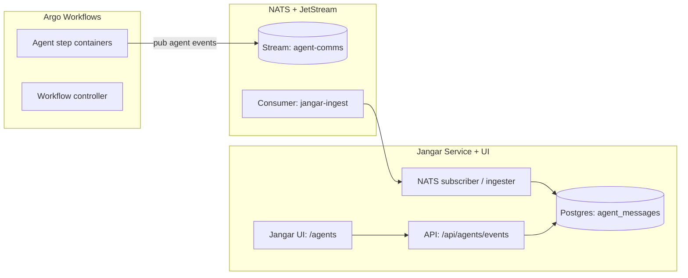

# NATS for Argo Workflow agent communications (Jangar UI)

Owner: Platform + Jangar
Status: Draft

## Goals

- Use NATS JetStream as the **real-time bus** for Argo workflow “agent” messages.
- Persist messages so Jangar can **render full agent conversations** in the Jangar UI.
- Keep existing Kafka-based Argo completion flow intact; NATS is for **agent comms**, not workflow completion.

## Non-goals

- Replace Kafka for Argo Events workflow completion topics.
- Implement external auth/TLS on day one (document a path, don’t block rollout).
- Expose NATS outside the cluster.

## Current stack context

- NATS cluster: `argocd/applications/nats` (JetStream enabled, Longhorn PVCs).
- NACK controller: `argocd/applications/nack` (JetStream CRDs).
- Jangar service + UI: `services/jangar` with Postgres (`jangar-db`) and Redis.
- OpenWebUI runs separately and proxies through Jangar’s OpenAI-compatible API.

## Architecture overview



## Message model

Every “agent communication” is a single NATS message that can be ordered and replayed.

### Required metadata (headers or JSON fields)

- `workflow_id`: Argo `workflow.uid`
- `workflow_name`: Argo `metadata.name`
- `run_id`: logical run id (e.g. same as `workflow_id` unless a run/attempt id is present)
- `step_id`: Argo node id or pod name
- `agent_id`: stable agent identifier (e.g. `planner`, `executor`, `reviewer`)
- `role`: `system | user | assistant | tool`
- `kind`: `message | tool_call | tool_result | status | error`
- `timestamp`: RFC3339

### Payload

- `content`: string (plain text or markdown)
- `tool`: optional tool metadata
- `attrs`: optional JSON map for structured data

### Example JSON

```json
{
  "workflow_id": "4f5f...",
  "workflow_name": "codex-issue-2180",
  "run_id": "4f5f...",
  "step_id": "codex-agent-1",
  "agent_id": "executor",
  "role": "assistant",
  "kind": "message",
  "timestamp": "2025-12-29T01:22:10Z",
  "content": "Applied patch to argocd/applications/nats/values.yaml"
}
```

## Subject taxonomy

Use hierarchical subjects so Jangar can filter quickly.

```
argo.workflow.<workflow_name>.<run_id>.agent.<agent_id>.<kind>
```

Examples:

- `argo.workflow.codex-issue-2180.4f5f.agent.executor.message`
- `argo.workflow.codex-issue-2180.4f5f.agent.executor.tool_call`

### Why this shape

- Stable prefixes for JetStream stream matching (`argo.workflow.>`)
- Easy to filter by run, agent, or kind without parsing JSON

## JetStream resources (NACK CRDs)

Create a dedicated stream for agent communications:

- Name: `agent-comms`
- Subjects: `argo.workflow.>`
- Retention: `limits`
- MaxAge: 7 days
- MaxBytes: 5–10Gi (tune)
- Replicas: 3
- Storage: `file`

Jangar uses a durable consumer:

- Name: `jangar-agent-comms`
- AckPolicy: `explicit`
- DeliverPolicy: `all`
- MaxAckPending: 20000

These CRDs should live under `argocd/applications/jangar/` (so the consumer is owned by Jangar)
while the stream can live under `argocd/applications/nats/` or a shared `argocd/applications/observability/` bundle.

## Argo workflow publishing

Workflow step containers publish events to NATS directly.

- `NATS_URL`: `nats://nats.nats.svc.cluster.local:4222`
- Optional: `NATS_SUBJECT_PREFIX` or computed subject per step

Example bash step:

```bash
nats pub "argo.workflow.${WORKFLOW_NAME}.${WORKFLOW_UID}.agent.${AGENT_ID}.message" \
  --header "content-type: application/json" \
  "${PAYLOAD_JSON}"
```

If desired, bake a small sidecar or init container that exports a helper script to standardize
schema and subject construction.

## Jangar ingestion + UI

### Ingestion

- Add a NATS JetStream consumer in Jangar (`services/jangar/src/server/nats/`).
- On message:
  - Validate schema.
  - Persist to Postgres table `agent_messages`.
  - Optionally store a short rolling window in Redis for quick UI streaming.

### Storage (Postgres)

Suggested table:

- `agent_messages`:
  - `id` (uuid)
  - `workflow_id`, `workflow_name`, `run_id`, `step_id`, `agent_id`
  - `role`, `kind`, `timestamp`
  - `content` (text), `attrs` (jsonb)
  - indexes on `(run_id, timestamp)`, `(workflow_id)`, `(agent_id)`

Retention policy:

- Keep 30–90 days in Postgres.
- JetStream holds 7 days for fast replay.

### UI

Add a new Jangar UI route:

- `/agents` list view: recent runs and active workflows.
- `/agents/:runId` detail view: timeline grouped by agent.
- Filters: agent, kind, time range.

Rendering:

- Use markdown rendering for message content.
- Use compact chips for `tool_call` / `tool_result`.

### Live updates

Expose SSE endpoint:

- `GET /api/agents/events?runId=...` streams new messages.
- UI subscribes to SSE for live updates.

## Auth / security

Phase 1 (current cluster):

- In-cluster NATS only, no auth/TLS.
- Trust boundary: cluster network.

Phase 2 (recommended):

- Enable NATS auth with creds + separate accounts:
  - `system` account for NACK.
  - `agents` account for Argo workflows.
  - `jangar` account for consumer.

Store creds as Kubernetes secrets in the appropriate namespaces.

## Observability

- Enable NATS monitoring endpoints.
- Optionally enable `promExporter` in the NATS Helm values and add a scrape target in `argocd/applications/observability`.
- Track:
  - publish rate per subject
  - JetStream storage growth
  - consumer lag for `jangar-agent-comms`

## Rollout plan

1) **Define JetStream CRDs** (stream + consumer) via NACK.
2) **Add Jangar ingestion** + table + API endpoints.
3) **Add Jangar UI pages** for agent comms.
4) **Update workflow templates** to publish to NATS.
5) **Enable observability** and tune retention/limits.

## Open questions

- Should OpenWebUI embed the agent comms view, or should it remain only in Jangar UI?
- Do we want to **link agent comms** directly to Codex run ids from Kafka completions?
- Retention: is 7 days in JetStream enough, or should we retain longer?
