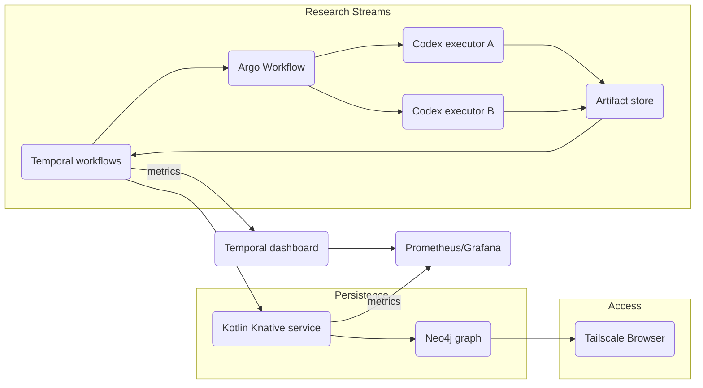
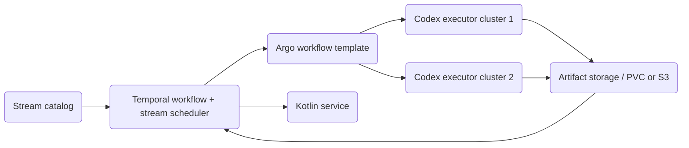
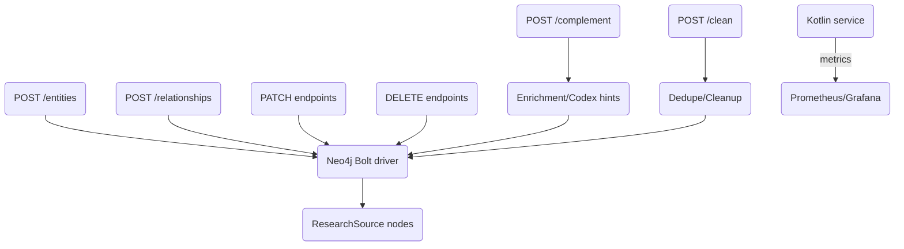
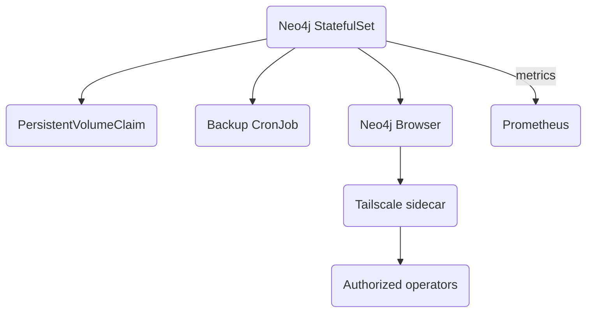

# Graf Knowledge Base Research Graph Design

> This file (`docs/nvidia-company-research.md`) replaces the legacy `docs/nvidia-supply-chain-graph-design.md` and now serves as the general knowledge-base reference; the NVIDIA story is preserved in the appendix below.

## Purpose

- Capture multi-tier partnerships, logistics, contracts, and strategic relationships for any domain inside a living Neo4j knowledge graph.
- Automate discovery/enrichment through Temporal → Argo → Codex research artifacts, persist those findings via a Knative-hosted Kotlin service, and make the graph operable through a Tailscale-accessible Neo4j Browser.

## Key Objectives

1. **Graph fidelity**: Model multi-tier partnerships, logistics, contracts, risks, certifications, and strategic collaborations; keep provenance for every insight.
2. **Automated research loop**: Temporal orchestrates Argo Workflows that run Codex jobs, produce structured artifacts, and feed the graph service.
3. **Operational service**: Kotlin Knative API handles insert/update/delete/complement/clean flows, exposed for Temporal activities and manual tooling.
4. **Secure access**: Neo4j Browser only reachable through a Tailscale sidecar; the service authenticates via short-lived tokens.

## AutoResearch prompt configuration

AutoResearch prompts and metadata are now driven by environment variables so you can retarget the experience without touching Kotlin. The stock defaults are vendor-neutral, but you can still point them at a domain (see the NVIDIA appendix for an example):

- `AUTO_RESEARCH_KB_NAME` – Knowledge-base name shown in the prompt header and ROLE statement (default `Graf AutoResearch Knowledge Base`).
- `AUTO_RESEARCH_STAGE` – Stage label that becomes `codex.stage`, prefixes AutoResearch workflow names (sanitized to DNS-1123 first), and feeds downstream telemetry (default `auto-research`).
- `AUTO_RESEARCH_STREAM_ID` – Stream value embedded in the prompt text, codex-graf payloads, and metadata map (default `auto-research`).
- `AUTO_RESEARCH_OPERATOR_GUIDANCE` – Fallback guidance appended when the caller omits `user_prompt`.
- `AUTO_RESEARCH_DEFAULT_GOALS` – Newline-separated numbered goals inserted below the GOALS heading.

Update the Graf Knative service (for example via `bun packages/scripts/src/graf/deploy-service.ts`) anytime these values change so the running service picks them up. Coordinate with Graf deploy owners before switching stage/stream labels that instrumentation or dashboards depend on.

## Architecture Overview

| Layer                                 | Responsibility                                                                                                                                                                                            |
| ------------------------------------- | --------------------------------------------------------------------------------------------------------------------------------------------------------------------------------------------------------- |
| **Research Orchestration**            | Temporal workflows coordinate multiple parallel research streams, trigger Argo workflows (with stream-aware queues), and handle retry/human-review logic per stream.                                      |
| **Research Execution (Argo + Codex)** | Each Argo workflow can instantiate several Codex executors (by topic/geography), enforce structured JSON schema, and expose per-instance artifact metadata (artifactId, confidence, citations, streamId). |
| **Persistence Service**               | Kotlin (Ktor/Spring Boot) running as a Knative service exposes CRUD/complement/clean endpoints, talks to Neo4j via the Bolt driver, and logs provenance in `ResearchSource` nodes.                        |
| **Graph Platform**                    | Neo4j StatefulSet (or Helm release) with PV-backed storage, Bolt+HTTP ports restricted to Tailscale sidecar, schema that supports companies, components, logistics, contracts, and risks.                 |

### High-level architecture diagram

## Neo4j Schema Highlights

- **Nodes**: `Company`, `Facility`, `Component`, `LogisticsProvider`, `Product`, `ResearchSource`, `RiskTag`, `Event`, `Certification`.
- **Relationships**:
  - `SUPPLIES`, `PARTNERS_WITH`, `MANUFACTURES_AT`, `LOGISTICS_BY`, `RESEARCHED_BY`, `HAS_RISK`, `CERTIFIED_BY`.
  - `INFRASTRUCTURE_FOR` to model foundry/test/tooling relationships.
- **Metadata**: `sourceUrl`, `confidence`, `artifactId`, `updatedAt`, `capacity`, `geo`, `contracts`, `riskScore`.
- **Integrity**: Each workflow/activity logs nodes for `ResearchSource` and edges from the data it mutated; `artifactId` flows through the lifecycle for audit and cleanup.
- **Composite modeling**: `CompositeTier` or `CompositeStack` nodes aggregate tiers (Tier 1, Tier 2...) and combine logistic/partner clusters for visualizations.

## Temporal → Argo → Codex → Service Flow for Concurrent Streams

1. **Trigger**: Temporal workflow (namespace `nvidia-company-research`) schedules research pulses per stream (e.g., foundries, ODMs, hyperscale partners, logistics). Backlogs, low confidence, or conflicting data escalate through review steps.
2. **Argo workflow execution**:
   - Pull research prompt templates associated with the stream.
   - Launch multiple Codex executors to cover different data sources or geographies for that stream; each executor emits artifacts tagged with `streamId`/`instanceId`.
   - Emit artifact JSON (timestamps, citations, `artifactId`, `confidence`, `sourceUrl`, `streamId`) to shared storage (PVC/S3) and signal completion.
3. **Temporal consumption**:
   - Fetch artifact reference(s), validate schema and confidence, and correlate them with the stream/instance metadata.
   - Enrich with geo, partner/supplier/manufacturer context, investment/research tags, and downstream significance scoring.
   - Invoke Kotlin service endpoints (`/entities`, `/relationships`, `/complement`, `/autoresearch`) with artifact metadata + stream lineage. `/autoresearch` now launches the Codex research workflow with a baked-in prompt (responds `202 Accepted` with workflow IDs) so frontends can steer automated investigations without managing prompts themselves. We refer to this workflow as AutoResearch.
4. **Neo4j persistence**:
   - Neo4j driver upserts nodes/edges, tagging each mutation with `artifactId`, `ResearchSource`, and originating streams.
   - Deduplicate via `apoc.coll.fuzzyMatch`, resolve conflicts using confidence/timestamp, and trigger `clean` endpoint for TTL/soft-deletes when needed.
5. **Feedback**: Temporal records success/failure for each stream/instance, logs workload metadata in Neo4j, and can enqueue complementary cleanup or dedupe runs.

## Concurrent Codex Stream Considerations

- **Stream catalog**: Maintain a Temporal-managed catalog of active research streams, each with `streamId`, topic (e.g., foundry/OEM/logistics), priority, prompt templates, and expected cadence.
- **Per-instance provenance**: Artifacts include `streamId`, `instanceId`, `promptId`, `generatedAt`, and `confidence`; the Kotlin service can filter/infer updates per stream and tag edges with `sourceStreams`.
- **Consistency**: When multiple streams target the same node, merge updates by prioritizing higher confidence/timestamp values, and keep `sourceStreams` collections on edges to prevent accidental overwrites.
- **Throughput scaling**: Temporal can fan out Argo subworkflows for each stream, allowing multiple Codex instances to research concurrently while the Kotlin service ingests them incrementally; the service supports batch operations to minimize contention.

### Research stream component diagram

The diagram below shows how Temporal tracks each research stream, launches Argo/Codex units, and funnels artifacts into the shared store that feeds the Kotlin persistence service.

## Kotlin Knative Service Responsibilities

- **Endpoints**:
  - `POST /entities` – insert nodes with schema validation and provenance annotation.
  - `POST /relationships` – connect entities with typed edges.
  - `PATCH /entities/{id}` / `PATCH /relationships/{id}` – apply delta updates while preserving `ResearchSource`.
  - `DELETE /entities/{id}` / `DELETE /relationships/{id}` – support soft delete + archival (record `deletedAt`, `artifactId`).
  - `POST /complement` – fill missing attributes (e.g., geolocation, procurement tier, certifications) using Codex hints or reference tables.
  - `POST /clean` – trigger dedupe logic, TTL purging, and referential integrity scans; ideally call Neo4j `apoc` procedures for fuzzy matching.
- **Integration hooks**: Temporal activities call these endpoints; each request includes workflow ID, artifact reference, and optional Codex citations.
- **Technology stack**: Kotlin + Ktor or Spring Boot, Neo4j Java driver, Knative service definitions (autoscale zero, concurrency), containerized via existing CI/CD pipeline.
- **Security**: Authenticate request via workload identity token or service account, limit to `company-research` namespace.

### Kotlin service component diagram

This view shows how each endpoint connects to Neo4j, enrichment hooks, cleaning routines, and observability.

## Neo4j Deployment & Access Control

- **Namespace**: `neo4j` with StatefulSet or Helm chart.
- **Storage**: PVC + scheduled backup CronJob persisting to object storage; snapshots versioned and referenced from Temporal for rollback.
- **Network**: Bolt port only accessible from service account; HTTP Browser port only accessible through Tailscale sidecar.
- **Tailscale sidecar**: pod runs Tailscale connecting to default tailnet; restrict access with Kubernetes network policy to Tailscale IP range.
- **Logs/Monitoring**: Export Neo4j metrics (transactions, store size) to Prometheus; alert on conflicting writes or slow queries impacting Temporal ingestion.

### Neo4j & access component diagram

The diagram below summarizes the Neo4j deployment, its storage/backup claims, and Tailscale-protected browser access.

## Observability & Security

- **Temporal metrics**: track workflow duration, retries, Argo artifact ingestion success; hook into Grafana dashboards and alert on pilot-timeouts.
- **Codex artifact validation**: store `confidence` and `citationCount`; if < threshold, flag for manual review and do not persist automatically.
- **Audit trail**: for every mutation log `artifactId`, `workflowId`, `workflowRunId`; `ResearchSource` nodes link to artifact metadata (prompt, citations).
- **Secrets**: store Neo4j credentials, Tailscale auth, Temporal namespace tokens in Kubernetes Secrets accessible only to respective namespaces.

## Deployment Steps

1. Provision Neo4j in Kubernetes with PV, Tailscale sidecar, and backup job; verify Browser access via Tailscale client.
2. Build Kotlin service container, deploy as Knative service; configure env vars for Neo4j connection, Temporal endpoint, and artifact storage location.
3. Implement Temporal workflows that schedule Argo jobs, retrieve artifacts, and call Knative service endpoints; include retry/human-review logic.
4. Define Argo Workflow templates that:
   - Accept prompt templates.
   - Run Codex job with guardrails.
   - Upload artifact JSON to shared storage (PVC/S3).
   - Return artifact metadata for Temporal.
5. Deploy monitoring (Prometheus/Grafana) for Neo4j, Knative service, and Temporal.

## Validation & Testing

- Unit tests for Kotlin endpoints using embedded Neo4j test harness.
- Temporal workflow tests mock Argo/Codex responses to ensure path coverage (success, low confidence, cleanup).
- Integration smoke test: deploy Neo4j + service + Temporal worker in cluster, run Argo Codex emulator, verify artifact ingestion and query return.
- Document manual QA steps (graph query validations, Tailscale access test).

## Appendix: NVIDIA relationship graph example

The NVIDIA supply-chain effort used the following playbook, which is preserved here for reference as an example of how to seed a domain-specific graph:

1. Capture Codex artifact schema (entities, relationships, metadata, confidence) and share with Argo/Temporal teams.
2. Scaffold Kotlin Knative service and Neo4j driver modules.
3. Define Temporal workflow templates and integrate Argo artifact retrieval logic.
4. Populate initial graph with known NVIDIA suppliers (foundries + ODMs + logistics) and label with procurement tiers.
