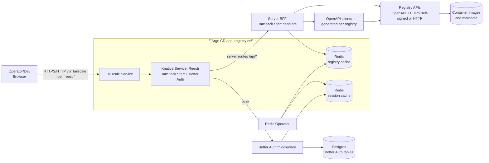

# Reestr Registry Browser - Design

## Implementation Status

### Phase 1: Scaffold & Core (Completed)

- [x] Initialize TanStack Start application with Bun.
- [x] Configure `package.json` (React 19, Tailwind 4, TanStack Start latest).
- [x] Implement `registry.config.ts` and Zod schema validation.
- [x] Create `gen:reestr` script for OpenAPI client generation.
- [x] Set up basic routing and Tailwind integration.

### Phase 2: Backend API & Data (Pending)

- [ ] Implement API routes (`/api/registries`, `/api/registries/:id/...`).
- [ ] Integrate `openapi-fetch` clients with registry config.
- [ ] Implement Redis caching layer (with in-memory fallback).
- [ ] Add structured logging and health checks.

### Phase 3: Frontend UI (Pending)

- [ ] Registry list dashboard with status indicators.
- [ ] Repository browser with search and pagination.
- [ ] Repository detail view (README, tags, metrics).
- [ ] Tag detail view (Manifest, SBOM).

### Phase 4: Auth & Deployment (Pending)

- [ ] Integrate Better Auth middleware.
- [ ] Create Dockerfile and build scripts.
- [ ] Configure Knative Service and Argo CD manifests.

## Overview

Reestr is a new TanStack Start application under `apps/reestr` that lets platform teams register container registry APIs via their OpenAPI schema and browse hosted images much like Docker Hub. The app ingests registry metadata (endpoints, auth, capabilities) from configuration, validates against the OpenAPI spec, and exposes a searchable UI for repositories, tags, manifests, and readme/metadata. It runs as a single Bun/TanStack server, serving SSR/SPA routes and a small API proxy for registry calls.

## Goals

- Simple onboarding: define registries in configuration (URL, OpenAPI document, auth) and get a usable UI without code changes.
- Trustworthy catalogue: show image details (description, tags, digests, platforms, sizes, last push/pull) similar to Docker Hub.
- Typed, schema-driven client: generate types/clients from each registry’s OpenAPI to reduce drift and surface validation errors early.
- Fast browsing: cached queries, server-side prefetch, and incremental page data to keep navigations snappy.
- Secure handling of credentials: support anonymous, PAT/basic, and bearer tokens without leaking secrets to the browser.

## Non-Goals (v1)

- Acting as a registry (no image uploads, deletes, or tag mutations).
- Supporting non-HTTP registries (e.g., peer-to-peer or air-gapped proprietary protocols).
- Auth flows for end users (only service-level credentials per registry config).

## Users & Use Cases

- Platform operators: audit what images are hosted, pull usage hints, verify provenance/labels.
- App developers: find the right image/tag, view README/usage instructions, copy pull/push commands.
- Security/release engineers: inspect digests, SBOM/attestations if available in the registry API.

## Functional Requirements

1. **Registry configuration**: load a list of registries at startup from `apps/reestr/registry.config.ts` (or YAML/JSON) with fields: `id`, `displayName`, `description`, `baseUrl`, `openapiUrl`, `auth`, `capabilities` (features flags like `supportsReadme`, `supportsMetrics`). Secrets come from env vars (`REESTR_REGISTRY_<ID>_TOKEN`, etc.).
2. **OpenAPI ingestion**: fetch each registry’s OpenAPI schema at startup (and on manual refresh) to validate required paths exist (list repositories, list tags, get manifest, optional README/SBOM endpoints). Generate a typed client per registry using `openapi-typescript` + `openapi-fetch` during build; keep generated code under `apps/reestr/.gen/<registry>/` and ignore from git.
3. **Catalogue views**:
   - List registries with status (last sync, schema version, auth mode) and counts (cached repository/tag counts when provided by API).
   - For a registry: searchable/paginatable repositories list with filters (namespace/org, updated/pulled recently, signed/not signed).
   - Repository detail: summary, README/description, tags table (tag, digest, size, platforms, published time, pull count), copyable `docker pull`/`ctr images pull` snippets, OCI labels if exposed.
   - Tag detail modal/page: manifest metadata (mediaType, layers, size, platform matrix), SBOM/attestations if the API exposes them.
4. **Search & filters**: server-side search where supported; fallback to client-side fuzzy filter with pagination guard. URL reflects state (query params) for shareable links.
5. **Status & errors**: inline errors per section; registry-level health banner when auth fails or schema endpoints are missing. Provide manual “Resync schema” action per registry.
6. **Storage accounting**: surface total image storage per registry and per repository (sum of layers by digest) and highlight largest images; allow sorting/filtering by size. Cache computed totals server-side to avoid recomputation per request.
7. **Connectivity**: operate against registries over HTTPS (including self-signed certificates) and plaintext HTTP when explicitly allowed in config; per-registry toggles control TLS verification and HTTP enablement.
8. **Performance**: SSR prefetch for above-the-fold data, TanStack Query caches with sensible `staleTime`, tag list virtualization for large repos, lazy-load README and SBOM panes.
9. **Accessibility & interaction**: follow AGENTS interaction rules-keyboard reachable controls, focus-visible rings, no blocked paste, confirm destructive actions (e.g., clearing cache), `aria-live` for toasts, responsive targets ≥24px (44px on mobile), respect `prefers-reduced-motion`.

## Non-Functional Requirements

- **Reliability**: tolerate per-registry failure; degraded UI should not block others. Schema refresh should be idempotent and timeout-bounded.
- **Security**: never send registry tokens to the browser; server-side proxy signs outbound requests. Mask tokens in logs and env inspection. Optional IP allowlist per registry.
  - App authentication uses Better Auth (self-hosted, framework-agnostic TypeScript library) running as server middleware to gate UI/API access, backed by the app database (e.g., Postgres) and pluggable identity providers.
- **Performance**: initial registry list TTFB < 500 ms when cache warm; repository search results in < 800 ms. Cache OpenAPI docs and metadata in-memory with periodic revalidation.
- **Observability**: structured logs (`bunyan`/console) with registry id + request id; basic metrics (latency, error rate, cache hit rate) via existing logging stack; feature flags to enable verbose tracing.
- **Maintainability**: generated clients isolated under `.gen`; shared utilities (auth headers, pagination) live in `packages/backend` if reused elsewhere.

## Architecture

- **Framework**: TanStack Start (beta/RC) on Vite + Nitro with TanStack Router; supports per-route SSR/CSR/data-only modes, streaming SSR, and server functions for typed RPCs.
- **UI shell**: TanStack Start app using `@tanstack/router` + `@tanstack/query` for data fetching and caching; Tailwind/utility-first styling consistent with existing apps.
- **Server layer**: TanStack Start server routes (`/api/registries`, `/api/registries/:id/...`) acting as BFF; they call registry clients with server-only secrets and return normalized DTOs. Better Auth (framework-agnostic, self-hosted TS library) mounts its handler here (e.g., `/api/auth/*`), using a Postgres/Drizzle adapter plus Redis for session cache to issue sessions, OAuth/2FA/WebAuthn, and protect routes.
- **OpenAPI clients**: build step generates types and lightweight fetch clients per registry using the provided OpenAPI URL. Runtime uses `openapi-fetch` with per-registry interceptors for auth and error normalization.
- **Data cache**: Redis (provisioned via the cluster’s Redis operator) as the primary cache for registry lists, tag inventories, and computed storage totals; in-memory cache remains as a fast local layer.

### Architecture Diagram



Simplified flow:

1. App boots → loads registry config → fetches/validates OpenAPI docs → builds/loads generated clients.
2. UI requests `/api/registries` → server reads cache/config → returns registry cards.
3. User opens a registry → server fetches repositories via typed client (cached/prefetched) → UI renders list with filters.
4. Selecting a repo → server fetches tags/manifest/readme as needed → UI shows details and copyable pull commands.

## Deployment & Infra

- **Argo CD placement**: ship Reestr as part of the existing `argocd/applications/registry` kustomization so it deploys alongside the registry service in the same namespace. Add a Knative Service (replace the app-specific Deployment/Service) for `apps/reestr` inside that kustomization to keep registry UI and backend co-located.
- **Redis requirement**: request a Redis instance via the in-cluster Redis Operator (already installed under `argocd/applications/redis-operator`). Create a Redis custom resource in the `registry` namespace, sized for metadata caching (e.g., 1–2Gi memory) and referenced by Reestr via env vars/secrets. Use it for OpenAPI doc cache, repository/tag listings, and precomputed storage totals.
- **Persistence**: continue using the existing PVC in `argocd/applications/registry` for the registry service; Reestr itself is stateless beyond Redis.
- **Tailscale service**: expose the app via the existing Tailscale service pattern in this namespace with a hostname of `reestr` (e.g., `tailscale-service.yaml` entry), ensuring compatibility with both HTTPS and HTTP origins.
- **Manual deploy helper**: add `bun packages/scripts/src/reestr/deploy-service.ts` mirroring the Facteur/Jangar deploy scripts-build/push image, update the Knative Service image tag and rollout annotation, and `kubectl apply -k argocd/applications/registry`.

## Configuration Model (draft)

```ts
// apps/reestr/registry.config.ts
import { defineRegistries } from './src/lib/registries'

export default defineRegistries([
  {
    id: 'ghcr',
    displayName: 'GitHub Container Registry',
    baseUrl: 'https://ghcr.io',
    openapiUrl: 'https://ghcr.io/api/v3/openapi.json',
    auth: { type: 'bearer', tokenEnv: 'REESTR_REGISTRY_GHCR_TOKEN' },
    capabilities: {
      supportsReadme: true,
      supportsMetrics: true,
      supportsSbom: false,
    },
    tls: {
      allowInsecure: false, // set true to trust self-signed certs
      allowHttp: false, // set true to permit plaintext endpoints
    },
    authProvider: 'better-auth', // server-side auth built with the Better Auth TS library
  },
  // add more registries...
])
```

Helper `defineRegistries` validates ids, checks env presence for required tokens at startup, and flags missing schema endpoints.

## Data Model (normalized DTOs)

- `Registry`: id, displayName, description, baseUrl, schemaVersion, authMode, capabilities, lastSyncedAt, status.
- `Repository`: id (namespace/name), description, pulls, stars (if available), updatedAt, signed?, labels.
- `Tag`: name, digest, sizeBytes, platforms[], createdAt, pulledAt, signed?, vulnerabilities summary (if provided).
- `Manifest`: mediaType, layers[], totalSize, configDigest, provenance links (SBOM/attestations URLs when exposed).
- `Readme`: source (registry/annotation), content (rendered markdown), lastUpdated.

## UI/UX Plan

- **Routes**
  - `/` - registries list with status, quick filters (auth required/anonymous), “Resync schema” per card.
  - `/r/$registryId` - repository search + filters; table/grid view toggle; pagination persisted in URL.
  - `/r/$registryId/$repo` - repository detail with summary, README, tags table (virtualized), metrics (pulls, last pushed), copyable pull command.
  - `/r/$registryId/$repo/$tag` - tag modal/page with manifest details, platform matrix, SBOM/attestations tabs if available.
- **Interaction guarantees**: keyboard nav with roving tabindex in tables/cards, focus-return after closing modals, `aria-live="polite"` for fetch errors, skip-to-content link, scroll position restoration, `scroll-margin-top` on anchors, mobile inputs at ≥16px font.
- **Visuals**: keep consistent with existing design system; avoid default stacks; ensure contrast; include reduced-motion styles.

## API & Schema Handling

- On `bun dev`/build, run `bun run gen:reestr` (new script) to download OpenAPI docs and generate typed clients into `.gen`. Cache docs to avoid repeated downloads; add `.gen` to `.gitignore`.
- Runtime guardrails:
  - Verify presence of required operations (`listRepositories`, `listTags`, `getManifest`); flag missing paths in the registry card with remediation hints.
  - Normalize pagination (link headers, `next` cursors) into a shared `PageResult<T>` shape.
  - Central error mapper producing user-friendly messages (auth failed, rate limited, missing scope, endpoint unavailable).
  - If schema fetch fails, fall back to a minimal manual client with documented routes from config.

## Caching & Sync Strategy

- Cache OpenAPI docs and capability checks for 15 minutes in Redis (with local in-memory fallback) with background refresh.
- TanStack Query settings: `staleTime` 30–120s depending on endpoint; `keepPreviousData` for pagination; `retry` with exponential backoff.
- Prefetch repos list on server for the registry detail route; lazy-load README/SBOM after first paint.
- Store computed storage totals per registry/repo in Redis with TTL and invalidate on manual refresh. Use Lua or transactions to keep totals consistent when recomputing.
- Optional warmup job to sync headline stats (repo count, popular images, storage by registry) on startup; results stored in Redis and memory.

## Security & Privacy

- Registry credentials stored in env and injected server-side only; never serialized to client.
- Redact tokens in logs; avoid writing OpenAPI docs containing secrets to disk.
- Enforce origin checks on API routes; CORS disabled except same-origin.
- Rate-limit per-IP on BFF routes; configurable via middleware.
- Provide per-registry allowlist for outbound hosts to prevent SSRF.
- App authentication uses the Better Auth TypeScript library (self-hosted, framework-agnostic middleware-no managed control plane) to gate UI/API access; uses the app database via an adapter plus optional Redis session cache; supports OAuth providers, WebAuthn, and TOTP/2FA; integrate with the existing identity provider when available.
- TanStack Start remains in beta/RC; expect occasional breaking changes-pin the toolchain and track upstream release notes during implementation.

## Observability & Ops

- Structured logs with `registryId`, `route`, `statusCode`, `latencyMs`, `cacheStatus`.
- Health endpoint `/healthz` includes registry schema status summary.
- Feature flags (via env) for verbose tracing, schema refresh on interval, and SBOM fetching.
- Deploy as a Knative Service inside the registry Argo CD app; use `bun run build:reestr` / `start:reestr` for local smoke tests and the Bun deploy helper for cluster rollout.

## Testing & Validation

- Unit tests for config parsing/validation and OpenAPI capability checks (`apps/reestr/src/lib/__tests__`).
- Contract tests against mocked registry APIs (wiremock/`msw`) to cover pagination, auth failures, and schema drift.
- UI tests (Playwright/Vitest) for navigation, keyboard support, and responsive layout across key routes.
- Lint/format via `bun run lint:reestr` and Oxfmt; add to CI once app is scaffolded.

## Risks & Open Questions

- Registry diversity: APIs may not expose README, metrics, or SBOM; need graceful fallbacks and capability flags.
- OpenAPI freshness: specs can lag behind live APIs; generation step must tolerate minor mismatches (loose `additionalProperties`, optional fields).
- Rate limits: unauthenticated registries may throttle; consider anonymous cache and per-registry backoff.
- Multi-tenant credentials: do we need per-user tokens later? (Out of scope v1 but affects API design.)
- Hosting location resolved: deploy as a dedicated Knative Service within the `argocd/applications/registry` app (same namespace), fronted by Tailscale host `reestr`.
