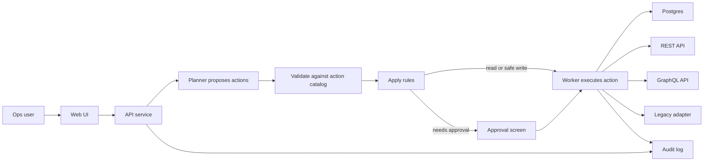

# Secure Action Gateway Essential Model

Date: 2026-05-13
Status: Simplified primitive model
Owner: Greg Konush

## The Real Problem

The problem is not "run an agent behind a firewall." That is deployment language.

The real problem is that important internal work lives in a few people's heads:

- which database to query,
- which API to call next,
- which cases are safe to fix automatically,
- which cases need a human,
- which legacy button or script can be run without breaking production,
- and how to prove what happened afterward.

An AI agent helps because it can interpret the operator's request and propose the next steps. The danger is that the same agent might also invent actions, reach arbitrary systems, use credentials too broadly, or trigger side effects no one approved.

The product exists to separate **suggesting work** from **doing work**.

## Non-Primitives

These are useful implementation details, but they are not the product model:

- **Private:** means the product runs in the customer's network and keeps data/secrets there. It is a deployment boundary, not a domain object.
- **Lease:** is an implementation technique for short-lived worker authority. The prototype does not need this word. Use approval plus worker handoff.
- **CRD:** is a Kubernetes packaging option. It is not needed to explain or prove the product.
- **Sandbox:** is defense in depth for risky execution. It matters, but it is not the core workflow primitive.
- **Control plane:** too broad for this challenge. The prototype should be one service and one worker.

## Minimal Primitives

Only seven concepts are needed.

### 1. Request

What the user asks for, who asked, and when.

Example:

> Investigate invoice sync failures from the last 24 hours, create tickets for invalid records, and retry only safe failures after approval.

The request is not executable. It is just the starting point.

### 2. Action

A named operation the system is allowed to perform.

An action has:

- a name,
- an input schema,
- an effect: `read` or `write`,
- allowed roles,
- whether approval is required,
- the connector that runs it.

Example actions:

- `find_invoice_failures`
- `lookup_account_status`
- `lookup_entitlement`
- `create_remediation_ticket`
- `retry_invoice_sync`

The agent can only choose from known actions. It cannot invent SQL, URLs, shell commands, or legacy operations.

### 3. Connector

The code path that talks to an internal system.

Examples:

- Postgres connector for invoice data,
- REST connector for account status and ticketing,
- GraphQL connector for entitlements,
- legacy adapter for invoice retry.

The connector owns credentials and network targets. The agent never sees them.

### 4. Rule

The decision logic for one action call.

Rules answer:

- is this user allowed to run this action?
- is the input valid?
- is this a read or write?
- does this action need approval?
- should this action be blocked?

Rules should be boring and visible. For the prototype they can be normal server code or seed data.

### 5. Approval

A human decision for one exact risky action call.

Approval is not "approve the whole agent run." It is:

- this action,
- this input,
- this user,
- this approver,
- this timestamp.

If the input changes, the approval no longer applies.

### 6. Run

One execution of a request.

A run contains:

- the original request,
- the proposed action plan,
- action calls and their statuses,
- approvals,
- final result.

The run is the thing the UI shows.

### 7. Event

One append-only audit record.

Events answer what happened:

- request submitted,
- plan proposed,
- action allowed,
- action blocked,
- approval requested,
- approval granted,
- connector started,
- connector completed,
- connector failed,
- run completed.

The audit log is the review artifact. A reviewer should be able to reconstruct the run from events without trusting server logs.

## Prototype Shape

Keep the implementation small:

One API service, one worker, local fixtures, Postgres storage, seeded users.

No CRDs. No reconciler. No separate policy service. No separate planner service.

## Data Model

Prototype tables:

- `users`
- `actions`
- `runs`
- `action_calls`
- `approvals`
- `events`

Connector config can be code or environment-backed configuration for the prototype. It does not need a table until the product supports customer-managed connectors.

## Demo Mapping

The invoice-sync demo should prove the model directly:

| Step | Primitive Proven |
| --- | --- |
| User submits request | Request |
| Planner proposes five known steps | Action |
| API rejects unknown action names | Action, Rule |
| SQL/REST/GraphQL calls run | Connector |
| Ticket creation only runs for invalid records | Rule |
| Legacy retry blocks | Rule |
| Approver approves exact retry input | Approval |
| Worker runs retry | Connector, Run |
| JSONL export shows all steps | Event |

## Why This Fits The Challenge

The challenge asks for natural language to multi-step internal actions, enterprise auth, secure connections, and audit trail.

The simple model satisfies that without inventing a platform:

- natural language becomes a proposed list of known actions,
- known actions connect to internal systems through connectors,
- rules enforce RBAC and approval,
- worker execution keeps credentials out of the planner,
- events produce the audit trail.

Everything else is production hardening.
