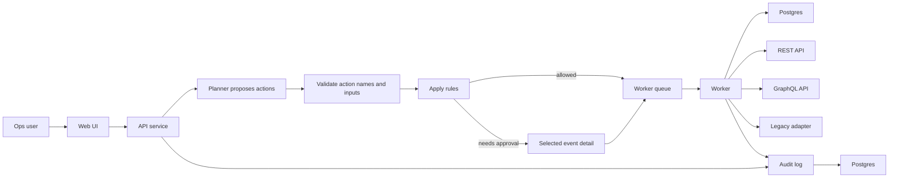

# Secure Action Gateway Product Requirements Document

Date: 2026-05-13
Status: Build challenge PRD
Owner: Greg Konush

## 1. Executive Summary

Secure Action Gateway is a product for running AI-assisted internal operations without letting the agent execute arbitrary work.

The product turns a plain-English request into a proposed list of known actions. The application then validates those actions, applies rules, asks for approval when needed, runs connectors through a worker, and writes an event for every step.

Initial workflow:

> Investigate invoice sync failures from the last 24 hours, check the related account and entitlement state, create remediation tickets for invalid records, and retry only safe failures after approval.

The point is not to build a general agent platform. The point is to replace brittle dashboards, scripts, SQL snippets, and tribal runbooks with a safer action workbench.

## 2. Target Users And Buyers

Primary users:

- finance systems operators,
- RevOps and billing operations teams,
- IT operations and internal tools teams,
- support operations teams managing exception queues.

Buyers and approvers:

- CIO,
- VP of IT,
- Head of Enterprise Automation,
- business owner for finance or revenue operations,
- security/platform approvers for any tool that touches internal systems.

## 3. Problem Statement

Large companies run important workflows through fragile internal tooling. A routine exception process often requires:

- a dashboard,
- a SQL query,
- an internal REST or GraphQL API,
- a ticket queue,
- a legacy admin tool,
- and an experienced operator who knows the safe order of operations.

When the operator leaves, the workflow becomes hard to operate. When volume spikes, manual steps do not scale. When credentials or APIs change, old scripts break.

Static workflow tools are brittle because every branch must be modeled in advance. Generic agents are unsafe because they can blur the line between suggesting a next step and actually taking a side effect.

Secure Action Gateway separates those concerns:

- the agent proposes,
- the application decides,
- the worker executes,
- the audit log proves.

## 4. Product Model

Use seven primitives:

1. **Request:** what the user asked for.
2. **Action:** a named operation the product allows.
3. **Connector:** code that talks to an internal system.
4. **Rule:** server-side decision logic for an action.
5. **Approval:** human approval for one exact risky action input.
6. **Run:** one execution of a request.
7. **Event:** one append-only audit record.

These primitives are enough for the prototype and easy to explain to reviewers.

## 5. Initial Workflow

The invoice-sync workflow proves the required surface area:

- SQL access to invoice failure rows,
- REST access to account status,
- GraphQL access to entitlement state,
- REST ticket creation,
- legacy retry action,
- role checks,
- approval-gated risky write,
- full audit export.

Example request:

> Investigate invoice sync failures from the last 24 hours, check account and entitlement state, create remediation tickets for invalid records, and retry only failures that are safe after approval.

## 6. Goals

- Accept a natural-language operations request.
- Convert it into a visible action plan.
- Reject unknown actions or invalid inputs.
- Run real SQL, REST, GraphQL, and legacy connector calls.
- Enforce role rules on every action call.
- Block risky writes until exact approval exists.
- Keep credentials out of the planner.
- Record a complete audit log.
- Ship a runnable local artifact and demo recording.

## 7. Non-Goals

- Generic chatbot.
- Broad connector marketplace.
- Kubernetes controller or CRD model.
- Autonomous destructive writes.
- Full enterprise SSO implementation in the prototype.
- Static JSON demo pretending to be integrations.

## 8. Product Experience

Core journey:

1. User signs in as `ops_user`.
2. User submits the invoice-sync request.
3. UI shows the proposed action plan.
4. API validates every action name and input.
5. Worker runs allowed read actions.
6. System creates tickets only for invalid records.
7. Retry action pauses for approval.
8. `ops_approver` approves the exact retry action input.
9. Worker runs the legacy retry adapter.
10. UI shows the agent event explorer and JSONL export.

Primary screens:

- **Agent Events:** searchable event log with facets, selected-event detail, request/action/connector/rule/approval records, and JSONL export.
- **Actions:** allowed actions, effect type, role rule, approval rule, connector.
- **Connectors:** SQL, REST, GraphQL, and legacy connector status.
- **Approvals:** actions available from selected blocked or approval-requested event details.
- **Audit:** event log and JSONL export.

## 9. Functional Requirements

### Request And Planning

- User can submit a natural-language task through UI or API.
- Planner returns a proposed action plan.
- Plan contains only action names and structured inputs.
- API rejects unknown actions.
- API rejects invalid action inputs.

### Action Catalog

Each action defines:

- name,
- effect: `read` or `write`,
- input schema,
- connector,
- allowed roles,
- approval requirement,
- redaction behavior.

Initial actions:

- `find_invoice_failures`
- `lookup_account_status`
- `lookup_entitlement`
- `create_remediation_ticket`
- `retry_invoice_sync`

### Connector Execution

- SQL connector queries seeded invoice data.
- REST connector checks account state and creates tickets.
- GraphQL connector checks entitlement state.
- Legacy connector runs only `retryInvoiceSync`.
- Connector credentials are held by server/worker config, not by the agent.
- Connector outputs are summarized before display and audit storage.

### Rules And Approvals

- Read actions can run automatically for `ops_user`.
- Ticket creation runs only for invalid records.
- Retry requires `ops_approver`.
- Approval is bound to action call ID and input digest.
- Wrong-role approval fails.
- Changed input requires a new approval.

### Audit

- Every run has a durable ID.
- Every action call has an audit event.
- Events include actor, timestamp, run ID, action, decision, input digest, output summary, and error if present.
- Event export is JSONL.

## 10. Security Requirements

- The agent cannot execute raw SQL, URLs, shell commands, or legacy operations.
- The agent only sees action names and schemas.
- Credentials stay inside connectors.
- Every action call passes through rule checks.
- Risky writes require exact approval.
- Worker executes action calls outside the web request path.
- Outputs are redacted before reaching UI or audit export.
- Blocked attempts are recorded.

Production hardening:

- OIDC/SAML group mapping,
- customer secret manager integration,
- NetworkPolicy,
- stronger worker isolation such as gVisor where available,
- signed action catalog,
- SIEM export,
- retention and legal hold.

## 11. MVP Architecture

Components:

- **Web UI:** agent event explorer, facets, selected-event detail, action catalog, approval actions, JSONL export.
- **API service:** creates runs, validates plans, applies rules, records events.
- **Planner:** proposes action names and inputs. It has no execution authority.
- **Worker:** executes allowed action calls.
- **Connectors:** SQL, REST, GraphQL, and legacy adapters.
- **Postgres:** product state, seeded data, audit events.

Prototype tables:

- `users`
- `actions`
- `runs`
- `action_calls`
- `approvals`
- `events`

## 12. Demo Scope

Seeded systems:

- invoice failure table,
- account REST service,
- ticketing REST service,
- entitlement GraphQL service,
- legacy retry adapter.

Demo flow:

1. Start local artifact.
2. Seed demo data.
3. Sign in as `ops_user`.
4. Submit invoice-sync request.
5. Watch the system produce action plan.
6. Watch read connectors run.
7. Watch ticket creation for invalid records.
8. Watch retry block for approval.
9. Switch to `ops_approver`.
10. Approve exact retry input.
11. Watch worker run legacy retry.
12. Export audit JSONL.

Reviewer acceptance:

- natural-language intake works,
- four connector types are exercised,
- unknown actions are rejected,
- risky write blocks before approval,
- approval unlocks only the approved action input,
- audit export is inspectable,
- no external SaaS is required for the core demo.

## 13. Submission Deliverables

Required bundle:

1. Working prototype URL or runnable artifact.
2. 2-5 minute demo recording or walkthrough link.
3. Source code as GitHub/repo link or zip.
4. PRD, 1-2 pages.
5. TDD, 1-2 pages.
6. Authorship/build note: what was built, reused, what broke, and how it was debugged.

The prototype is the main event. The documents exist to explain the build, not replace it.

## 14. Success Metrics

Prototype metrics:

- Fresh reviewer can run demo in under 20 minutes.
- SQL, REST, GraphQL, and legacy actions run in one workflow.
- Zero unapproved risky writes.
- Audit export includes every request, action, rule decision, approval, connector result, and final state.
- Demo recording explains the workflow in 2-5 minutes.

Product metrics:

- reduction in manual exception-handling time,
- number of brittle scripts/workflows replaced,
- percentage of actions executed through known action catalog,
- approval latency for risky writes,
- audit export completeness.

## 15. Risks And Mitigations

| Risk | Impact | Mitigation |
| --- | --- | --- |
| Looks like chatbot | Reviewers reject it as thin wrapper | Make action plan, connectors, approvals, and audit visible. |
| Looks fake | Reviewers cannot trust the proof | Use real local SQL, REST, GraphQL, and legacy calls. |
| Looks overbuilt | Reviewers cannot see the product | Keep one service, one worker, six tables, no CRDs. |
| Unsafe planner | Agent tries unsupported work | Reject unknown action names and invalid inputs. |
| Weak approval | Approval feels ceremonial | Bind approval to action call and input digest. |

## 16. Milestones

### Milestone 1: Skeleton

- UI, API, worker, Postgres start locally.
- Run creation works.
- Audit events write to database.

### Milestone 2: Connectors

- SQL, REST, GraphQL, and legacy connector calls work with seeded data.

### Milestone 3: Rules And Approval

- Read actions run.
- Retry blocks.
- Approver unlocks exact retry.
- Wrong-role approval fails.

### Milestone 4: Submission Package

- Runnable artifact or hosted URL.
- Source code link or zip.
- 2-5 minute demo.
- PRD.
- TDD.
- Authorship/build note.

## 17. Open Questions

- Should the first planner be deterministic templates plus model extraction, or model-first planning with strict schema validation?
- Should role auth be seeded RBAC only, or include a local OIDC provider?
- Should the demo include worker isolation metadata, or keep isolation to production notes?
- Should audit export be JSONL only, or also include CSV?
