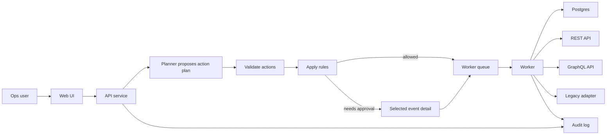

# Secure Action Gateway Production Plan

Date: 2026-05-13
Status: Build plan for panel-ready prototype
Owner: Greg Konush

## Goal

Build a runnable prototype that shows an agent helping with internal operations without giving the agent execution authority.

The reviewer should see one complete workflow:

> Investigate invoice sync failures from the last 24 hours, check account and entitlement state, create remediation tickets for invalid records, and retry only safe failures after approval.

The build should optimize for proof, not breadth.

## Submission Definition Of Done

- Runnable local artifact or deployed prototype URL.
- Source code link or zip.
- 2-5 minute demo walkthrough.
- PRD, 1-2 pages.
- TDD, 1-2 pages.
- Authorship/build note.
- Visible depth area in the product, not only the docs.

Visible depth area:

> Every agent action is visible as an event; only known actions can run; risky writes require exact approval; the whole run exports as JSONL.

## Product Slice

The invoice workflow is the right slice because it forces the product to cross four internal-system shapes:

- SQL: find failed invoice sync rows.
- REST: check account status and create tickets.
- GraphQL: check entitlement state.
- Legacy adapter: retry invoice sync.

It also has both safe reads and risky writes, so approval and audit are visible.

## Architecture

Implementation shape:

- one Web/API service,
- one worker process,
- one Postgres database,
- local fixture services for REST and GraphQL,
- one constrained legacy adapter,
- no Kubernetes controller,
- no CRDs,
- no separate control plane.

Production deployment can package the same service and worker in a Helm chart and run worker jobs with stronger isolation where the customer environment supports it.

## Core Data Model

Keep the schema small:

- `users`: seeded identity and role.
- `actions`: allowed action name, input schema, effect, role rule, approval rule, connector.
- `runs`: request text, proposed plan, status, requester, timestamps.
- `action_calls`: one action with one input payload, status, decision, output summary.
- `approvals`: approver decision for one action call and input digest.
- `events`: append-only audit log.

Connector configuration can be code/env config for the prototype.

## Build Phases

### Phase 1: Skeleton

Duration: 0.5 day

Build:

- Web UI shell with Agent Events, facets, selected-event detail, action catalog, and JSONL export.
- API routes for creating a run and reading run detail.
- Postgres schema and seed data.
- Seeded users: `ops_user`, `ops_approver`, `security_auditor`.

Acceptance:

- Submitting a request creates a run.
- Agent Events shows request, empty plan, facets, and audit events.

### Phase 2: Action Catalog

Duration: 0.5 day

Build these actions:

- `find_invoice_failures`
- `lookup_account_status`
- `lookup_entitlement`
- `create_remediation_ticket`
- `retry_invoice_sync`

Acceptance:

- Unknown action names are rejected.
- Invalid action inputs are rejected.
- Action definitions are visible in the UI.

### Phase 3: Connectors

Duration: 0.5-1 day

Build:

- Postgres invoice fixture.
- REST account fixture.
- REST ticketing fixture.
- GraphQL entitlement fixture.
- Legacy retry adapter with dry-run and execute modes.

Acceptance:

- Worker calls real local endpoints or database queries.
- No static JSON is used as the integration proof.

### Phase 4: Rules And Approvals

Duration: 1 day

Build:

- Role checks for each action.
- Rule that ticket creation only runs for invalid records.
- Rule that invoice retry requires approver approval.
- Approval tied to action call ID and input digest.
- Wrong-role approval failure.

Acceptance:

- Read actions run automatically for `ops_user`.
- Retry blocks before approval.
- Approval unlocks only the exact retry input.
- Changed input requires a new approval.

### Phase 5: Agent Event Explorer

Duration: 0.5 day

Build:

- Searchable event table for all agent/run events.
- Facets for run, actor, event, action, connector, and result.
- Selected-event detail panel with JSON preview.
- JSONL export.
- Redacted output summaries.
- Error and blocked-action events.

Acceptance:

- Reviewer can reconstruct the whole run from the event explorer and JSONL export.
- No raw credentials or secrets appear in UI or export.

### Phase 6: Packaging And Demo

Duration: 0.5 day

Build:

- README quickstart.
- Seed/reset command.
- One-command local run.
- Demo script.
- 2-5 minute recording.
- Authorship/build note.

Acceptance:

- Fresh reviewer can run the demo from a clean checkout.

## API Surface

Minimum API:

- `POST /api/runs`
- `GET /api/runs`
- `GET /api/runs/:id`
- `GET /api/actions`
- `GET /api/action-calls/:id`
- `POST /api/approvals/:id/approve`
- `POST /api/approvals/:id/deny`
- `GET /api/events?runId=:id`
- `GET /api/events/:runId/export.jsonl`

## Test Plan

Unit tests:

- action schema validation,
- unknown action rejection,
- role rules,
- approval digest matching,
- output redaction,
- event creation.

Integration tests:

- full invoice run before approval,
- wrong-role approval fails,
- changed input invalidates approval,
- worker cannot execute blocked retry,
- JSONL audit export contains the full chain.

E2E test:

- submit request,
- observe agent event log,
- observe read connectors run,
- observe retry block,
- approve as approver,
- observe worker retry,
- export event log.

## Production Hardening

After the prototype works:

- replace seeded users with OIDC/SAML groups,
- move connector secrets into the customer's secret manager,
- add NetworkPolicy and stronger worker isolation,
- add signed action catalogs,
- add SIEM export,
- add retention and redaction policy,
- add connector SDK,
- package as Helm chart.

## Engineering Priorities

Highest priority:

1. End-to-end invoice workflow.
2. Known-action enforcement.
3. Exact approval for risky write.
4. Real connector calls.
5. Complete agent event export.

Lower priority:

- broad connector catalog,
- generic workflow builder,
- Kubernetes-native control plane,
- multi-agent collaboration,
- full compliance reporting.

## Risk Controls

| Risk | Control |
| --- | --- |
| Looks like a chatbot | Make the agent event log the primary screen: request, action, connector, rule, approval, worker, result. |
| Looks fake | Use real local SQL, REST, GraphQL, and legacy adapter calls. |
| Looks overbuilt | Keep one service, one worker, six tables, no CRDs. |
| Looks unsafe | Reject unknown actions and block risky writes before approval. |
| Audit is too vague | Show searchable event rows and export append-only JSONL with action, actor, decision, input digest, and output summary. |

## Submission Checklist

- [ ] Working prototype URL or runnable artifact.
- [ ] Demo recording link.
- [ ] Source code link or zip.
- [x] PRD: `docs/secure-action-gateway/prd-submission.md`.
- [x] TDD: `docs/secure-action-gateway/tdd-submission.md`.
- [ ] Authorship/build note.
