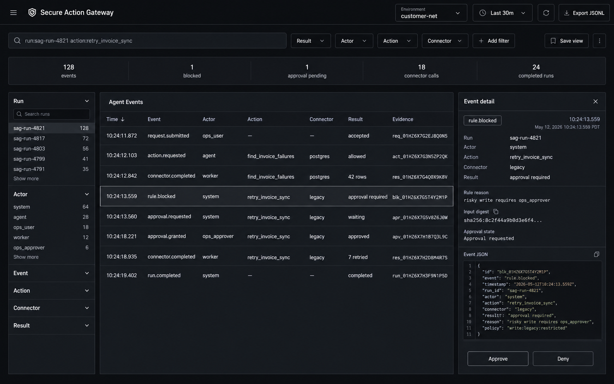

# Secure Action Gateway UX/UI Design

Date: 2026-05-13
Status: Agent event explorer direction
Owner: Greg Konush

## Interface Thesis

The product is an event log for AI agents operating internal systems.

The primary screen should answer:

- what agent event just happened,
- who or what caused it,
- which action or connector it touched,
- whether it was allowed, blocked, approved, or completed,
- what evidence is attached.

The approval workflow is secondary. It appears as an event detail state, not as the whole product.

## Design Reference

Use the product grammar of modern observability tools:

- Datadog Log Explorer: search/filter first, list of log records, facets, export, inspect selected records.
- Datadog Events Explorer: recent events, facets/search, selected event side panel, event attributes.
- Vercel Runtime Logs: searchable runtime logs, filtering/grouping, selected log detail, chronological log messages and request context.

This should feel closer to Datadog/Vercel observability than a workflow dashboard.

Reference docs:

- Datadog Log Explorer: https://docs.datadoghq.com/logs/explorer/
- Datadog Events Explorer: https://docs.datadoghq.com/events/explorer/navigate/
- Vercel Runtime Logs: https://vercel.com/docs/logs/runtime

## Visual Direction

Polished, quiet, log-first enterprise UI:

- dark neutral theme,
- dense but calm,
- thin borders,
- crisp typography,
- one main event table,
- left-side facets,
- right-side selected event detail,
- small metric strip,
- no graph-first layout,
- no approval-card-first layout,
- no Christmas-tree color coding.

Use color sparingly only for severity/status text accents. The base UI should be grayscale like Vercel, with Datadog-like operational density.

## Primary Screen: Agent Events

The first screen is `Agent Events`, not `Run Review`.

Layout:

1. **Header:** product name, environment, time range, export.
2. **Query bar:** search text and filter chips.
3. **Summary strip:** events, blocked, approvals, connector calls, completed runs.
4. **Left facets:** run, actor, action, connector, result.
5. **Event table:** chronological list of all agent events.
6. **Event detail panel:** selected event JSON, reason, evidence, related run.

The table is the product.

## Event Table

Columns:

- time,
- event,
- actor,
- action,
- connector,
- result,
- evidence.

Example rows:

- `request.submitted` / `ops_user` / `-` / `-` / `accepted`
- `action.requested` / `agent` / `find_invoice_failures` / `postgres` / `allowed`
- `connector.completed` / `worker` / `find_invoice_failures` / `postgres` / `42 rows`
- `rule.blocked` / `system` / `retry_invoice_sync` / `legacy` / `approval required`
- `approval.requested` / `system` / `retry_invoice_sync` / `legacy` / `waiting`
- `approval.granted` / `ops_approver` / `retry_invoice_sync` / `legacy` / `approved`
- `connector.completed` / `worker` / `retry_invoice_sync` / `legacy` / `7 retried`
- `run.completed` / `system` / `-` / `-` / `completed`

Rows should be scannable, not decorative.

## Event Detail Panel

When a row is selected, show:

- event name,
- timestamp,
- actor,
- run ID,
- action,
- connector,
- result,
- input digest,
- output digest or redacted summary,
- rule reason,
- approval state,
- raw JSON preview.

For `rule.blocked`, the panel explains exactly why the event is blocked and which approval can unblock it.

## Facets

Facets make the product useful:

- Run
- Actor
- Event
- Action
- Connector
- Result

Each facet shows count and can narrow the table.

## Query Bar

Support plain useful filters:

- `run:sag-run-4821`
- `action:retry_invoice_sync`
- `result:"approval required"`
- `actor:ops_approver`
- `connector:legacy`

The demo does not need a full query language, but the UI should imply it.

## Approval UX

Approval is an action from the selected event detail panel.

If the selected event is `rule.blocked` or `approval.requested`, the detail panel can show:

- input digest,
- records,
- required role,
- reason,
- `Approve`,
- `Deny`.

The approval buttons should be subordinate to the event detail, not the main page.

## Mockup Asset

Use this generated mockup as the implementation reference:



This image is generated from the Imagen prompt below. Do not add hand-authored SVG mockups.

## Imagen Prompt

Use this prompt for a high-fidelity generated product mockup:

```text
Create a high fidelity dark enterprise SaaS UI mockup for "Secure Action Gateway" as an agent event explorer, polished like Datadog Log Explorer and Vercel Runtime Logs. 1440x900 desktop viewport. The product is not an approval card and not a workflow dashboard. It is a searchable event log for AI agents operating internal systems.

Visual style: refined Vercel-like dark neutral UI, crisp typography, thin borders, restrained spacing, production-grade observability console. Mostly grayscale with tiny muted status accents only. No glowing lights, no colorful dashboard, no graph canvas, no timeline nodes, no cartoon agent, no marketing hero, no giant cards.

Layout: top header with "Secure Action Gateway", environment "customer-net", time range "last 30m", and Export JSONL button. Under it, a search/query bar with placeholder `run:sag-run-4821 action:retry_invoice_sync` and filter chips: Result, Actor, Action, Connector. Small summary strip with exactly these five operational metrics: 128 events, 1 blocked, 1 approval pending, 18 connector calls, 24 completed runs. Do not add negative incident metrics to the summary strip.

Main workspace: left narrow facets column with sections Run, Actor, Event, Action, Connector, Result and counts. Center large event table titled "Agent Events" with columns Time, Event, Actor, Action, Connector, Result, Evidence. Rows include request.submitted, action.requested, connector.completed, rule.blocked, approval.requested, approval.granted, connector.completed, run.completed. One row `rule.blocked` for `retry_invoice_sync` is selected using subtle border/background only. Right detail panel titled "Event detail" showing selected event rule.blocked, run sag-run-4821, actor system, action retry_invoice_sync, connector legacy, result approval required, input digest sha256:8c2f44..., reason risky write requires ops_approver, and a compact JSON preview. Include small monochrome Approve and Deny buttons inside the detail panel only.

Make the UI clearly about listing and inspecting all agent events. It should be clean, premium, useful, and immediately understandable.
```

## Implementation Notes

- Build the event explorer before approval screens.
- Table row density should be closer to logs than cards.
- Every event should be filterable by run, actor, action, connector, result.
- Selecting an event should reveal detail without navigating away.
- Approval is just one event-detail action.
- JSONL export is first-class.
