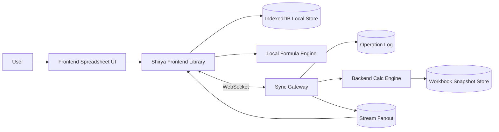

# Shirya: Local-First Realtime Spreadsheet Design

Status: Proposed (2026-02-21)

## Name
- Product/library name: `Shirya`
- Origin: from Kalmyk `ширә` (table)

## Summary
`Shirya` is a local-first spreadsheet platform for web apps with Excel-like formulas, interactive editing, and near-real-time collaboration.

The system has two cooperating runtime layers:
1. A frontend library that provides interactive spreadsheet UX, local persistence, formula evaluation, and optimistic updates.
2. A backend sync+calc layer that streams operations/results in near real time, performs server-side recalculation for consistency, and fans out updates to other clients.

## Problem Statement
The website needs Excel-replicated behavior but cannot depend exclusively on remote round-trips for every edit. Users must keep working with low latency while offline/intermittent, and still converge to a shared, correct workbook state.

## Goals
- Excel-compatible formula authoring and evaluation for core business functions.
- Interactive editing experience (keyboard, selection, fill handle, copy/paste, formula assist) with immediate feedback.
- Local-first behavior: edits apply locally first, then sync in background.
- Near-real-time multi-user sync with conflict resolution and deterministic convergence.
- Dual calculation execution: local engine for immediacy, backend engine for authoritative consistency and streaming fan-out.

## Non-Goals (v1)
- Full 100% parity with every Excel feature (macros/VBA, PowerQuery, PivotTables).
- Binary `.xlsx` runtime as storage of truth (import/export supported later as adapters).
- Arbitrary user-defined native code execution in formulas.

## Functional Requirements
1. Workbook primitives: sheets, cells, ranges, row/column ops, named ranges, basic formatting metadata.
2. Formula support:
   - A1 notation and cross-sheet references.
   - Core Excel functions (minimum): `SUM`, `AVERAGE`, `MIN`, `MAX`, `COUNT`, `COUNTA`, `IF`, `IFS`, `AND`, `OR`, `NOT`, `XLOOKUP` or `INDEX/MATCH`, `VLOOKUP` (compat), `SUMIF`, `SUMIFS`, `DATE`, `TODAY`, `NOW`, text functions (`LEFT`, `RIGHT`, `MID`, `CONCAT`, `TEXT`).
   - Relative/absolute references (`A1`, `$A$1`, `A$1`, `$A1`).
   - Dependency recalculation after every edit.
3. Interactivity:
   - Cell selection and range selection.
   - Keyboard-first editing and navigation.
   - Multi-cell paste.
   - Fill handle and drag operations.
   - Formula bar + in-cell edit mode.
4. Local-first:
   - Works offline with local queue.
   - Local writes visible immediately.
   - Sync resumes automatically when connection returns.
5. Realtime collaboration:
   - Multi-client updates propagate in near real time.
   - Remote edits update local grid and affected formula outputs.
6. Backend stream:
   - Server streams op deltas and authoritative calc outputs to subscribers.

## Non-Functional Requirements
- Local edit-to-paint latency (p95): < 16 ms for visible cells.
- Local recalc latency (p95): < 50 ms for medium dependency graphs (target: 10k formula cells).
- Remote propagation latency (p95): < 300 ms intra-region.
- Deterministic recomputation: same inputs and function set => same outputs.
- Durability: acknowledged operations persist server-side before broadcast.

## Architecture Overview


## Selected Libraries
- Spreadsheet runtime: `jspreadsheet-ce` (MIT)
- Formula engine (high Excel compatibility): `hyperformula` (GPL-3.0-only)
- CRDT/local-first core: `yjs`
- Offline browser persistence: `y-indexeddb`
- Collaboration transport: `y-websocket`
- Collaboration backend: `@hocuspocus/server`
- Local app IndexedDB abstraction: `dexie`
- Backend service event stream: `nats` (JetStream)

If GPL copyleft is not acceptable for your distribution model:
- Replace `hyperformula` with a Shirya in-house formula engine and treat this as a dedicated build-from-scratch stream.

Library research and maintenance evidence is documented in:
- `docs/shirya/shirya-library-selection-research.md`

## Frontend Library Design
Package split:
- `@proompteng/shirya-core`: workbook model, op log, formula parser/evaluator, dependency graph.
- `@proompteng/shirya-react`: React bindings, hooks, keyboard handlers, virtualization adapters.
- `@proompteng/shirya-sync`: websocket transport, retry, ack tracking, snapshot/bootstrap.

Core responsibilities:
- Keep local authoritative working state for UI responsiveness.
- Apply user operations optimistically and enqueue for sync.
- Recalculate impacted dependency subgraphs immediately.
- Merge remote ops and authoritative calc corrections.

Frontend state model:
- `WorkbookState`: sheet metadata, cell payloads, dependency graph index, version vector.
- `PendingOpsQueue`: ordered operations not yet acknowledged.
- `CalcState`: dirty nodes, recompute batches, error states (`#REF!`, `#VALUE!`, circular).

## Backend Design
Services:
1. Sync Gateway
- Authenticates clients.
- Accepts operation batches.
- Assigns monotonic commit sequence.
- Persists ops to durable log.
- Broadcasts committed ops to subscribers.

2. Calc Engine Service
- Rebuilds workbook state from snapshot + op stream.
- Runs authoritative recomputation for impacted graph.
- Emits calc result patches (value, type, error, provenance).
- Supports horizontal sharding by workbook id.

3. Snapshot Service/Store
- Periodic compact snapshots to bound replay cost.
- Provides fast bootstrap for reconnecting clients.

## Data Model
Cell payload:
```ts
interface CellPayload {
  address: string;           // e.g., "B12"
  input?: string;            // raw user input, including formula string "=SUM(A1:A10)"
  value?: ScalarValue;       // computed or literal value
  valueType: 'number' | 'string' | 'boolean' | 'date' | 'error' | 'blank';
  formulaAst?: FormulaAst;
  format?: CellFormat;
  revision: string;          // op revision/version
}
```

Operation envelope:
```ts
interface WorkbookOp {
  opId: string;
  workbookId: string;
  actorId: string;
  baseVersion: string;
  timestampMs: number;
  type: 'set_cell' | 'clear_cell' | 'insert_row' | 'delete_row' | 'insert_col' | 'delete_col' | 'rename_sheet';
  payload: Record<string, unknown>;
}
```

## Formula Engine Strategy
Parser and evaluator:
- Parse Excel-style syntax into AST.
- Maintain dependency graph keyed by cell address.
- Recompute only dirty descendants (incremental topological recalc).
- Detect cycles and emit deterministic circular-reference errors.

Compatibility strategy:
- Function registry with compatibility tiers (`core`, `extended`, `beta`).
- Strict argument coercion rules aligned to Excel behavior where feasible.
- Unsupported functions return explicit `#NAME?` with telemetry for prioritization.

Determinism rules:
- Normalize floating-point operations with configurable precision policy.
- Track timezone and locale as workbook-level settings for date/time formulas.
- Volatile functions (`NOW`, `TODAY`, `RAND`) are evaluated under explicit recalculation policy.

## Local-First Sync Model
Approach:
- Op-based replication with per-workbook ordered commits.
- Client generates ops locally and applies immediately.
- Server acks each op with committed sequence.
- Client rebases pending local ops on incoming remote commits.

Conflict handling:
- Same-cell concurrent edits: last-committed-wins on input layer, with conflict event stream for audit/UX indicators.
- Structural conflicts (row/col insert/delete): resolve via stable row/column ids, not positional indexes only.
- Formula/value races: formula input always owns computed output field; manual value entry clears formula unless explicit override mode is enabled.

## Streaming Protocol
Transport:
- WebSocket primary; SSE fallback for read-only streams.

Client -> server messages:
- `hello`, `subscribe`, `op_batch`, `ack`, `resync_request`.

Server -> client messages:
- `snapshot_chunk`, `op_commit`, `calc_patch`, `presence`, `resync_required`.

Backpressure:
- Sequence-based catch-up windows.
- Snapshot handoff when lag exceeds configured threshold.

## Interaction Model (UX)
Interactive guarantees:
- Editing never blocks on network.
- Formula preview updates while typing.
- Error highlights and dependency tracing are immediate.
- Undo/redo stack is local-first and sync-aware.

Accessibility and ergonomics:
- Keyboard parity for common spreadsheet actions.
- Screen-reader labels for active cell/range and formula errors.
- Large-sheet virtualization for smooth scrolling.

## Consistency Contract
- Frontend local calc is immediate but provisional.
- Backend calc is authoritative for shared state.
- If divergence occurs, backend `calc_patch` wins and client records a reconciliation event.

This preserves interactive speed without sacrificing cross-client correctness.

## Security and Multi-Tenancy
- Workbook access controlled by tenant/workspace authn/authz.
- All websocket channels scoped by workbook ACL.
- Operation and calc logs are tenant-partitioned.
- Formula execution sandboxed; no direct network/file access from formula runtime.

## Observability
Metrics:
- `local_edit_latency_ms`
- `local_recalc_latency_ms`
- `sync_ack_latency_ms`
- `remote_apply_latency_ms`
- `calc_divergence_count`
- `unsupported_formula_function_count`

Tracing:
- Correlate user op -> server commit -> calc patch -> client paint.

## Rollout Plan
Phase 1: Single-user local-first MVP
- Local engine + IndexedDB + snapshot import/export.
- No collaboration, no backend authoritative calc.

Phase 2: Realtime sync collaboration
- Sync gateway, op log, subscriptions, optimistic ack flow.

Phase 3: Authoritative backend calc
- Calc engine service + correction patches + divergence telemetry.

Phase 4: Excel compatibility expansion
- Add high-demand functions based on telemetry.
- Import/export adapters for `.xlsx`.

## Testing Strategy
Unit:
- Parser/evaluator tests for each supported function and coercion edge cases.
- Dependency graph/cycle detection tests.

Integration:
- Client/server op replay determinism.
- Concurrent edit conflict cases.
- Offline -> reconnect -> rebase correctness.

Regression:
- Golden workbook fixtures compared against expected outputs.
- Formula compatibility suite against selected Excel-equivalent cases.

Load:
- Recalc and fan-out under concurrent editors.
- Lag and recovery behavior for slow clients.

## Risks and Mitigations
- Risk: Excel parity gaps cause user distrust.
- Mitigation: publish compatibility matrix and telemetry-driven prioritization.

- Risk: Divergence between local and server calc semantics.
- Mitigation: shared evaluator core/library and deterministic numeric/date settings.

- Risk: Large-sheet performance degradation.
- Mitigation: incremental recompute, viewport virtualization, snapshot compaction.

## Open Questions
1. Should v1 include collaborative presence (cursor/selection) or defer to phase 2.5?
2. Should backend authoritative calc be mandatory for all tenants or configurable by workbook size/risk profile?
3. Do we need strict Excel date serial compatibility mode from day one?
