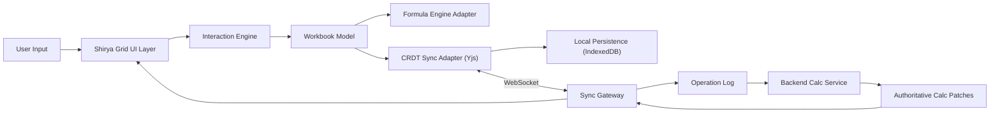

# Shirya: Near-Excel UX Parity Library Design

Status: Proposed (2026-02-21)

## Name
- Product/library name: `Shirya`
- Origin: from Kalmyk `ширә` (table)

## Objective
Design `Shirya` as a local-first, real-time spreadsheet library with near-Excel interaction parity for web applications, while remaining fully open-source in the runtime stack.

## Scope
- In scope:
  - Excel-like interactive spreadsheet UX in browser.
  - High formula compatibility and deterministic recalculation.
  - Local-first editing with collaborative sync and backend authoritative reconciliation.
  - `.xlsx` import/export adapters with defined fidelity rules.
- Out of scope:
  - VBA/macros execution.
  - Power Query, OLAP pivots, and all desktop-only Excel integrations.
  - Perfect 100% parity for every legacy Excel edge case.

## Design Principles
1. Interaction-first parity: keyboard and editing behavior must feel native to spreadsheet users.
2. Local-first correctness: edits are instant locally, then reconciled with server authority.
3. Deterministic outcomes: same workbook + same inputs => same computed outputs.
4. Explicit compatibility boundaries: unsupported features surface clear messages, never silent corruption.
5. OSS-only runtime: no required proprietary dependency for core editing/calc/sync loop.

## Parity Definition
`Near-Excel UX parity` means:
- Familiar grid behavior for common spreadsheet workflows.
- Formula authoring and recalculation behavior that matches Excel in high-value cases.
- Import/export that preserves most business-critical structures and formulas.
- Predictable, documented differences where parity is not feasible.

## Capability Contract
### Required parity domains
1. Grid interaction:
   - Cell/range selection, multi-range selection, keyboard navigation.
   - In-cell edit mode and formula bar editing with commit/cancel semantics.
   - Fill handle, drag copy, drag move, row/column insert/delete/resize/hide.
2. Editing workflows:
   - Clipboard interoperability (plain text/TSV/HTML table forms).
   - Undo/redo for user and collaborative operations.
   - Context menus and shortcut behavior for frequent operations.
3. Formula workflows:
   - A1 references, mixed refs, cross-sheet references, named ranges.
   - Function autocomplete/help, error highlighting, precedent/dependent tracing.
   - Volatile function policy with deterministic replay behavior.
4. View/state:
   - Frozen panes, filters, sort, tabs/sheet operations.
   - Efficient virtualization for large grids.
5. Collaboration:
   - Presence indicators, remote cursor/range hints, conflict visibility.
   - Local-first optimistic updates with server reconciliation patches.

### Deferred parity domains
- Pivot tables, chart editing parity, full conditional-format rule UI parity, advanced data tools.
- Dynamic array corner cases requiring specialized evaluator behavior beyond initial formula scope.

## System Architecture


## Library Modules
1. `@proompteng/shirya-grid`
   - Virtualized canvas/DOM hybrid grid rendering.
   - Selection, active cell, edit-state machine.
   - Accessibility labels, focus model, keyboard dispatcher.
2. `@proompteng/shirya-workbook`
   - Workbook/sheet/cell model with stable row/column IDs.
   - Structural mutations and operation serialization.
   - Undo/redo journal with operation grouping.
3. `@proompteng/shirya-formula-adapter`
   - Formula engine abstraction boundary.
   - Runtime adapter for `hyperformula` (or compatible replacement).
   - Dependency graph invalidation and incremental recalc triggers.
4. `@proompteng/shirya-sync`
   - Local op queue, ack tracking, rebase logic.
   - CRDT bindings and transport protocol integration.
   - Snapshot bootstrap and resync path.
5. `@proompteng/shirya-interop`
   - `.xlsx` import/export transformation layer.
   - Clipboard conversion utilities and fidelity checks.

## Interaction Engine Design
State machine modes:
- `idle`
- `selecting`
- `editing_cell`
- `editing_formula_bar`
- `drag_fill`
- `drag_move`
- `clipboard_paste_preview`

Core interaction rules:
1. Entering edit mode does not lose selection context.
2. Keyboard navigation after commit mirrors spreadsheet expectations:
   - `Enter`, `Shift+Enter`, `Tab`, `Shift+Tab`, arrow keys.
3. Multi-cell paste applies shape-aware placement; overflow conflicts produce visible warnings.
4. Fill handle supports:
   - copy-fill,
   - linear trend fill,
   - date series fill,
   - formula relative-reference propagation.
5. Undo/redo is operation-aware and collaboration-safe:
   - local operations are reversible in order,
   - remote operations create non-reversible boundaries unless explicitly grouped by policy.

## Formula Engine Integration
### Why headless is correct
The formula runtime should remain separate from UI. This allows:
- deterministic server-side recomputation,
- engine swap flexibility,
- easier parity testing.

### Adapter contract
```ts
interface FormulaAdapter {
  setCellInput(sheetId: string, address: string, input: string): void;
  clearCell(sheetId: string, address: string): void;
  applyStructureChange(change: StructureChange): void;
  recalc(changed: CellRef[]): CalcPatch[];
  getCellValue(sheetId: string, address: string): EvaluatedValue;
  getDependencies(sheetId: string, address: string): CellRef[];
}
```

Engine behavior requirements:
- Strict coercion policy with documented Excel-aligned behavior.
- Stable error propagation (`#REF!`, `#VALUE!`, `#DIV/0!`, `#NAME?`, circular refs).
- Locale/timezone normalization at workbook level.
- Volatile function evaluation policy that supports replay consistency.

## Local-First + Realtime Collaboration
Data flow:
1. User action emits local operation.
2. Operation applies immediately to local model.
3. Formula adapter recalculates impacted graph locally.
4. Operation is sent to sync gateway for commit.
5. Backend calc emits authoritative patches.
6. Client reconciles provisional vs authoritative values.

Conflict policy:
- Cell input conflicts: commit-order winner for input value, plus conflict event metadata.
- Structural conflicts: resolved against stable row/column IDs, not visual index only.
- Formula/value conflicts: formula input controls computed value field by default.

## Excel Interop Strategy
### Import
- Parse `.xlsx` into normalized workbook model.
- Preserve:
  - sheet names/order,
  - cell formulas,
  - key number/date formats,
  - merged region metadata,
  - named ranges where representable.
- Record non-representable features in import diagnostics.

### Export
- Generate `.xlsx` from workbook model using explicit fidelity mapping.
- Include metadata markers for unsupported constructs when round-trip loss is possible.

### Fidelity classes
1. `Exact`: round-trips with no semantic drift.
2. `Compatible`: behavior preserved with representational changes.
3. `Degraded`: output preserved partially; warnings required.
4. `Unsupported`: explicit block with reason and remediation note.

## Performance Model
- Virtualize rows/columns with overscan tuned by scroll velocity.
- Keep visible-region render path independent from full workbook size.
- Recalc only dirty dependency descendants.
- Batch remote patch applies into animation-frame-sized units.
- Keep clipboard, fill, and selection logic allocation-light to avoid UI jank.

## Accessibility Model
- ARIA semantics for grid, row/column headers, active cell, and formula errors.
- Full keyboard coverage for non-pointer workflows.
- High-contrast mode compatibility and visible focus indicators.
- Screen-reader announcements for:
  - active cell changes,
  - formula error states,
  - range selection updates.

## OSS Runtime Stack (Current)
- Grid runtime: `jspreadsheet-ce` (MIT)
- Formula engine: `hyperformula` (GPL-3.0-only)
- Local-first CRDT: `yjs` (MIT)
- Offline provider: `y-indexeddb` (MIT)
- Realtime provider: `y-websocket` (MIT)
- Collaboration backend: `@hocuspocus/server` (MIT)
- Local app DB helper: `dexie` (Apache-2.0)
- Backend event stream: `nats` (Apache-2.0)

## Build-From-Scratch Considerations
If formula engine licensing/constraints require replacement, `Shirya` must add:
1. Excel-compatible formula parser and AST.
2. Dependency graph and incremental recompute executor.
3. Function semantics library with coercion and error parity.
4. Array/range evaluation engine.
5. Compatibility harness versus Excel fixture workbooks.

Even with existing OSS libraries, these Shirya-owned components are still mandatory:
1. Interaction engine and keyboard parity layer.
2. Operation protocol and CRDT/model binding.
3. Backend authoritative calc reconciliation pipeline.
4. Import/export fidelity diagnostics and user-facing compatibility warnings.

## Validation Strategy
1. Behavioral parity suite:
   - Golden workbooks with expected values/errors.
   - Cross-check results against Excel-generated fixtures.
2. Interaction parity suite:
   - Keyboard and selection scenario playback tests.
   - Clipboard and fill-handle cross-browser tests.
3. Collaboration suite:
   - Concurrent edit simulations across clients.
   - Offline/reconnect/rebase correctness checks.
4. Interop suite:
   - `.xlsx` import/export round-trip checks with fidelity-class assertions.
5. Accessibility suite:
   - Automated a11y scans + keyboard-only manual runs.

## Risks and Mitigations
1. Formula edge-case mismatch with Excel.
   - Mitigation: compatibility suite expansion driven by telemetry.
2. Collaboration complexity in structural edits.
   - Mitigation: stable IDs + deterministic transform rules.
3. Performance regressions on very large workbooks.
   - Mitigation: virtualization, dirty-graph recalc, patch batching, perf CI gates.
4. Licensing drift in dependencies.
   - Mitigation: automated OSS license audit in CI and adapter boundaries for swap options.

## Success Criteria
- Spreadsheet users can execute primary Excel-like workflows without retraining.
- Formula behavior is reliable for core business models and visibly bounded for unsupported cases.
- Multi-user local-first editing remains responsive and convergent.
- Import/export preserves business-critical workbook semantics with explicit fidelity reporting.
