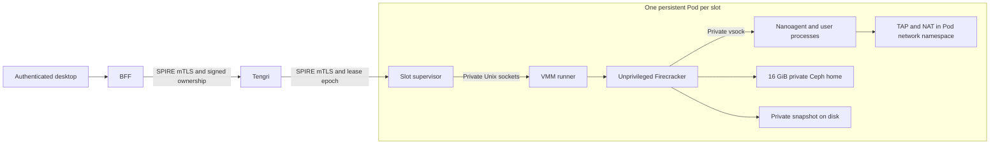

# KVM and TAP lifecycle for Tengri

Status: Runtime design, 2026-10-06. The [source implementation](../../services/tengri/README.md) follows this design.
Permission grants, isolated execution, and production cutover require their scoped authorization and evidence.
This document does not establish a deployed migration or measured authenticated latency.

Validation and cutover must not drain, cordon, reboot, or change scheduling on shared nodes. Stop or replace only the
affected Tengri guest Pods. Keep unrelated workloads running.

## The target is a usable guest within one second

Creation and resume must complete below one second at p95, measured from the authenticated BFF lifecycle request to a
usable Nanoagent. Include request signing, replay protection, ownership checks, slot claim, restore, and readiness.
A successful response requires a working file read, terminal round trip, and already initialized Codex app server.
Opening a listener or reporting Kubernetes readiness alone does not meet the target.

Keep the existing 4 vCPU, 8 GiB guest RAM, 16 GiB private home, and six-owner capacity. Every completed sleep releases
resident guest RAM and stops background processes. The home and workspace survive. Automatic sleep uses the power
settings from #14787, including zero to disable automatic sleep and manual sleep to release RAM.

## Keep a small supervisor alive around a stopped guest

Replace the Kata guest Pod lifecycle with six prepared slots. Each slot has one stable Pod, one private raw-block
home PVC, one writable root disk, one TAP interface, and its own snapshot. Each vacant slot boots and provisions its
own guest before becoming available, then snapshots and stops that guest. A user claims a vacant slot once.

Creation restores the claimed slot's prepared snapshot. Resume restores that owner's latest committed snapshot.
Neither path schedules a Pod, attaches a volume, downloads tools, boots a kernel, or installs editor plugins.
If no prepared slot is available, return a capacity error with the current preparation state. Do not acknowledge an
agent as ready while synchronously provisioning it behind the response.

Use two containers in the slot Pod. The supervisor owns SPIRE identity, controller authorization, and API proxying.
The runner owns the Firecracker API socket, disks, journal, and VMM child. A separate short-lived init container creates TAP. The runner has no SPIRE socket, credentials,
Kubernetes token, or Kubernetes roles. The containers share only that slot's private control sockets and runtime files.
Keep separate PID namespaces and disable service-account token mounting.

The external BFF, terminal, file, Codex, and preview contracts remain owned by Tengri. The supervisor forwards guest
operations over vsock. Host lifecycle commands use a separate authenticated service, inaccessible to the guest.
The controller validates the current supervisor Pod UID, MicroVM UID, slot ID, and lease epoch before forwarding.
The resume hook binds Nanoagent to that incarnation before readiness succeeds.

## Claim slots without sharing user state

Store six slot claims in Kubernetes Leases, updated with `resourceVersion` compare-and-swap. The claim contains the
MicroVM UID and a monotonically increasing lease epoch. The existing deterministic MicroVM name continues to prevent
two agents for one owner. Retries reuse the claim for the same MicroVM UID. A conflicting owner or epoch fails closed.

The runner maintains one local journal per slot. Its record binds the lease epoch, Pod UID, image and kernel digests,
Firecracker version, CPU compatibility, disk identities, and snapshot generation.
The controller recovers an interrupted claim by checking both the MicroVM and Lease. A supervisor authorizes work
only after the matching claim is durable. Filesystem paths and VMM arguments are derived from this record, never from
browser input.

| Slot state | Guest process                             | Owner                    | Allowed transition                                            |
| ---------- | ----------------------------------------- | ------------------------ | ------------------------------------------------------------- |
| Preparing  | Booting or provisioning                   | Vacant or retained owner | Commit a private ready snapshot                               |
| Vacant     | Stopped                                   | None                     | Claim once, then restore                                      |
| Restoring  | Starting from a snapshot                  | One fenced MicroVM UID   | Become Awake after usable-guest checks                        |
| Awake      | Running                                   | Same owner               | Quiesce for sleep or terminate for explicit deletion          |
| Saving     | Paused during snapshot commit             | Same owner               | Stop and become Sleeping, or resume the live guest on failure |
| Sleeping   | Stopped                                   | Same owner               | Restore the committed snapshot                                |
| Failed     | Stopped or unproven after loss of contact | Claim retained           | Fence the old instance before recovery or deletion            |

A prepared snapshot belongs to one slot and is never cloned into another owner's VM. Deletion revokes terminal and
preview sessions, fences the claim, stops the VMM, and removes that owner's disks and snapshots. The replacement
slot receives a fresh PVC, snapshot, and Pod identity before it becomes vacant again. It cannot serve the next owner
from the previous owner's filesystem or memory.

## Grant KVM access without host networking

Use the normal Linux OCI runtime for the supervisor Pod. A narrow device plugin supplies `/dev/kvm` and
`/dev/net/tun` to the runner, including container-runtime device permissions. A hostPath mount alone does not establish
device-cgroup permission. Advertise only validated nodes and enough slots for the configured capacity. Keep the
device-plugin service separate from user guests and limit its node mounts to its kubelet registration contract.
The [Kubernetes device-plugin contract](https://kubernetes.io/docs/concepts/extend-kubernetes/compute-storage-net/device-plugins/)
defines the runtime allocation boundary.

Run TAP initialization with NET_ADMIN only in the private Pod network namespace, before any lifecycle request.
The runner starts with MKNOD/SETUID/SETGID to create its private allocated-home inode, then irreversibly drops to UID/GID
65532 with no capabilities. It never chmods the node device. Firecracker runs as a separate non-root child with its
default seccomp filter enabled. Verify the child has no effective, permitted, or ambient capabilities. The container
root filesystem is read-only and exposes only that slot's devices, disks, and sockets. Device allocation must give
the runner UID access without changing ownership or modes of the node's device files. The runner closes inherited
control descriptors before starting the VMM. Guest root access remains inside the guest.

Use the OCI container's mount, PID, network, and cgroup isolation for the VMM process. Validate that boundary in the
isolated fixture before accepting it. The upstream [jailer](https://github.com/firecracker-microvm/firecracker/blob/v1.16.1/docs/jailer.md)
also creates mount namespaces and manages cgroups. Adding it would require a separately reviewed privilege contract.
Do not silently add `privileged: true`, `CAP_SYS_ADMIN`, host PID, host network, or a writable host root to make a test pass.

| Component         | Proposed host access                                   | Authority                                   |
| ----------------- | ------------------------------------------------------ | ------------------------------------------- |
| Tengri controller | Existing Kubernetes lifecycle and claim operations     | Signed GitHub ownership and replay checks   |
| Slot supervisor   | SPIFFE CSI socket and that slot's control directory    | Exact Tengri SPIFFE peer plus current lease |
| TAP initializer   | TUN and NET_ADMIN in the Pod namespace                 | Runs once before lifecycle requests         |
| VMM runner        | Allocated KVM/TUN, private disks and startup UID setup | Supervisor commands for one fenced slot     |
| Firecracker child | Allocated devices and that slot's backing files        | Non-root UID, no capabilities, seccomp      |
| Guest Nanoagent   | Guest kernel, private home, private vsock              | No Kubernetes or host SPIRE identity        |

The user authorized source implementation. New permission/identity grants and a KVM test workload still require their scoped approval before execution.
This design does not authorize namespace policy changes, node configuration, or additional host devices.

## Keep TAP, routes, and identity stable through sleep

Each slot uses a TAP in its existing Pod network namespace. Give every isolated namespace the same private /30 guest
subnet after validating that it does not overlap the cluster's Pod, Service, or host routes. Keep the guest MAC,
address, gateway, and TAP name stable for that slot. The runner applies forwarding and masquerading to the Pod's
ordinary CNI interface. It does not create a host bridge, host route, host-network Pod, or cluster-wide forwarding rule.

Retain the current [guest egress exclusions](../../argocd/applications/tengri/network-policies.yaml). Add Pod-local
filtering that blocks guest traffic to supervisor listeners, Firecracker control sockets, and identity services.
Allow DNS through the reviewed resolver path. Controller and preview traffic reaches the supervisor's authenticated
listener, then enters the guest through private vsock. TAP carries guest application egress.

TAP setup follows the pinned [Firecracker networking contract](https://github.com/firecracker-microvm/firecracker/blob/v1.16.1/docs/network-setup.md).
Validate CNI policy enforcement and any mesh interception with this NAT path. Exclude the guest TAP path from mesh
redirection where required by the verified packet flow. An unexpected bypass blocks release.

The supervisor obtains rotating SPIRE credentials outside guest memory. A saved guest therefore contains no host SVID
or projected PSAT token that expires during sleep. Remove guest PSAT renewal, guest SPIRE bootstrap, and their specific
RBAC and admission rules during the hard migration. Preserve exact controller peer checks and per-owner authorization.

Treat existing network and vsock connections as closed on restore. Reconnect terminal, events, editor, preview, and
Codex transports without repeating guest provisioning. The pinned [vsock contract](https://github.com/firecracker-microvm/firecracker/blob/v1.16.1/docs/vsock.md)
supplies the host-to-guest transport. Readiness requires the new connections to work.

## Commit a snapshot before reporting sleep

Begin with full snapshots only. Pin the VMM, kernel, guest image, CPU configuration, and snapshot format in the journal.
Keep a memory file while a restored VMM maps it. The pinned [snapshot API](https://github.com/firecracker-microvm/firecracker/blob/v1.16.1/docs/snapshotting/snapshot-support.md)
loads file-backed memory on demand. A pause alone retains guest RAM.

Sleep follows one serialized transition:

1. Fence new operations and revoke active transient browser transports. Quiesce writable guest filesystems through a
   guest hook that remains reachable while writes are frozen.
2. Pause vCPUs with `PATCH /vm`. Flush the backing disks and verify that guest writes have stopped.
3. Write `Full` memory and device-state files into a new private generation with `PUT /snapshot/create`.
4. Sync the files, backing disks, journal, and parent directories.
5. Terminate and reap the VMM. Evict clean snapshot pages with file-scoped `POSIX_FADV_DONTNEED` after the mapping closes.
6. Commit Sleeping atomically and report it only after no VMM remains and resident guest memory has been released.

Keep the previous mapped memory file until its process exits. It is not a recovery snapshot once the guest has written
to its disks. If saving fails, discard the partial generation, thaw the filesystems, and resume the still-live guest.
Report the failed sleep. Never restore older memory against newer writable disks.

Resume starts a fresh VMM against the same private disks and committed memory generation. Load it with
`PUT /snapshot/load`, using the file backend and `resume_vm: false`. Mark the generation consumed before resuming vCPUs.
The guest hook thaws filesystems, updates wall-clock time, binds the current incarnation, and reestablishes control
connections. The boot artifact must enable VMGenID and its guest kernel entropy notification. Application-generated
identifiers and one-use tokens remain subject to the lease and incarnation checks. The supervisor returns Ready only
after all usable-guest checks pass.

A failed restore becomes Failed with its private home retained. A controller restart reads MicroVM bindings and
Leases, then queries the existing runner. Only the runner's live child handle proves process termination. It never
adopts a process by a reusable PID after restart. A runner restart during an active save or restore fails closed because
the disks may have advanced. Committed sleeping journals can reopen only with unchanged identities.

Loss of contact, an expired Lease, or a missing readiness signal does not prove that the old VMM stopped. Keep recovery
blocked while its execution state is unknown. Before starting a replacement, establish old-VMM or node fencing through
an authorized operation. Verify that the original process cannot execute or write, then prove safe volume detachment
and the storage backend's exclusive-writer state. Do not force-detach the home or clear storage locks to bypass an
unproven fence. A partitioned node must not regain write access after its home has moved.

Do not automate shared-node fencing. If the affected VMM and its storage access cannot be fenced without disrupting
unrelated workloads, retain the claim and report recovery blocked pending a separately authorized operation.

Only after those checks may explicit recovery cold-boot the retained home. It cannot masquerade as a successful
snapshot resume. The journal records the fencing evidence and successor incarnation before the claim admits new work.

## Bound storage and distinguish RAM from reservations

Keep each 16 GiB home on the existing shared Ceph raw-block PVC. Guest root and snapshots use a private disk-backed
`emptyDir`, not tmpfs. Use a 24 GiB disk-backed snapshot/root volume for the private root, two 8 GiB memory
generations, and metadata, plus a 2 GiB artifact volume. Each runner reserves and limits 26 GiB ephemeral storage. Check full allocation rather than assuming sparse files stay sparse. Six slots require up
to 156 GiB of local disk in addition to the existing 96 GiB home capacity.

Local snapshots intentionally survive sleep and controller restarts, but not loss of their Pod or node. The home PVC
remains the durable recovery boundary. This choice removes remote snapshot reads from normal resume and leaves shared
Ceph ownership unchanged. Cross-node snapshot migration is outside this design.

Account for all VMM and supervisor overhead within the 51 GiB namespace limit, including all six 8320 MiB runners, six 128 MiB supervisors, and controller limits. Preallocated Pod requests reserve capacity for prompt resume even when a guest is stopped. Sleep releases
physical guest RAM; it does not return the stable Pod's memory request to the Kubernetes scheduler. Report both values
in the acceptance evidence. Do not claim scheduler capacity was released because guest RSS fell.

The prepared guest artifact contains a pinned kernel, bootable root filesystem, Nanoagent, and the tool inputs needed
to initialize each private home. OCI container layers alone are not a standalone VM boot image. Build and verify the
boot artifacts in CI. Prepare tools, editor plugins, and Codex before committing a vacant snapshot. No installer or
background cold boot belongs to the authenticated creation or resume path.

## Prove the lifecycle in an isolated KVM fixture

The fixture needs approved KVM and TUN access on a Linux node matching the intended production CPU and runtime profile.
Mocks establish protocol behavior only. Record exact source, kernel, VMM and image digests, host capabilities, workload
profile, and the measurement boundary. Keep fixture storage separate from every production workspace.

| Requirement                  | Evidence required before implementation merge                                                                                                                  |
| ---------------------------- | -------------------------------------------------------------------------------------------------------------------------------------------------------------- |
| Creation below one second    | At least 50 fresh owner claims from independently prepared slots, recycling between runs; end-to-end p50, p95, and maximum                                     |
| Resume below one second      | At least 50 RAM-releasing sleep/resume cycles, including long sleep and file-cache eviction; authenticated request through file, terminal, and Codex readiness |
| RAM release                  | VMM absent; cgroup anonymous and file-memory counters, per-process RSS, and snapshot page residency approach the measured idle supervisor baseline             |
| Process continuity           | A process with an in-memory counter resumes with the same state, alongside terminal reconnection and background work                                           |
| Workspace retention          | Before/after file hashes, permissions, filesystem identity, and unchanged home PVC UID                                                                         |
| Private ownership            | Simultaneous claims and foreign-owner calls cannot access another slot, snapshot, terminal, preview, or home                                                   |
| Network behavior             | DNS and permitted egress work after restore; protected destinations and supervisor/identity listeners stay blocked                                             |
| Expired credentials and time | Resume after SVID and PSAT lifetimes; host identity rotates, guest clock is current, and transports reconnect                                                  |
| Failure handling             | Stop each save/restore stage; corrupt state files and missing, mismatched, or consumed generations fail visibly with the home retained                         |
| Partition recovery           | Keep an old guest writing while its node loses controller contact; no replacement or volume reattachment starts before fencing and exclusive-writer proof      |
| Capacity                     | Six guests can restore concurrently within the same limits; exhausted or preparing capacity returns a truthful error                                           |

Measure snapshot-save time separately. Full memory writes can make sleep slower than resume. Report the time until
RAM is actually released. A fast Firecracker API call is not an end-to-end latency result.

## Replace the old lifecycle in one migration

Implement one supervisor/runner service, the device allocation boundary, the guest quiesce/resume hook, and the slot
claim state. Replace the controller's guest Pod recreation with that lifecycle. Remove Kata-specific Pod projection,
guest attestation and token-refresh paths, and old runtime negotiation from Tengri. Do not carry two runtime engines
or add a sleep mode that keeps guest RAM resident.

Keep existing homes intact during cutover. Stop only the affected Kata guests at an explicitly approved owner or
maintenance boundary, then replace their Pods with slots that reuse the same home PVC. Prepare those retained homes
before opening the new lifecycle to requests. Guest processes restart once at this hard cutover because the old Kata
path supplies no transferable memory snapshot. Do not reformat, resize, or replace retained home claims.

Update protobuf contracts, CRD/status fields, BFF callers, ownership validation, image builders, Kargo artifact grouping,
network policy, and SPIRE admission together. Publish the guest boot artifacts and host supervisor through the existing
[CI and Kargo release path](../release-automation.md). Withhold discoverable aliases until the full image set and KVM
acceptance pass. Validate rendered manifests and the precise permission diff before any authorized rollout.

Recovery preserves the home even when snapshot compatibility or node availability fails. Runtime rollback must use a
compatible image set and an explicit retained-home cold boot. A snapshot with different VMM, CPU, kernel, image, or disk
identity is never accepted by a compatibility fallback.

Source implementation does not authorize new device or identity grants. Review the exact permission diff and isolated
test script before their execution. Production cutover remains separately authorized; do not merge changes that
automatically remove live guest identity or promote the new runtime without that authorization.
