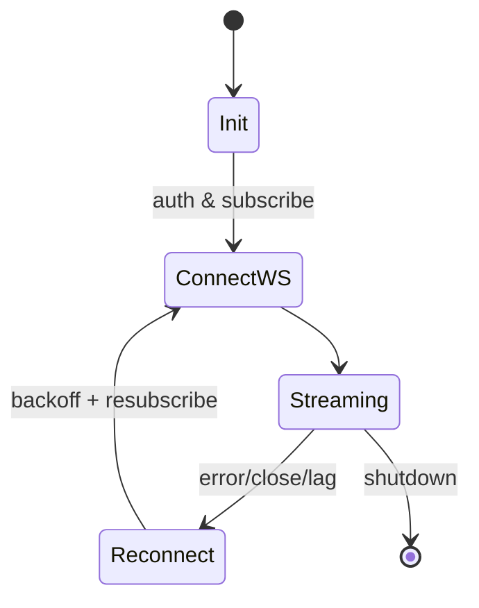

# Kotlin WS Service (torghut)

## Purpose
Single-replica Kotlin/JVM service (Gradle multi-project) that ingests Alpaca market (and optional trading) WebSocket streams and forwards to Kafka with ordering, dedup, and status signals.

## Requirements
- Streams: trades (`T=t`), quotes (`T=q`), 1m bars/updated bars (`T=b|u`), status; optional `trade_updates`.
- One active WS per account (Alpaca constraint); reconnect with backoff and resubscribe.
- Dedup keys: trades by `i`; quotes/bars by `(t,symbol)`; trade_updates by order id; maintain monotonic `seq` keyed by symbol.
- Envelope: `ingest_ts`, Alpaca `event_ts` (`t`), `feed`, `channel`, `symbol`, `seq`, `payload`, `is_final?`, `source` (ws/rest), optional `window{}`.
- Kafka producer: SASL/PLAIN over TLS using Strimzi KafkaUser secret; acks=all; linger 20–50 ms; compression lz4; idempotence on.
- Optional startup backfill: last 100 1m bars via REST (`source: rest`, `is_final: true`).

### Config knobs
- Env/ConfigMap keys (suggested):
- `ALPACA_KEY_ID`, `ALPACA_SECRET_KEY`, `ALPACA_FEED` (`iex|sip|delayed`), `ALPACA_BASE_URL` (for paper/live)
- `ALPACA_STREAM_URL` (WS base; use sandbox `wss://stream.data.sandbox.alpaca.markets` for tests)
- `ALPACA_TRADE_STREAM_URL` (optional trade_updates WS base; required when `ENABLE_TRADE_UPDATES=true`)
  - `SYMBOLS` (comma list fallback if Jangar is unavailable), `ENABLE_TRADE_UPDATES` (bool), `ENABLE_BARS_BACKFILL` (bool)
  - `RECONNECT_BASE_MS` (e.g., 500), `RECONNECT_MAX_MS` (e.g., 30000)
  - `DEDUP_TTL_SEC` (e.g., 5 for quotes/bars), `DEDUP_MAX_ENTRIES`
  - `KAFKA_BOOTSTRAP`, `KAFKA_SASL_USER`, `KAFKA_SASL_PASSWORD`, `KAFKA_SASL_MECH=SCRAM-SHA-512`, `KAFKA_SECURITY_PROTOCOL=SASL_SSL`
- `KAFKA_LINGER_MS=30`, `KAFKA_BATCH_SIZE` (tune), `KAFKA_ACKS=all`
- `TOPIC_TRADES`, `TOPIC_QUOTES`, `TOPIC_BARS_1M`, `TOPIC_STATUS`, optional `TOPIC_TRADE_UPDATES`
- `METRICS_PORT`, `HEALTH_PORT` (metrics served on `METRICS_PORT`; if equal to `HEALTH_PORT`, they share one server)

### Local / sandbox testing
- Copy `services/dorvud/websockets/.env.local.example` to `.env.local` and populate Alpaca sandbox credentials.
- Point the WS base to sandbox: `ALPACA_STREAM_URL=wss://stream.data.sandbox.alpaca.markets` with `ALPACA_FEED=iex` (or `sip` if available).
- Keep REST base on sandbox (`ALPACA_BASE_URL=https://data.sandbox.alpaca.markets`) so any backfill stays in the non-live environment.
- Run locally against a dev Kafka:
  ```bash
  cd services/dorvud
  ./gradlew :websockets:run
  ```
- Or spin up local infra (Kafka + UI) with FAKEPACA as the test symbol:
  ```bash
  cd services/dorvud/websockets
  cp .env.local.example .env.local   # set Alpaca keys first
  docker compose -f docker-compose.local.yml up --build
  ```
  Kafka UI will be at http://localhost:8085 and broker at localhost:9092; topics auto-create on first produce. Run the forwarder separately with your `.env.local` loaded: `cd services/dorvud && ./gradlew :websockets:run`.
- Quick WS smoke (without Kafka):
  ```bash
  websocat "wss://stream.data.sandbox.alpaca.markets/v2/iex" \
    -H "Authorization: Bearer $ALPACA_KEY_ID" \
    -H "x-alpaca-secret-key: $ALPACA_SECRET_KEY"
  # then send a subscribe frame for trades/quotes/bars
  ```

### Reconnect/dedup behavior
- Exponential backoff with jitter; cap at 30 s.
- On reconnect: re-auth, resubscribe all symbols/channels, emit status event.
- Dedup caches keyed per channel; evict by TTL or LRU to bound memory.
- Readiness waits on WS auth + subscription and Kafka metadata; flips not-ready on sustained Kafka send failures.

### Error handling
- If Kafka produce fails repeatedly (3+ consecutive send failures): trip not-ready and recover on the next success; continue retrying with backoff; alert via status topic.
- If Jangar symbol polling fails: keep the last-known symbol list (static fallback if configured) and log the failure.
- If WS lags beyond threshold (`now - event_ts > 2s`): emit status + metric; consider reconnect.
- Startup probe waits for first successful WS subscribe and Kafka metadata fetch.

## Project layout (Gradle)
- `platform`: shared config (typesafe Config), logging (SLF4J), common envelope/Avro, Kafka producer factory.
- `ws`: Ktor (or JetBrains HTTP) WebSocket client, reconnect/backoff, dedup caches, envelope builder, Kafka producers.
- `ta`: shared TA schema/types for downstream consumers (used by ws for envelope typing and by Flink integration tests).
- Repo path: `services/dorvud/` (multi-project). Forwarder code lives in the `websockets` module (shared code in `platform`, TA types in `technical-analysis`). Dockerfile under `services/dorvud/websockets/`; Kustomize manifests under `argocd/applications/torghut/ws/`.

## Kubernetes Design
- Namespace: torghut. Objects: Deployment (replicas=1), ServiceAccount, ConfigMap (feeds/symbols/backoff/toggles), Secret refs, Service (health/metrics), optional PDB.
- Probes: startup (WS connect), liveness (loop running), readiness (Kafka produce + WS subscribed).
- Security: runAsNonRoot, readOnlyRootFS, drop NET_RAW; limit egress to Alpaca + Kafka + registry.
- Secrets: reuse torghut secrets or reflector from kafka namespace for KafkaUser; sealed-secret for Alpaca key/secret.

## Observability
- /metrics (Prometheus format) for scrape by existing Mimir/Grafana Agent stack: reconnect count, WS lag (ingest_ts - event_ts), Kafka send latency, dedup drops.
- Logs to Loki: JSON structured, include symbol/channel/event_ts/ingest_ts/lag_ms.
- Status topic fields (example): `{status: "reconnect"|"healthy"|"error", reason, attempt, lag_ms?, ts}`.

## Secrets & Rotation
- Alpaca keys: sealed-secret in torghut; rotate by updating the SealedSecret and restarting Deployment; never log keys.
- Kafka auth: Strimzi KafkaUser secret reflected into torghut or mounted directly; rotation via Strimzi user password change + pod restart.

## Network & RBAC
- NetworkPolicy: egress only to Alpaca endpoints, Kafka bootstrap/brokers, MinIO (if used for backfill), image registry, observability ingress.
- RBAC: ServiceAccount with minimal permissions; no cluster-admin.

## Incident & Runbook
- WS 406 (connection limit): ensure only one replica; check leaked connections; restart if stuck.
- Persistent Kafka produce failures: mark not-ready, emit status, backoff; check auth/ACL; consider rolling restart.
- Lag spike: compute lag metric; reconnect if `now - event_ts` exceeds threshold; emit status.

## Testing
- Replay FAKEPACA feed to ensure dedup and envelope correctness.
- Inject WS disconnect (close socket) and verify auto-reconnect + status emit.
- Kafka auth negative test: invalid credentials should fail readiness.

## CI/CD & image
- Dockerfile: multi-stage (Gradle build → slim distroless/temurin runtime); non-root user.
- CI: `./gradlew :ws:shadowJar` (or `bootJar` if using Spring) + `docker build -t <registry>/torghut-ws:<tag> -f apps/torghut-ws/Dockerfile .`; run unit tests for envelope/dedup.

## Network & security
- NetworkPolicy: egress only to Alpaca endpoints, Kafka bootstrap/brokers, registry, optional metrics collector.
- Truststore: mount from Strimzi secret; set `ssl.endpoint.identification.algorithm=HTTPS` if TLS.

## Topics Produced
- `trades`/`quotes`/`bars.1m`/`status` (names finalized in issue #1914), partitions=1, RF=3, lz4, retention: trades/quotes 7d; bars 30d; status 7d (compaction optional).

## Mermaid (forwarder lifecycle)

