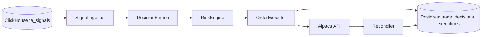

# Torghut Automated Trading — One‑Shot Execution Doc

This document describes a **single-run, end‑to‑end** implementation plan for the core automated trading pipeline in torghut. It is intentionally structured as a one‑shot execution guide for Codex (no milestones).

## Scope
- **Signals source:** ClickHouse `ta_signals`.
- **Execution mode:** paper trading by default, live trading gated by config.
- **Universe:** from Jangar symbols endpoint or per‑strategy list.
- **Owner:** torghut service (FastAPI) or a dedicated worker deployment in the torghut namespace.

## Design References
- Streaming + TA pipeline: `docs/torghut/architecture.md`
- Flink TA job: `docs/torghut/flink-ta.md`
- Topics & schemas: `docs/torghut/topics-and-schemas.md`
- Main service consumer guide: `docs/torghut/main-service-consumer.md` (deprecated)

## System Overview
Pipeline:
```

## Runtime Configuration (env)
- `TRADING_ENABLED` (default `false`) gates the trading loop.
- `TRADING_MODE` (`paper|live`, default `paper`); live requires `TRADING_LIVE_ENABLED=true`.
- `TRADING_SIGNAL_SOURCE` (`clickhouse`), `TRADING_SIGNAL_TABLE` (default `torghut.ta_signals`).
- `TRADING_SIGNAL_SCHEMA` (`auto|envelope|flat`) to align ClickHouse shape with ingestion.
- `TRADING_PRICE_TABLE` (default `torghut.ta_microbars`) for price snapshots.
- `TRADING_PRICE_LOOKBACK_MINUTES` for price lookups (default `5`).
- `TA_CLICKHOUSE_URL`, `TA_CLICKHOUSE_USERNAME`, `TA_CLICKHOUSE_PASSWORD` for ClickHouse access.
- `TRADING_POLL_MS` and `TRADING_RECONCILE_MS` for loop intervals.
- `TRADING_UNIVERSE_SOURCE` (`jangar|static`), `JANGAR_SYMBOLS_URL`, `TRADING_STATIC_SYMBOLS`.
- Optional risk defaults: `TRADING_MAX_NOTIONAL_PER_TRADE`, `TRADING_MAX_POSITION_PCT_EQUITY`.
- LLM controls: `LLM_ENABLED`, `LLM_SHADOW_MODE`, `LLM_PROMPT_VERSION`, `LLM_RECENT_DECISIONS`,
  `LLM_CIRCUIT_MAX_ERRORS`, `LLM_CIRCUIT_WINDOW_SECONDS`, `LLM_CIRCUIT_COOLDOWN_SECONDS`.
SignalIngestor -> DecisionEngine -> RiskEngine -> OrderExecutor -> Reconciler
                                   ↘ Persistence (trade_decisions, executions)
```



## One‑Shot Execution Steps (implementation within a single Codex run)

### 1) Create trading modules (code)
Create a module folder under `services/torghut/app/trading/` with:
- `models.py` — Pydantic DTOs for signals/decisions/execution requests.
- `ingest.py` — ClickHouse signal ingestion (poll by `event_ts` cursor).
- `decisions.py` — Strategy evaluation (start with simple MACD/RSI example).
- `risk.py` — Risk checks:
  - `max_position_pct_equity`
  - `max_notional_per_trade`
  - symbol allowlist
  - paper‑only gate + kill switch
- `execution.py` — Idempotent order submission via `TorghutAlpacaClient`.
- `reconcile.py` — Order reconciliation (poll Alpaca for status updates).
- `scheduler.py` — Worker loop:
  - `ingest -> decide -> risk -> execute`
  - periodic reconciliation

### 2) Wire into torghut service
In `services/torghut/app/main.py`:
- On startup, spawn the trading loop if `TRADING_ENABLED=true`.
- Optional admin endpoints:
  - `GET /trading/status`
  - `GET /trading/health`

### 3) Extend config
In `services/torghut/app/config.py` add:
- `TRADING_ENABLED` (bool)
- `TRADING_MODE` (`paper|live`)
- `TRADING_SIGNAL_SOURCE` (`clickhouse`)
- `TRADING_POLL_MS`
- `TRADING_UNIVERSE_SOURCE` (`jangar|static`)

### 4) DB schema updates
Use Alembic in `services/torghut/migrations/` to add:
- `trade_decisions.decision_hash` (unique)
- `trade_decisions.executed_at` (timestamp)
- Optional: `executions.last_update_at`
- Optional: `trade_cursor` table for ingestion cursor (or re‑use `tool_run_logs`).

### 5) Idempotency
Decision hash:
```
decision_hash = sha256(strategy_id + symbol + event_ts + action + params)
```
Before submitting an order:
- check if decision exists for hash
- if execution exists, skip

### 6) Risk & gating rules
Minimum checks before order submission:
- `TRADING_ENABLED=true`
- `TRADING_MODE=paper` unless explicit live override
- strategy enabled + symbol allowed
- buying power / equity coverage
- max notional per trade
- max percent equity per position
- optional cool‑down per symbol

### 7) Observability
Logs (structured):
- `strategy_id`, `decision_id`, `symbol`, `event_ts`, `alpaca_order_id`

Metrics (min set):
- `decisions_total`
- `orders_submitted_total`
- `orders_rejected_total`
- `reconcile_updates_total`
- `llm_requests_total`
- `llm_veto_total`
- `llm_adjust_total`
- `llm_error_total`
- `llm_circuit_open_total`
- `llm_shadow_total`

### 8) Manifests / runtime
Option A: run trading loop in torghut Knative service.
Option B: create a **dedicated worker Deployment**:
- `argocd/applications/torghut/trading/`
- ConfigMap for trading settings
- Secret for Alpaca creds

### 9) Tests
Add unit tests:
- decision logic
- risk engine
- idempotency
Integration test:
- ingest one fake signal -> decision -> execution row

## Strategy provisioning
Seed or update a default strategy (dev/stage):
```
uv run python services/torghut/scripts/seed_strategy.py \
  --name macd-rsi-default \
  --base-timeframe 1Min \
  --symbols AAPL,MSFT \
  --enabled
```

## Replay / backtest hook
Replay ClickHouse signals through the decision engine without executing orders:
```
uv run python services/torghut/scripts/replay_signals.py \
  --start 2026-01-01T00:00:00Z \
  --end 2026-01-01T01:00:00Z \
  --symbol AAPL \
  --limit 200 \
  --apply-risk
```

## Trading audit APIs
- `GET /trading/decisions?symbol=&since=`
- `GET /trading/executions?symbol=&since=`
- `GET /trading/metrics`

## Code Locations (existing + new)
Existing:
- `services/torghut/app/alpaca_client.py`
- `services/torghut/app/models/entities.py`
- `services/torghut/app/snapshots.py`

New (proposed):
- `services/torghut/app/trading/*.py`
- `services/torghut/migrations/*`
- `argocd/applications/torghut/trading/*` (if separate worker)

## Suggested TODO markers (for tracking)
```
# TODO(trading): implement SignalIngestor for ClickHouse
# TODO(trading): implement StrategyRunner
# TODO(trading): implement RiskEngine checks
# TODO(trading): implement OrderExecutor + idempotency
# TODO(trading): implement Reconciliation loop
```

## Notes
- Signal ingestion is ClickHouse-only for this plan.
- Keep the system paper‑only unless explicitly configured for live trading.
