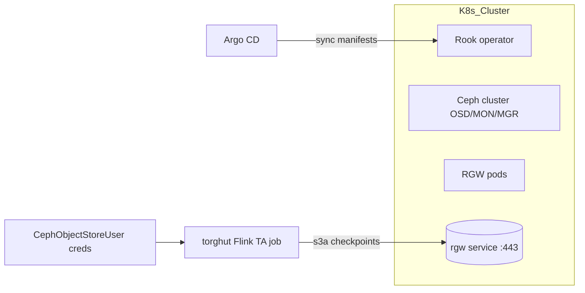

# Ceph Object Storage Migration (MinIO → Ceph RGW via Rook)

> Note: Canonical production-facing design docs live in `docs/torghut/design-system/README.md` (v1). This document is supporting material and may drift from the current deployed manifests.

## 1. Context and goals
- Replace MinIO with an open-source, production-grade S3 backend while keeping Flink checkpoints and torghut data flows S3-compatible.
- Preserve latency budgets (≤500 ms end-to-end for signals) and checkpoint reliability.
- Avoid license friction; Ceph + Rook is Apache-2.0/LGPL and widely used in Kubernetes.
- Enable future features (multitenancy/IAM, tiering) without re-architecting storage.

## 2. Why Ceph RGW fits
- Rook deploys/operates Ceph RGW on Kubernetes and exposes an in-cluster S3 endpoint (`rook-ceph-rgw-<store>.<ns>.svc`).
- RGW is S3-compatible and works with Flink’s `s3a://` filesystem via custom `s3.endpoint` / `s3.path.style.access` settings.
- Published benchmarks show RGW scales to high aggregate throughput under load (multi-node GET/PUT testing).

## 3. Target architecture


### Key design points
- **Namespace**: `rook-ceph` (operator + cluster); RGW service consumed from `torghut` namespace via cluster DNS.
- **CephObjectStore**: TLS enabled with cert referenced via `sslCertificateRef`; advertise endpoint DNS to match cert SAN.
- **Buckets**:
  - `flink-checkpoints` (state.checkpoints.dir, state.savepoints.dir)
  - `torghut-artifacts` (future: fixtures, replays)
- **Access**: dedicated `CephObjectStoreUser` named `torghut-flink`; keys mounted as K8s Secret `torghut-ceph-s3` in `torghut`.
- **Networking**: allow egress from Flink JM/TM pods to RGW service TCP/443; optional NodePort/Ingress for external ops not required.
- **Durability**: start with EC 2+1 or replica 3 (depending on available OSDs); revisit after sizing.

## 4. Client configuration changes (Flink)
Set in `FlinkDeployment` `spec.jobManager.spec.flinkConfiguration` and mirrored in TM section:
```yaml
s3.endpoint: https://rook-ceph-rgw-objstore.rook-ceph.svc:443
s3.path.style.access: true
s3.access-key: ${CEPH_ACCESS_KEY}
s3.secret-key: ${CEPH_SECRET_KEY}
s3.connection.ssl.enabled: true
s3.connection.maximum: 256
s3.socket.timeout: 300000
fs.s3a.fast.upload: true
fs.s3a.connection.establish.timeout: 60000
fs.s3a.path.style.access: true
```
- If the cert is internal, mount CA bundle and set `ssl.truststore.location` accordingly.
- Use `s3a://flink-checkpoints/torghut/` for both `state.checkpoints.dir` and `state.savepoints.dir`.
- Keep transaction timeout > checkpoint timeout (e.g., 120s).

## 5. Migration plan (MinIO → Ceph)
### Phase 0 - Prep
- Deploy Rook operator + CephCluster (distinct storage class or raw devices).
- Create `CephObjectStore` (`objstore`), `CephObjectStoreUser` (`torghut-flink`).
- Create buckets via `radosgw-admin bucket create` or `aws s3api --endpoint`.
- Add NetworkPolicy allowing JM/TM → RGW:443.

### Phase 1 - Dual-write ready (optional)
- Keep MinIO as primary; configure `rclone sync` cron from MinIO bucket to Ceph bucket for checkpoints and artifacts.
- Validate object ACLs and path-style compatibility.

### Phase 2 - Cutover with savepoint
1. Trigger Flink savepoint and stop job (drain) while sinks commit.
2. `rclone sync` MinIO → Ceph for checkpoint + savepoint prefixes.
3. Patch `FlinkDeployment` to new S3 endpoint/keys; set `state.savepoints.dir` to Ceph URI; redeploy.
4. Resume from latest savepoint; confirm checkpoints writing to Ceph.

### Phase 3 - Decommission MinIO (after soak)
- Remove sync job; archive MinIO bucket for rollback window (e.g., 7 days).
- Update runbooks to point to Ceph-only.

### Validation
- Run `docs/torghut/test-harness.md` replay; assert p99 lag ≤500 ms and checkpoint age <2× interval.
- Confirm RGW metrics scraping and alerts present.

### Rollback
- Redeploy FlinkDeployment with MinIO endpoint and prior savepoint; keep MinIO bucket intact until Ceph soak complete.

## 6. Operations and security
- **TLS**: Terminate at RGW; benchmarks typically show small overhead (<5% PUT) when HTTPS is enabled.
- **Multitenancy**: Ceph IAM accounts support per-tenant users/roles on RGW.
- **Lifecycle/tiering**: RGW bucket lifecycle rules can transition objects to other storage classes/providers (e.g., COS) for cold data.
- **Capacity planning**: Start with replica 3 for simplicity; evaluate EC 2+1 after baseline to reduce overhead.

## 7. Risks and mitigations
- **Client compatibility**: Ensure `s3.path.style.access=true` for s3a; without it virtual-hosted style may fail on cluster DNS. Mitigate via config above.
- **Checkpoint consistency**: Always migrate via savepoint; do not reuse in-flight MinIO checkpoints.
- **TLS trust**: Provide CA bundle to Flink pods; misaligned SANs will break HTTPS-match `advertiseEndpoint` in CephObjectStore.
- **Performance**: Start with conservative `connection.maximum` and adjust after observing RGW CPU; benchmarks indicate network-bound at scale, so watch NIC saturation.

## References
- Rook Ceph Object Store docs: https://rook.io/docs/rook/latest/Storage-Configuration/Object-Storage-RGW/object-storage/
- Ceph RGW S3 API compatibility: https://docs.ceph.com/en/latest/radosgw/s3/
- Apache Flink S3A filesystem config: https://nightlies.apache.org/flink/flink-docs-stable/docs/deployment/filesystems/s3/

## 8. Open questions
- Final storage topology (dedicated disks vs shared PVCs)?
- Do we need multisite replication for DR in another cluster?
- KMS for server-side encryption (SSE-S3 vs SSE-C) - align with platform policy.
