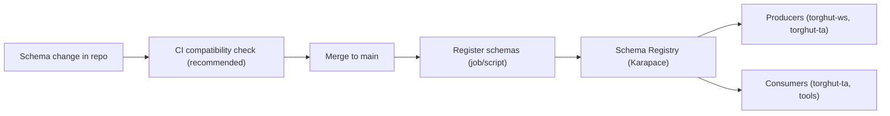

# Component: Schema Registry and Evolution

## Purpose
Define how schemas are authored, registered, evolved, and validated for Torghut Kafka topics, including compatibility
and rollback safety.

## Non-goals
- Selecting a different serialization framework for v1 (the existing Avro+registry approach is assumed).
- Supporting arbitrary breaking changes without a multi-version topic plan.

## Terminology
- **Subject:** Schema Registry identity, typically `<topic>-value` for TopicNameStrategy.
- **Compatibility:** Backward/forward/full compatibility mode for schema evolution.
- **Reader/writer schema:** Consumer vs producer schema at decode time.

## Current repo artifacts
- Schemas: `docs/torghut/schemas/*.avsc`
- Registration helper: `docs/torghut/register-schemas.sh`
- Topic semantics: `docs/torghut/topics-and-schemas.md`
- TA config references registry URL: `argocd/applications/torghut/ta/configmap.yaml` (`TA_SCHEMA_REGISTRY_URL`)

## Design

## Evolution rules (v1)
### Allowed without new topic
- Add optional fields with defaults.
- Add new enum symbols if consumers treat unknown as “other” or can safely ignore.
- Widen types only when Avro rules permit and downstream code is compatible.

### Requires a new topic version (breaking)
- Removing fields.
- Changing semantic meaning of existing fields.
- Changing keying/partitioning assumptions.

## Configuration examples
### Schema registry URL
`argocd/applications/torghut/ta/configmap.yaml`:
- `TA_SCHEMA_REGISTRY_URL: "http://karapace.kafka:8081"`

### Local registration (operator workflow)
The helper script supports registering schema subjects:
- `docs/torghut/register-schemas.sh`

Environment variables used by the helper (example):
| Env var | Purpose | Safe default |
| --- | --- | --- |
| `KARAPACE_URL` | Registry endpoint | `http://karapace.kafka.svc:8081` |

## Failure modes and recovery
| Failure | Symptoms | Detection signals | Recovery |
| --- | --- | --- | --- |
| Missing schema subject | producers/consumers fail startup | logs include 404 from registry | register subjects before deploy; rerun helper script |
| Incompatible schema change | consumer decode errors | consumer logs; spike in error counters | roll back producer; or publish to new topic version |
| Registry outage | decode failures, retries | registry health checks; client timeouts | treat as incident; circuit-break consumer; ensure local caching where possible |

## Security considerations
- Registry should be internal-only; do not expose publicly.
- Treat schemas as part of the security contract: schema changes must be code-reviewed.
- Avoid embedding PII in schemas; data minimization is part of governance.

## Decisions (ADRs)
### ADR-04-1: Backward compatibility by default
- **Decision:** Default schema compatibility mode is **backward** for existing subjects.
- **Rationale:** Enables additive evolution while preventing accidental breaks to older consumers.
- **Consequences:** Some cleanups require new topic versions; topic hygiene becomes part of release planning.

