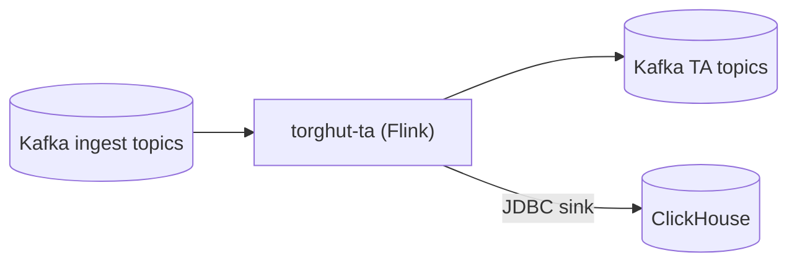

# Component: Flink Technical Analysis (TA) Job

## Purpose
Specify the Flink TA job’s runtime contract, configuration, checkpointing semantics, ClickHouse sink behavior, and the
operational model for upgrades and recovery.

## Non-goals
- Implementing new indicators beyond what the current job computes (v1 documents existing behavior).
- Treating ClickHouse JDBC sinks as exactly-once (they are effectively at-least-once and require dedup-friendly storage keys).

## Terminology
- **Checkpoint:** Periodic snapshot enabling state recovery.
- **Savepoint:** Manually-triggered consistent snapshot used for upgrades/migrations.
- **Watermark:** Event-time progress signal; drives windowing correctness.

## Current implementation + manifests (pointers)
- Flink job code: `services/dorvud/technical-analysis-flink/src/main/kotlin/ai/proompteng/dorvud/ta/flink/FlinkTechnicalAnalysisJob.kt`
- Env config: `services/dorvud/technical-analysis-flink/src/main/kotlin/ai/proompteng/dorvud/ta/flink/FlinkTaConfig.kt`
- ClickHouse DDL: `services/dorvud/technical-analysis-flink/src/main/resources/ta-schema.sql`
- FlinkDeployment: `argocd/applications/torghut/ta/flinkdeployment.yaml`
- TA config: `argocd/applications/torghut/ta/configmap.yaml`

## Data flow

## Configuration
### Where configuration lives
- `argocd/applications/torghut/ta/configmap.yaml` sets `TA_*` values.
- `argocd/applications/torghut/ta/flinkdeployment.yaml` wires secrets and Flink-level config.

### Env var table (selected)
| Env var | Purpose | Current / default |
| --- | --- | --- |
| `TA_KAFKA_BOOTSTRAP` | Brokers | `kafka-kafka-bootstrap.kafka:9092` |
| `TA_TRADES_TOPIC` | Input | `torghut.trades.v1` |
| `TA_MICROBARS_TOPIC` | Output | `torghut.ta.bars.1s.v1` |
| `TA_SIGNALS_TOPIC` | Output | `torghut.ta.signals.v1` |
| `TA_GROUP_ID` | Consumer group | `torghut-ta-2025-12-23` |
| `TA_AUTO_OFFSET_RESET` | Replay behavior | `earliest` |
| `TA_CHECKPOINT_DIR` | Checkpoints | `s3a://flink-checkpoints/torghut/technical-analysis` |
| `TA_SAVEPOINT_DIR` | Savepoints | `s3a://flink-checkpoints/torghut/technical-analysis/savepoints` |
| `TA_MAX_OUT_OF_ORDER_MS` | Watermark tolerance | `2000` |
| `TA_CLICKHOUSE_URL` | JDBC URL | `jdbc:clickhouse://...:8123/torghut` |
| `TA_CLICKHOUSE_BATCH_SIZE` | Sink batching | `500` |
| `TA_CLICKHOUSE_MAX_RETRIES` | Sink retries | `3` |

## Checkpointing and delivery guarantees
The job supports Kafka delivery guarantees (see `FlinkTaConfig.kt`):
- `TA_KAFKA_DELIVERY_GUARANTEE=EXACTLY_ONCE` (recommended)
- `TA_KAFKA_TRANSACTION_TIMEOUT_MS` must exceed checkpoint interval and broker settings.

**Important:** ClickHouse JDBC sink is not transactional in the same way Kafka is; it must be treated as at-least-once.
Storage keys/ORDER BY must allow dedup or “last write wins” semantics.

## ClickHouse sinks and disk-full behavior (known production issue)
When ClickHouse disks fill:
- Inserts will fail (`No space left on device`), Flink sink retries will be exhausted, and the job may enter `FAILED`.

### Detection
- FlinkDeployment `FAILED` / unstable state.
- Flink logs show JDBC exceptions during insert.
- ClickHouse metrics indicate low free space / merges unable to proceed.

### Recovery (high level)
- Free disk space (drop old partitions / ensure TTL merges can run).
- Consider temporarily stopping the job to prevent thrash while remediating disk.
- Restart FlinkDeployment after ClickHouse is healthy.

See also: `v1/08-component-clickhouse-capacity-ttl-and-disk-guardrails.md` and `docs/torghut/ops-2026-01-01-ta-recovery.md`.

## Failure modes, signals, recovery
| Failure | Symptoms | Detection signals | Recovery |
| --- | --- | --- | --- |
| Checkpoint failures | increasing checkpoint age; lag | Flink metrics; job UI | fix S3/MinIO creds/endpoints; restart with last-state/savepoint |
| Kafka auth failures | job fails to start/consume | logs show SASL errors | fix KafkaUser secret; restart |
| ClickHouse disk full | JDBC insert errors; job FAILED | Flink logs; ClickHouse disk alerts | free disk; restart job |
| Keeper metadata lost | replicas read-only | ClickHouse `system.replicas` shows readonly | `SYSTEM RESTORE REPLICA`; see `v1/23-runbooks-clickhouse-replica-and-keeper.md` |

## Security considerations
- Flink job secrets (Kafka password, S3 keys, ClickHouse password) must be Kubernetes Secrets only.
- Avoid logging sensitive connection strings or query parameter values.
- Use least-privilege KafkaUser; ClickHouse user `torghut` should be scoped to required DB/tables.

## Decisions (ADRs)
### ADR-05-1: Treat ClickHouse sinks as at-least-once
- **Decision:** Use ClickHouse sink with retries and “replacing” storage semantics to tolerate duplicates.
- **Rationale:** JDBC sink is not transactional; operational simplicity matters.
- **Consequences:** Queries must handle potential duplicates; schema and ORDER BY must encode dedup keys.

