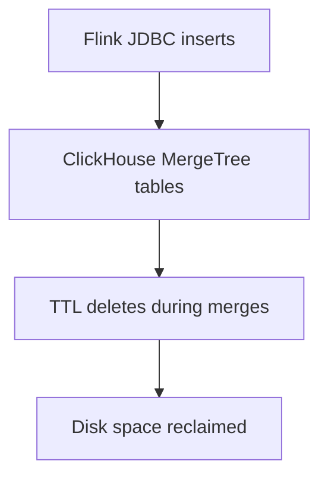

# Component: ClickHouse Capacity, TTL, and Disk Guardrails

## Purpose
Define ClickHouse capacity assumptions, TTL/retention strategy, and guardrails to prevent and recover from disk-full
incidents that can take down the TA pipeline (notably JDBC sink failures).

## Non-goals
- Replacing ClickHouse with another OLAP store.
- Providing a full ClickHouse SRE guide; this doc focuses on Torghut-specific operational needs.

## Terminology
- **PVC:** Kubernetes persistent volume claim (storage backing ClickHouse data).
- **Read-only replica:** ClickHouse can mark replicas read-only due to keeper metadata issues or disk pressure.
- **TTL merge:** Background merge process that enforces TTL (not immediate).

## Current capacity reality (prod manifests)
ClickHouse PVC size is currently **20Gi per replica**:
- `argocd/applications/torghut/clickhouse/clickhouse-cluster.yaml` (`volumeClaimTemplates[chi-data].resources.requests.storage: 20Gi`)

This is sufficient for early-stage experimentation but is small enough that:
- bursts of TA writes,
- increased symbol universe,
- or slow merges (CPU contention)
can fill disks quickly.

## Retention strategy (v1)
Retention is encoded in DDL (see `services/dorvud/technical-analysis-flink/src/main/resources/ta-schema.sql`):
- `ta_microbars`: TTL 30 days
- `ta_signals`: TTL 14 days

## Guardrails (recommended)
### 1) Disk alerts + “stop the bleeding” policy
When free disk drops below a threshold:
- Prefer stopping TA writes temporarily (pause/stop Flink job) while reclaiming disk.
- Avoid repeated retry storms that amplify disk pressure and log volume.

### 2) Partition strategy aligned to TTL
Tables partition by day (`PARTITION BY toDate(event_ts)`), which is compatible with TTL and fast drops.

### 3) Operational knobs for TA sink behavior
From `argocd/applications/torghut/ta/configmap.yaml`:
- `TA_CLICKHOUSE_BATCH_SIZE`
- `TA_CLICKHOUSE_FLUSH_MS`
- `TA_CLICKHOUSE_MAX_RETRIES`

If disk pressure is ongoing, lowering batch size may reduce burstiness but can increase overhead. Prefer increasing
storage or reducing retention rather than “tuning around” persistent disk scarcity.

## Failure mode focus: disk full → Flink JDBC sink failure
### Symptoms
- FlinkDeployment `torghut-ta` transitions to `FAILED`.
- Flink logs show JDBC `SQLException` on insert; root cause mentions out-of-space.
- ClickHouse logs show “cannot write” / “No space left” or merges stuck.

### Detection signals
- Kubernetes: `kubectl get flinkdeployment -n torghut torghut-ta`
- ClickHouse: low free bytes; pending merges/backlog
- Trading/UI: stale `max(event_ts)` in `ta_signals`

### Recovery steps (operator)
1) **Confirm** it is disk pressure (not auth):
   - Check ClickHouse disk free.
2) **Reduce write pressure**:
   - Temporarily scale/stop TA job (`FlinkDeployment`) to prevent thrash.
3) **Reclaim disk**:
   - Drop old partitions if TTL cannot catch up fast enough.
   - Reduce retention TTLs *only via code-reviewed DDL change*.
4) **Restart TA** after ClickHouse healthy.

## Security considerations
- Guardrails must not require privilege escalation by default; keep “drop partitions” actions for oncall with explicit access.
- Do not expose ClickHouse HTTP interface externally; keep it internal to cluster networks.

## Decisions (ADRs)
### ADR-08-1: Disk pressure is treated as an incident with explicit mitigations
- **Decision:** Disk-full events are handled with explicit runbooks and alerts, not silent retries.
- **Rationale:** Disk exhaustion is common in early clusters and can cascade into TA/trading outages.
- **Consequences:** Oncall procedures must include temporary TA pause and space-reclamation steps.

