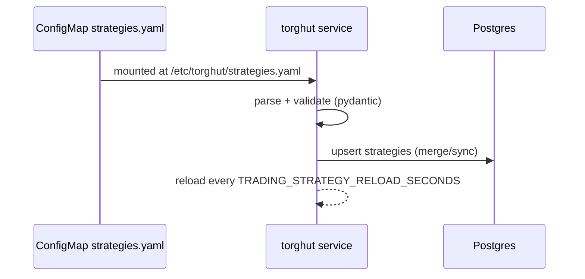

# Component: Strategy Catalog and Hot Reload

## Purpose
Describe the declarative strategy catalog, how it is mounted into the trading service, how it syncs into Postgres,
and how hot reload behaves under failure.

## Non-goals
- Allowing runtime code injection (strategies are configuration, not arbitrary scripts).
- Building a full “strategy marketplace” UI in v1.

## Terminology
- **Catalog file:** YAML/JSON file listing strategies and their limits.
- **Mode `sync`:** Disable strategies removed from the file.
- **Mode `merge`:** Only upsert listed strategies; do not disable missing.

## Current implementation + manifests (pointers)
- Catalog loader: `services/torghut/app/strategies/catalog.py` (`StrategyCatalog.refresh`)
- Knative volume mount: `argocd/applications/torghut/knative-service.yaml`
- Catalog ConfigMap: `argocd/applications/torghut/strategy-configmap.yaml`

## Data flow

## Configuration
From `argocd/applications/torghut/knative-service.yaml`:
| Env var | Purpose | Current |
| --- | --- | --- |
| `TRADING_STRATEGY_CONFIG_PATH` | path to catalog | `/etc/torghut/strategies.yaml` |
| `TRADING_STRATEGY_CONFIG_MODE` | `merge`/`sync` | `sync` |
| `TRADING_STRATEGY_RELOAD_SECONDS` | reload interval | `10` |

## Failure modes, detection, recovery
| Failure | Symptoms | Detection | Recovery |
| --- | --- | --- | --- |
| Invalid YAML/JSON | strategy changes ignored | logs warn `Strategy catalog load failed` | fix ConfigMap content; re-sync Argo; confirm digest changes |
| Duplicate names | catalog apply fails | logs show duplicate strategy name error | de-duplicate entries; re-sync |
| DB unavailable | catalog not applied | logs show DB errors | restore Postgres; catalog will reapply on next refresh |

## Security considerations
- Strategy catalog is configuration and must be code-reviewed like production policy (it changes trading behavior).
- Do not store secrets in the catalog.
- Treat catalog as part of model risk controls (limits live here).

## Decisions (ADRs)
### ADR-14-1: Strategies are declarative config, not executable code
- **Decision:** Strategies are expressed as validated configs persisted to DB; no arbitrary code loading.
- **Rationale:** Prevents code injection and keeps oncall operations predictable.
- **Consequences:** Complex strategies require productized strategy primitives, not custom scripts.

