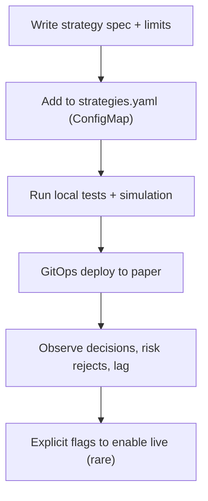

# Strategy Authoring Kit (SAK)

## Purpose
Provide a safe, repeatable way for engineers to define new strategies and roll them out with strong defaults, tests,
and operational hooks.

## Non-goals
- A GUI strategy builder.
- Strategies that “learn online” and auto-update without governance.

## Terminology
- **Strategy config:** Declarative definition in `strategies.yaml`.
- **Decision schema:** Normalized representation of a trade intent (`StrategyDecision`).
- **Paper-first rollout:** Strategy runs in paper mode and is evaluated before live enablement.

## Authoring workflow (v1)

## Where to define strategies (repo pointers)
- Deployed catalog: `argocd/applications/torghut/strategy-configmap.yaml`
- Loader/validator: `services/torghut/app/strategies/catalog.py`
- DB models: `services/torghut/app/models/entities.py`

## Required sections for every strategy (policy)
1) **Purpose and hypothesis**
2) **Universe selection** (static list or defined rule)
3) **Entry/exit rules** (deterministic)
4) **Risk limits** (max notional, max position % equity)
5) **Operational signals** (decision rate, reject reasons)
6) **Rollback plan** (disable via catalog or `TRADING_ENABLED=false`)

## Safe defaults
- Start disabled or paper-only until validated.
- Conservative limits:
  - `max_notional_per_trade` low enough for paper evaluation
  - `max_position_pct_equity` small (e.g., <= 5%)

## Failure modes and recovery
| Failure | Symptoms | Detection | Recovery |
| --- | --- | --- | --- |
| Over-trading | many decisions per minute | decision counters spike | raise cooldown; tighten entry rules; disable strategy |
| Too strict | no decisions ever | decision counters flat | adjust thresholds; verify signals ingestion |
| Unexpected symbol exposure | trading outside intended universe | audit shows symbols outside list | fix universe config; add allowlist gate |

## Security considerations
- Strategies affect financial risk: treat strategy changes as security-sensitive changes.
- Require code review; keep audit trails in Postgres.

## Decisions (ADRs)
### ADR-15-1: Strategy rollout is paper-first and gated
- **Decision:** No strategy is promoted to live without explicit flag changes and risk review.
- **Rationale:** Avoids unintended live behavior; improves auditability.
- **Consequences:** Adds friction; acceptable for safety.

