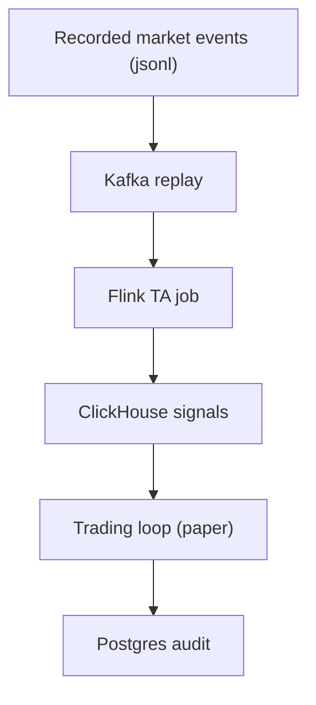

# Backtesting and Simulation

## Purpose
Define a safe and reproducible approach to evaluating strategies and trading-loop behavior using historical data,
Kafka replay, and “paper-first” simulation, without coupling correctness to live broker conditions.

## Non-goals
- A fully-featured quant research platform.
- Automatically promoting strategies to live based on backtest performance.

## Terminology
- **Backtest:** Offline evaluation using recorded historical signals/market data.
- **Replay:** Feeding recorded events through the same ingest → TA pipeline.
- **Paper simulation:** Running the trading loop against a paper broker account or mocked broker.

## Design options (v1)

### Option A: Kafka replay → full pipeline
- Most realistic operationally.
- Validates dedup, watermarks, checkpointing, ClickHouse sink behavior.
- Requires Kafka + Flink + ClickHouse environment.

### Option B: Direct ClickHouse fixtures
- Faster for pure strategy logic.
- Less faithful to ingest/TA failure modes.

## Repo pointers (existing tooling)
- Replay concepts and kcat examples: `docs/torghut/test-harness.md`
- Kafka topic tail helper: `packages/scripts/src/kafka/tail-topic.ts`
- WS smoke test: `packages/scripts/src/torghut/ws-smoke.ts` (run via `bun run smoke:torghut-ws`)

## Configuration examples
Example replay with `kcat` (concept; see `docs/torghut/test-harness.md` for full context):
- Produce recorded messages keyed by `symbol` into `torghut.trades.v1`.

Environment variables (operator-run commands):
| Env var | Purpose |
| --- | --- |
| `KAFKA_BOOTSTRAP` | broker endpoint |
| `KAFKA_USERNAME` / `KAFKA_PASSWORD` | SASL auth |

## Failure modes and recovery
| Failure | Symptoms | Detection | Recovery |
| --- | --- | --- | --- |
| Replay overwhelms ClickHouse | TA job fails inserts | Flink logs; disk/merge pressure | throttle replay; lower TA batch size; increase disk |
| Non-deterministic strategy evaluation | backtest results fluctuate | mismatched decision counts | pin versions; persist fixtures; enforce deterministic inputs |

## Security considerations
- Recorded data must be treated as potentially sensitive; follow governance and retention policies (see `v1/43-data-governance-and-retention.md`).
- Do not include secrets in fixtures or test harness scripts.

## Decisions (ADRs)
### ADR-16-1: Prefer pipeline replay for end-to-end validation
- **Decision:** Use Kafka replay for any change affecting ingest/TA/storage correctness.
- **Rationale:** Most production failures arise from operational boundaries, not pure strategy math.
- **Consequences:** Requires a staging environment or local stack; can be slower than pure unit tests.

