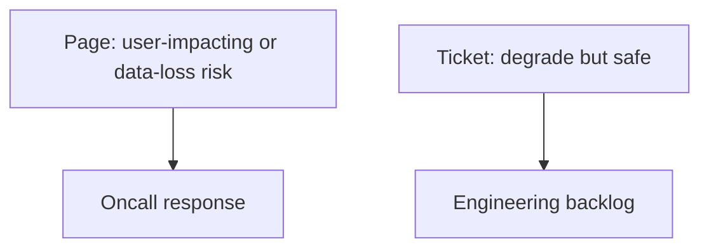

# Alerting, SLOs, and Oncall

## Purpose
Define actionable alerting and SLOs for Torghut so oncall can detect and recover from incidents quickly, while
maintaining safe-by-default trading behavior.

## Non-goals
- A company-wide oncall policy.
- Paging on every transient blip.

## Terminology
- **SLO:** Target level of reliability/latency (with an error budget).
- **Page:** High urgency notification requiring immediate action.
- **Ticket:** Lower urgency; can be handled during business hours.

## SLOs (suggested v1)
### Freshness SLO (signals)
- **Objective:** `max(now - ta_signals.max(event_ts))` < threshold for active symbols.
- **Why:** stale signals can cause trading to act on old data or stop acting at all.

### Pipeline health SLO
- WS forwarder readiness is healthy (`/readyz` OK) for most of the time window.
- Flink job is `RUNNING` and checkpoint age is bounded.

### Trading safety SLO
- Live trading remains disabled unless explicitly approved.
- Any live trading enablement is auditable and alerts on config drift.

## Alert taxonomy (v1)

### Paging alerts (examples)
- `torghut-ws` readiness 503 for > N minutes.
- FlinkDeployment `FAILED` or not `RUNNING/STABLE`.
- ClickHouse disk free bytes below critical threshold.
- Trading service crashloop (Knative revision not Ready).

### Ticket alerts (examples)
- Watermark lag elevated but still progressing.
- Increased dedup rate.
- Reconcile lag elevated but not yet impacting.

## Runbook links
- TA recovery: `v1/21-runbooks-ta-replay-and-recovery.md`
- WS connection/auth: `v1/22-runbooks-ws-connection-limit-and-auth.md`
- ClickHouse replica/keeper: `v1/23-runbooks-clickhouse-replica-and-keeper.md`
- Knative revision failures: `v1/24-runbooks-knative-revision-failures.md`

## Failure modes and response expectations
| Alert | First checks | Safe action |
| --- | --- | --- |
| WS readiness 503 | check Alpaca 401/406, Kafka SASL | restart WS forwarder; keep single replica |
| ClickHouse disk low | check merges, TTL, recent writes | pause TA writes; reclaim disk; restart TA |
| Knative revision failing | check logs for UUID JSON bug | roll back revision; apply serialization fix |

## Security considerations
- Alert routing must not leak secrets (avoid embedding DSNs or headers in alerts).
- Live trading enablement should generate an audit event and alert.

## Decisions (ADRs)
### ADR-20-1: Freshness is the primary user-facing SLO
- **Decision:** Alert on stale signals and broken ingestion before alerting on micro-optimizations.
- **Rationale:** If data is stale, everything else becomes moot.
- **Consequences:** Some performance regressions may be caught by dashboards rather than pages.

