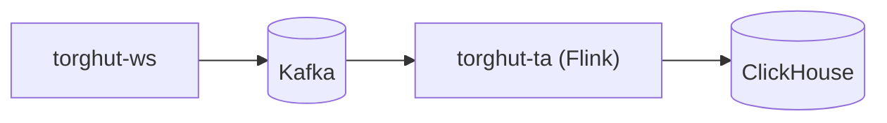

# Runbooks: TA Replay and Recovery

## Purpose
Provide oncall runbooks for recovering TA outputs when:
- the Flink TA job fails,
- ClickHouse becomes unavailable/out-of-disk/replicas read-only,
- or replay/backfill is required.

## Non-goals
- A full Flink SRE guide (focus is Torghut-specific recovery).
- Long-term historical backfills beyond configured Kafka retention.

## Terminology
- **Replay:** Recompute TA outputs from Kafka ingest topics.
- **Backfill window:** Period covered by Kafka retention.
- **Last-state restore:** Flink upgrade mode that restores from latest checkpoint.

## Quick architecture reminder

## Preconditions (before doing anything)
1) Confirm whether the incident is caused by:
   - ClickHouse disk pressure,
   - ClickHouse replicas read-only / keeper metadata,
   - Kafka auth/broker issues,
   - or Flink checkpoint storage issues (MinIO/S3).
2) Confirm whether trading should be paused:
   - If signals are stale or uncertain, disable trading (`TRADING_ENABLED=false`) via GitOps.

## Runbook A: Flink TA job FAILED due to ClickHouse disk full
This is a known production failure mode.

### Symptoms
- `kubectl get flinkdeployment -n torghut torghut-ta` shows `FAILED`.
- Flink logs show JDBC insert exceptions, possibly with “No space left on device”.

### Steps
1) Check ClickHouse disk:
   - Inspect PVC usage and ClickHouse disk metrics.
2) Stop write pressure:
   - Scale down/pause the TA job (preferred: set job state to suspended or stop the FlinkDeployment via GitOps).
3) Reclaim disk:
   - Drop old partitions (fastest), or reduce retention TTL via reviewed DDL change.
4) Restart TA:
   - Trigger a restart of the FlinkDeployment (in GitOps, bump a nonce annotation or re-apply).
5) Verify:
   - ClickHouse `max(event_ts)` advances in `torghut.ta_signals`.

## Runbook B: ClickHouse replicas read-only (keeper metadata loss)
See also `docs/torghut/ops-2026-01-01-ta-recovery.md` and `v1/23-runbooks-clickhouse-replica-and-keeper.md`.

### Steps (high level)
1) Validate replica state in ClickHouse (`system.replicas`).
2) Restore replicas:
   - `SYSTEM RESTORE REPLICA torghut.ta_signals`
   - `SYSTEM RESTORE REPLICA torghut.ta_microbars`
3) Restart TA job after ClickHouse is healthy.

## Runbook C: Replay/backfill within retention window
### When to replay
- TA job bug fixed and you need recomputation.
- ClickHouse data corrupted or partially missing.

### Approach (v1)
1) Decide replay window:
   - Bound by Kafka retention configured for ingest topics (see `docs/torghut/topics-and-schemas.md`).
2) Ensure TA job consumes from the correct offsets:
   - `TA_AUTO_OFFSET_RESET=earliest` supports “start from beginning” when offsets missing.
   - For controlled replay, use a new consumer group id (edit `TA_GROUP_ID` in `argocd/applications/torghut/ta/configmap.yaml`).
3) Clear ClickHouse target partitions for the replay window (optional but recommended to avoid duplicates).
4) Start TA job and monitor progress.

## Verification checklist
- `kubectl get flinkdeployment -n torghut torghut-ta` is `RUNNING/STABLE`
- ClickHouse queries:
  - `SELECT max(event_ts) FROM torghut.ta_signals WHERE symbol='NVDA';` advances
- Jangar visuals:
  - `/api/torghut/ta/latest?symbol=NVDA` returns fresh data (per `docs/torghut/ops-2026-01-01-ta-recovery.md`)

## Security considerations
- Avoid running ad-hoc SQL from random pods; use approved operational access paths.
- Do not paste secrets into commands or tickets.

## Decisions (ADRs)
### ADR-21-1: Replay uses consumer-group isolation
- **Decision:** Use a dedicated `TA_GROUP_ID` for replay/backfill when needed.
- **Rationale:** Avoids corrupting steady-state consumer offsets.
- **Consequences:** Must manage and document group IDs; old groups may be garbage collected eventually.

