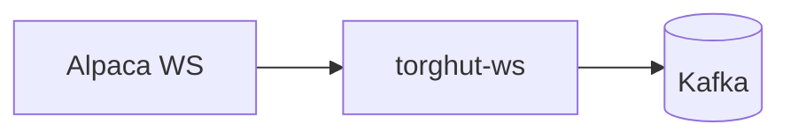

# Runbooks: WS Connection Limit and Auth

## Purpose
Provide oncall procedures for the `torghut-ws` forwarder when:
- Alpaca WS connection limit errors (406) occur,
- auth fails (401/403),
- readiness sticks at 503 while liveness remains OK.

## Non-goals
- Alpaca account management policies.

## Terminology
- **Readiness:** `/readyz` indicates “can make progress” (upstream+downstream OK).
- **Liveness:** `/healthz` indicates “process alive”.

## Quick architecture reminder

## Known production symptom: readiness stuck 503
Documented in `docs/torghut/ops-2026-01-01-ta-recovery.md`:
- `/readyz` returned 503 due to Alpaca 401/406 errors; restart was required.

## Runbook A: Alpaca 406 connection limit
### Symptoms
- Logs mention 406.
- Readiness fails (503).

### Steps
1) Ensure only one replica is running:
   - `argocd/applications/torghut/ws/deployment.yaml` should keep `replicas: 1`.
2) Force-close lingering connections by restart:
   - Scale deployment to 0, then back to 1 (or roll restart).
3) Verify:
   - Pod becomes Ready, and status topic resumes.

## Runbook B: Alpaca 401/403 auth failures
### Steps
1) Confirm logs show 401/403.
2) Rotate credentials through GitOps (SealedSecrets) and sync Argo:
   - Do **not** paste secrets into docs or tickets.
3) Restart `torghut-ws` to pick up new secrets.
4) Verify readiness.

## Runbook C: Kafka produce failures (SASL/ACL)
### Symptoms
- Readiness fails; logs show SASL/authorization errors.

### Steps
1) Confirm KafkaUser secret exists in torghut namespace (`torghut-ws` secret).
2) Validate broker reachability from torghut namespace.
3) After fixing auth/ACL, restart `torghut-ws`.

## Verification checklist
- `kubectl get pods -n torghut -l app=torghut-ws` shows `READY 1/1`
- `GET /healthz` returns 200
- `GET /readyz` returns 200

## Security considerations
- Keep single replica to avoid violating broker/venue rules.
- Secrets rotation must be done via sealed secrets; never via plaintext manifests.

## Decisions (ADRs)
### ADR-22-1: Restart is the standard operational fix for 406 and stuck readiness
- **Decision:** The primary remediation for 406 connection-limit and stuck readiness is a controlled restart.
- **Rationale:** It deterministically closes stale sockets and rebuilds subscriptions.
- **Consequences:** There is a short ingestion gap; Kafka retention covers it.

