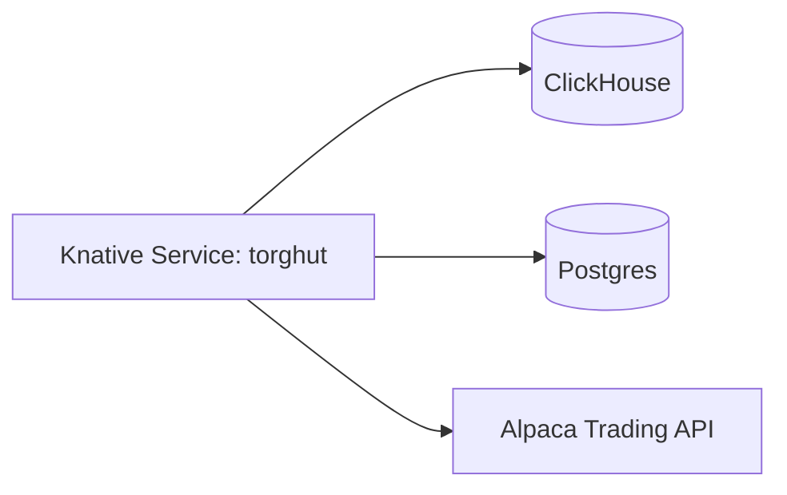

# Runbooks: Knative Revision Failures (Torghut Service)

## Purpose
Provide oncall procedures for diagnosing and recovering from Knative revision failures in the Torghut trading service,
including the known UUID→JSON serialization crash mode.

## Non-goals
- General Knative platform troubleshooting beyond the Torghut service.

## Terminology
- **Revision:** Immutable version of a Knative Service.
- **Ready condition:** Knative readiness for routing traffic.

## Current deployed service (pointer)
- `argocd/applications/torghut/knative-service.yaml`

## Quick architecture reminder

## Runbook A: Revision not Ready (general)
### Steps
1) Inspect Knative conditions:
   - `kubectl -n torghut describe ksvc torghut`
2) Inspect revision pod logs for the newest revision.
3) Common root causes:
   - missing secrets (DB_DSN, ClickHouse password),
   - unreachable dependencies (ClickHouse/Postgres),
   - application crash on startup.

## Runbook B: UUID JSON serialization crash (known failure mode)
### Symptoms
- Revision crashloops.
- Logs contain errors like:
  - `Object of type UUID is not JSON serializable`
  - psycopg JSON adaptation errors

### Root cause model (v1)
- A JSONB column write includes a Python `uuid.UUID` object instead of a string.
- Hot spots include `decision_json`, `input_json`, `response_json` (see `services/torghut/app/models/entities.py`).

### Recovery steps
1) Roll back to last known good image digest in `argocd/applications/torghut/knative-service.yaml`.
2) Hotfix by ensuring UUID coercion at the serialization boundary:
   - use `model_dump(mode="json")` consistently,
   - use `jsonable_encoder` for responses (`services/torghut/app/main.py`),
   - avoid writing raw UUID into JSONB payloads.
3) Re-deploy via GitOps and confirm revision Ready.

## Runbook C: Dependency failures (ClickHouse/Postgres)
### Steps
1) Confirm ClickHouse host is reachable:
   - `CLICKHOUSE_HOST=torghut-clickhouse.torghut.svc.cluster.local` in `argocd/applications/torghut/knative-service.yaml`.
2) Confirm Postgres is healthy:
   - CNPG cluster `torghut-db` in `argocd/applications/torghut/postgres-cluster.yaml`.
3) If dependencies are down, disable trading to prevent partial execution.

## Security considerations
- Do not print secrets in logs when diagnosing env.
- Keep service visibility cluster-local unless explicitly required.

## Decisions (ADRs)
### ADR-24-1: Crashloop root causes are handled via GitOps rollback first
- **Decision:** First recovery action is typically to roll back the image digest and restore service availability.
- **Rationale:** Fastest path to stabilize while preparing a safe fix.
- **Consequences:** Requires discipline to not “kubectl edit” production state outside GitOps.

