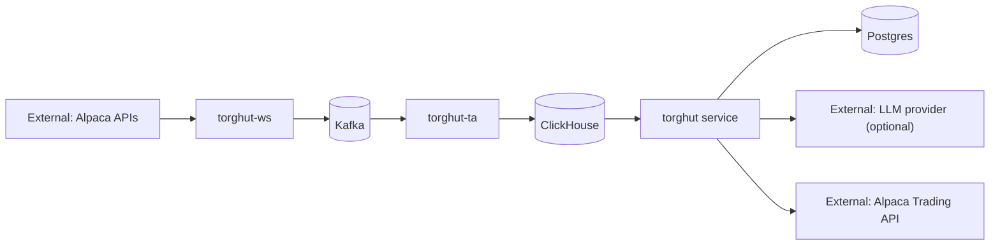

# Security: Threat Model

## Purpose
Threat-model the Torghut trading system end-to-end, including AI advisory surfaces, and document mitigations aligned
to “paper by default” and deterministic risk gates.

## Non-goals
- Formal compliance certification documentation (see `v1/46-compliance-and-auditability.md`).
- Penetration testing report (this doc frames threats and mitigations).

## Terminology
- **Threat:** A plausible adversarial action that could cause harm.
- **Mitigation:** Control that reduces likelihood or impact.
- **Trust boundary:** Interface where untrusted data enters a component.

## Trust boundaries

## Threats and mitigations (v1)
### 1) Credential leakage
- **Threat:** Secrets leak via logs, metrics, or docs.
- **Mitigations:**
  - secrets only in Kubernetes Secrets / SealedSecrets (`argocd/applications/torghut/sealed-secrets.yaml`).
  - log redaction; never emit DSNs or secret env values.

### 2) Unauthorized order execution
- **Threat:** Trading enabled or switched to live without approval.
- **Mitigations:**
  - paper-by-default config: `TRADING_MODE=paper`, `TRADING_LIVE_ENABLED=false` (`argocd/applications/torghut/knative-service.yaml`).
  - deterministic risk engine must enforce these gates.
  - audit logging for config changes (GitOps history) + runtime status endpoint.

### 3) Data poisoning / prompt injection (AI layer)
- **Threat:** LLM is manipulated by untrusted data (market messages, UI input) to bypass safety.
- **Mitigations:**
  - AI layer is advisory only; cannot bypass deterministic risk checks.
  - strict schemas for LLM outputs; validate and clamp values.
  - circuit breakers and fallback to deterministic-only mode (see `v1/38-ai-layer-circuit-breakers-and-fallbacks.md`).

### 4) Kafka topic tampering
- **Threat:** Unauthorized producer writes bad events to topics.
- **Mitigations:**
  - SASL auth + least privilege KafkaUser (e.g., `argocd/applications/kafka/torghut-ws-kafkauser.yaml`).
  - schema validation and consumer-side envelope checks.

### 5) ClickHouse misuse / data exfil
- **Threat:** Broad ClickHouse access allows reading sensitive signals or operational metadata.
- **Mitigations:**
  - scoped users (`torghut` user in `argocd/applications/torghut/clickhouse/clickhouse-cluster.yaml`).
  - internal-only networking and RBAC.

## Failure modes and response (security-focused)
| Incident | Immediate action | Follow-up |
| --- | --- | --- |
| suspected secret leak | rotate secrets via sealed secrets; invalidate old | postmortem; add redaction tests |
| unexpected live trading | disable trading flags; revoke live keys | full audit; tighten gates + approvals |

## Decisions (ADRs)
### ADR-25-1: GitOps history is part of the security audit trail
- **Decision:** All production config changes occur via GitOps and are treated as auditable events.
- **Rationale:** Enables reliable forensic analysis and reduces configuration drift.
- **Consequences:** Requires disciplined access controls to the repo and ArgoCD.

