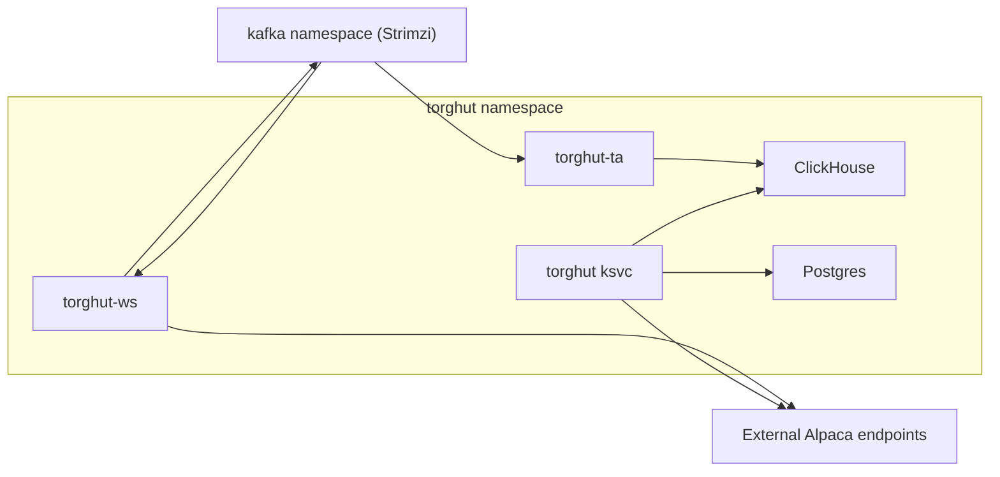

# Security: Network and RBAC

## Purpose
Define network boundaries and RBAC expectations for Torghut workloads, aligned with the existing manifests and
documented network policy patterns.

## Non-goals
- Designing a full cluster-wide zero-trust architecture.
- Replacing existing platform-level policy enforcement.

## Terminology
- **RBAC:** Kubernetes role-based access control.
- **NetworkPolicy:** Kubernetes policy restricting pod ingress/egress.
- **Least privilege:** Grant only the permissions a component needs.

## Current repo references
- Torghut ServiceAccount/RBAC: `argocd/applications/torghut/serviceaccount.yaml`, `argocd/applications/torghut/role.yaml`, `argocd/applications/torghut/rolebinding.yaml`
- Existing examples: `docs/torghut/network-and-rbac.md`

## Trust boundaries

## RBAC principles (v1)
- Workloads should not need cluster-admin.
- Most workloads need only:
  - read ConfigMaps/Secrets,
  - read Pods/logs for self-diagnostics (optional),
  - access their own namespace resources.

## Network principles (v1)
- Keep ClickHouse and Postgres internal to the cluster network.
- Restrict Kafka access to only the required ports/namespaces.
- Allow egress to Alpaca endpoints only from forwarder and trading service.

## Failure modes and recovery
| Failure | Symptoms | Detection | Recovery |
| --- | --- | --- | --- |
| NetworkPolicy too strict | forwarder cannot reach Alpaca | readiness 503; connect errors | adjust egress rules (reviewed change) |
| RBAC missing secret access | pods crash on env injection | pod events show secret errors | fix Role/RoleBinding to allow get/list secrets |

## Security considerations
- Treat network policy changes as security-sensitive.
- Ensure observability egress is allowed for metrics/logs export but remains least-privilege.

## Decisions (ADRs)
### ADR-27-1: Cluster-local trading service
- **Decision:** Keep `torghut` Knative service cluster-local by default.
- **Rationale:** Reduces exposure of trading APIs.
- **Consequences:** External access requires explicit gateway/proxy design and security review.

