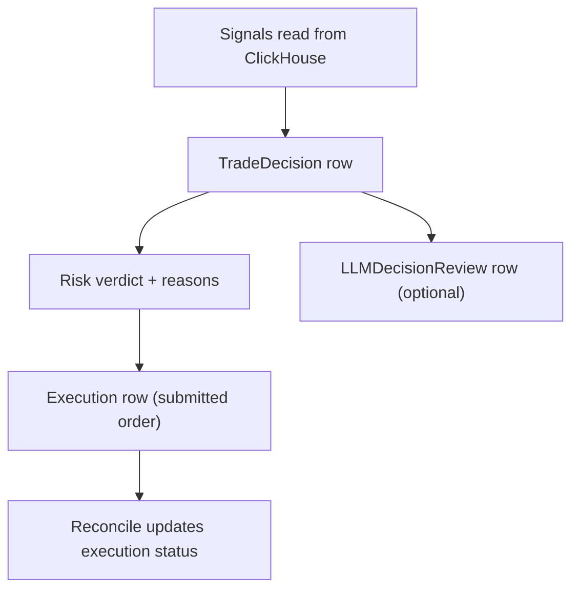

# Security: Audit Logging and Immutability

## Purpose
Define an auditable trail for:
- decisions,
- risk outcomes,
- AI review verdicts,
- executions and reconciliation,
with guidance to keep audit logs meaningful and resistant to accidental mutation.

## Non-goals
- Building a WORM-compliant archival system in v1.
- Full SIEM integration documentation.

## Terminology
- **Audit log:** Record that enables reconstruction of what happened and why.
- **Immutability:** Practical resistance to mutation; in v1 achieved via process + constraints.

## Current storage of audit records (pointers)
- Postgres tables: `services/torghut/app/models/entities.py` (`trade_decisions`, `executions`, `llm_decision_reviews`)
- Knative env points to Postgres via `DB_DSN`: `argocd/applications/torghut/knative-service.yaml`

## Audit events (v1)

### Required fields (minimum)
- timestamps (created_at)
- symbol, timeframe, strategy id/name
- decision payload (`decision_json`) coerced to JSON
- risk verdict and reason codes
- execution broker ids (`alpaca_order_id`, `client_order_id`/hash)
- reconciliation timestamps

## Immutability practices (v1)
- Prefer append-only patterns:
  - new rows for reviews,
  - status updates only for lifecycle transitions.
- Use uniqueness constraints:
  - `trade_decisions.decision_hash` unique
  - `executions.alpaca_order_id` unique

## Failure modes and recovery
| Failure | Symptoms | Detection | Recovery |
| --- | --- | --- | --- |
| Missing audit rows | broker shows activity; DB incomplete | reconcile detects missing orders | run reconciliation; add incident note |
| Mutated audit payloads | investigations unclear | inconsistent fields | enforce stricter write paths; avoid manual DB edits |

## Security considerations
- Audit data access should be restricted; it can reveal trading behavior.
- Do not store secrets in audit payloads (e.g., API keys, auth headers).

## Decisions (ADRs)
### ADR-28-1: Postgres is the canonical audit store for trading decisions
- **Decision:** Postgres holds the authoritative audit trail of decisions/executions/reviews.
- **Rationale:** Strong transactional semantics, indexing, and well-understood backup patterns.
- **Consequences:** DB health is required for trading; degrade to “observe-only” when DB unavailable.

