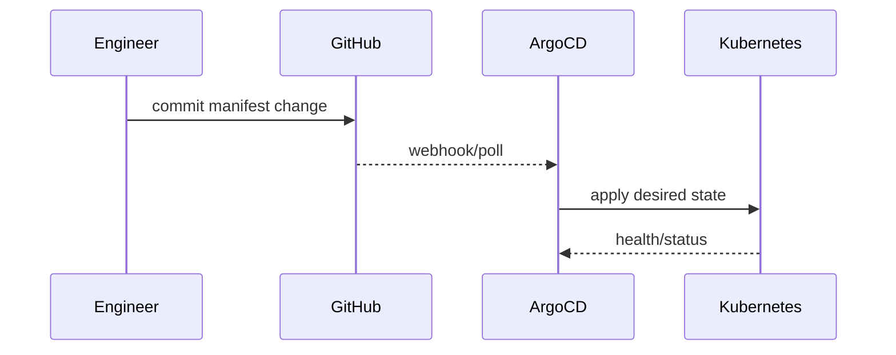

# Argo GitOps and Overlays

## Purpose
Document how Torghut is deployed using ArgoCD (GitOps), how kustomize overlays should be structured, and how to
perform safe rollouts and rollbacks.

## Non-goals
- Rewriting ArgoCD project structure.
- Direct kubectl applies as the standard workflow.

## Terminology
- **Desired state:** Manifests in git that ArgoCD continuously reconciles.
- **Overlay:** Environment-specific kustomize patch.

## Current repo pointers
- Torghut app manifests: `argocd/applications/torghut/**`
- Existing Argo notes: `docs/torghut/argo.md`
- Root kustomization: `argocd/applications/torghut/kustomization.yaml`

## GitOps flow

## Overlay guidance (v1)
If/when environment overlays exist:
- Keep topic names and schemas consistent across envs.
- Overlays should primarily change:
  - image digests,
  - external endpoints,
  - resource requests/limits,
  - alert thresholds,
  - and safe defaults (paper trading remains default).

## Failure modes and recovery
| Failure | Symptoms | Detection | Recovery |
| --- | --- | --- | --- |
| Drift due to manual kubectl edit | Argo shows OutOfSync | Argo dashboard | revert manual edits; re-sync from git |
| Bad patch | workloads crash | health checks fail | `git revert` and resync |

## Security considerations
- Git history is an audit log; restrict who can merge to main.
- Avoid storing secrets in overlays; use SealedSecrets.

## Decisions (ADRs)
### ADR-30-1: GitOps is the only supported production change path
- **Decision:** Operational changes happen via PRs and Argo sync.
- **Rationale:** Repeatability, auditability, reduced drift.
- **Consequences:** Requires disciplined incident procedures and fast rollback process.

