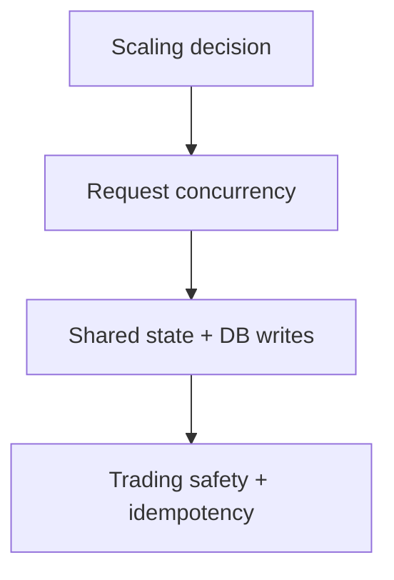

# Knative Scaling and Concurrency

## Purpose
Document how the Torghut Knative service is scaled, how concurrency settings impact trading safety, and how to avoid
unexpected behavior when revisions roll.

## Non-goals
- Converting the service to a non-Knative deployment.
- Autoscaling for high throughput (trading loop is periodic; stability and determinism matter more).

## Terminology
- **Revision:** Immutable deployment unit in Knative.
- **minScale / maxScale:** Knative autoscaler bounds.
- **containerConcurrency:** Max concurrent requests per pod (0 means unlimited).

## Current production config (pointer)
- `argocd/applications/torghut/knative-service.yaml`

Key current annotations:
- `autoscaling.knative.dev/minScale: "1"`
- `autoscaling.knative.dev/maxScale: "1"`
- `autoscaling.knative.dev/target: "80"`

## Design constraints (trading safety)

Guidance:
- Keep `maxScale=1` for v1 unless the trading loop is explicitly designed for multi-replica coordination.
- If scaling beyond 1:
  - enforce leader election for the trading loop, or
  - move scheduling to a single external scheduler, or
  - use DB-based “lease” to ensure only one replica executes a tick.

## Configuration examples
The current Knative Service sets:
- readiness/liveness probes at `/healthz`
- port `8181`

See `argocd/applications/torghut/knative-service.yaml`.

## Failure modes and recovery
| Failure | Symptoms | Detection | Recovery |
| --- | --- | --- | --- |
| Unexpected scale-out | double decisions/executions | decision counters spike; duplicates | set `maxScale=1`; deploy leader election; disable trading until resolved |
| Revision rollout breaks trading | crashloop | Knative `Ready=False` | roll back image digest |

## Security considerations
- Treat scaling and concurrency as safety controls: changes require review and audit.
- Keep service visibility cluster-local by default.

## Decisions (ADRs)
### ADR-31-1: Single-replica trading service in v1
- **Decision:** `maxScale=1` for the torghut service in production.
- **Rationale:** Avoids coordinating trading ticks across replicas without a proven leader-election design.
- **Consequences:** Throughput is limited; acceptable for v1.

