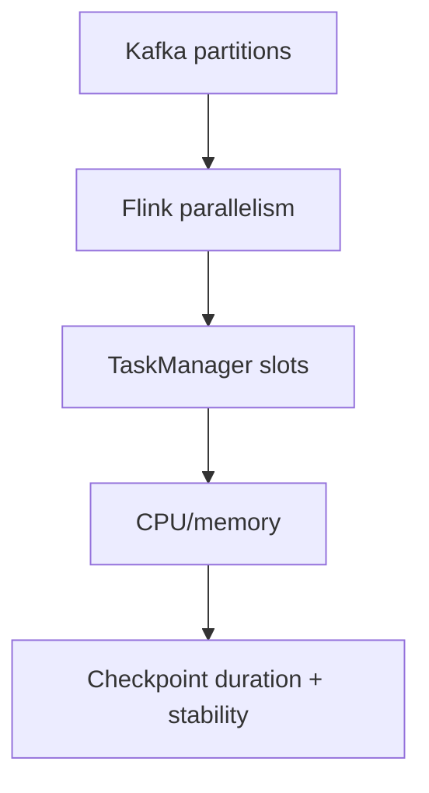

# Flink Scaling, Checkpoints, and Upgrades

## Purpose
Document how to scale the TA Flink job safely, how checkpointing interacts with upgrades, and which knobs are safe to
change in production.

## Non-goals
- Operator installation and cluster-level Flink tuning.

## Terminology
- **Parallelism:** Number of parallel operator instances.
- **Task slots:** Execution slots per TaskManager.
- **Upgrade mode:** FlinkDeployment strategy (stateless, last-state, savepoint).

## Current production config (pointers)
- FlinkDeployment: `argocd/applications/torghut/ta/flinkdeployment.yaml`
- TA config: `argocd/applications/torghut/ta/configmap.yaml`

Key current values:
- `taskmanager.numberOfTaskSlots: "2"`
- TaskManagers: `replicas: 4`
- Job parallelism: `parallelism: 8`
- Upgrade mode: `stateless` (v1 current manifest)

## Scaling model

Guidance:
- Keep parallelism ≤ (taskmanagers * slots) to avoid slot starvation.
- After increasing parallelism:
  - monitor checkpoint duration and backpressure,
  - validate ClickHouse sink capacity.

## Upgrade guidance (v1)
- Prefer savepoint/last-state upgrades when changing stateful operators or windowing logic.
- Stateless upgrades are acceptable for purely stateless changes but risk losing state.

## Failure modes and recovery
| Failure | Symptoms | Detection | Recovery |
| --- | --- | --- | --- |
| Checkpoints fail after scale | job instability | checkpoint failure metrics | revert scale; fix S3 creds/endpoint; restart with last-state |
| Backpressure increases | lag grows | watermark lag metrics | increase resources; tune sinks; reduce parallelism |

## Security considerations
- Checkpoint storage credentials are secrets; rotate carefully (see `v1/26-security-secrets-rotation.md`).

## Decisions (ADRs)
### ADR-33-1: Scale TA conservatively with checkpoint health as primary signal
- **Decision:** Treat checkpoint health as the primary “can we scale further?” signal.
- **Rationale:** Unhealthy checkpoints make recovery and correctness unreliable.
- **Consequences:** Scaling decisions are slower but safer.

