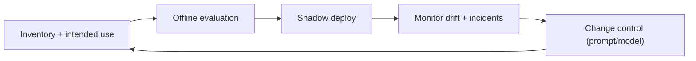

# AI Layer: Model Risk Management (MRM)

## Purpose
Define a pragmatic model risk management program for Torghut’s AI advisory layer, suitable for an engineering team
operating a safety-critical automated trading system.

## Non-goals
- Full regulatory compliance documentation for a broker-dealer.
- Using AI without an inventory/validation/audit plan.

## Terminology
- **Model inventory:** List of models, versions, providers, and intended uses.
- **Validation:** Evidence the model meets performance and safety requirements for its intended use.
- **Effective challenge:** Structured review by someone other than the author.

## MRM lifecycle (v1)

## Required artifacts (v1)
- Prompt versions (stored in repo) and change log.
  - Example: `services/torghut/app/trading/llm/prompt_templates/system_v1.txt`
- Output schemas and policy bounds.
  - Example: `services/torghut/app/trading/llm/schema.py`, `services/torghut/app/config.py`
- Audit records for each review:
  - `llm_decision_reviews` table (`services/torghut/app/models/entities.py`)

## Monitoring and incident response
- Track:
  - veto rate vs baseline,
  - parse error rate,
  - circuit breaker activations,
  - cost metrics (tokens).
- Treat spikes as incidents if they affect trading behavior (even paper).

## Security considerations
- Prompt injection and output handling are MRM concerns (see `v1/25-security-threat-model.md`).
- API keys are high-value secrets; rotate regularly and restrict usage.

## Decisions (ADRs)
### ADR-40-1: No AI changes without evaluation evidence
- **Decision:** Prompt/model changes require documented evaluation (offline + shadow) before affecting execution.
- **Rationale:** Prevents silent regressions.
- **Consequences:** Slower iteration; acceptable for safety.

